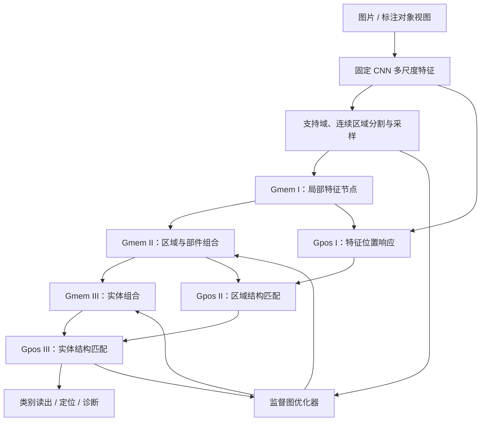

# Conscious Demo

**基于固定 CNN 与层级超图的视觉记忆、空间检索和持续学习实验。**

本项目探索一种可显式检查的视觉学习方式：将局部特征存为节点，将相对位置和组合关系存为边，再将部件组合成更高层的实体记忆。模型面对新图片时，通过特征与空间结构的共同匹配，回答“哪些部分见过”“它们在哪里”“是否构成已知实体”。

长期目标是探索面向多模态感知、记忆与行动的类脑系统；当前仓库聚焦**视觉编码与图记忆原型**，尚未实现完整的多模态系统或动作解码器。

[快速开始](#快速开始) · [系统结构](#系统结构) · [当前进展](#当前进展) · [文档导航](#文档导航)

## 核心思路

- **固定特征编码**：CNN 提取颜色、梯度、曲率、各向异性及方向响应。当前图学习不通过反向传播更新 CNN。
- **层级组合记忆**：从局部特征到连续区域，再到多个区域构成的实体；高层节点允许共享低层部件。
- **外观与位置联合检索**：Gmem 保存特征和关系，Gpos 根据输入响应和相对几何约束进行空间定位。
- **逐观察积累证据**：按独立来源记录支持，重复输入同一标注不会被当作新的独立学习证据。
- **可检查的学习过程**：展示分割、采样点、实体成员、候选检索、拒绝原因以及熟悉／差异／未知热力图。

## 系统结构



图中 Gpos 表示分层位置计算与检索职责，不意味着代码中存在三份与 Gmem 完全对称的持久化图对象。

| 层级 | Gmem：存储内容 | Gpos：检索职责 |
| --- | --- | --- |
| I | 局部特征原型及低层关系 | 在输入中计算特征响应与可评估位置 |
| II | 由 anchor–peri 星型结构组织的区域，包含成员及相对位置约束 | 匹配连续区域或部件，检验外观、覆盖与几何一致性 |
| III | 多个区域构成的实体、成员关系与观察证据 | 联合检索实体组合，估计其位置并输出匹配证据 |

当前主线使用一次观察构图与框监督优化器。早期模拟眼跳的控制器及优化器保留在仓库中，供研究对照。

### 五类视觉输入

| 输入 | 当前含义 |
| --- | --- |
| `RGB` | 颜色区域响应 |
| `grad` | 梯度及边缘连续性 |
| `curv` | 局部曲率属性 |
| `aps` | 当前实现中的局部各向异性属性；不等同于目标框长宽比 |
| `ori` | 方向及方向置信度 |

默认使用 `grad_refined`：边缘属性在保留的 grad 父域内细分；同源属性按 family 组织，避免把同一边缘的多个属性视作多份独立证据。具体定义见 [区域细分与形状设计](docs/algorithm/Alg_RegionRefinementAndShape.md)。

## 当前进展

已实现的主要能力：

- 固定 CNN、多模态连续分区、区域采样及三层记忆组合。
- 二进制粗筛、候选生成与空间结构精验。
- VOC 标注框监督写入、来源去重、检查点保存与恢复。
- 冻结记忆查询、训练对象回查、独立划分上的类别读出与分类头对照。
- 滑窗候选检测及简化评价，逐对象日志、内存／显存统计。
- 未决关联状态管理，以及熟悉度／差异的只读实验探针。

**当前仍处于研究验证阶段。** 跨观察实体巩固、尺度与遮挡鲁棒性、类别泛化及长期增长能力尚需验证。熟悉度热图尚未驱动自动图更新，不能将候选检索失败直接解释为“从未见过”。

### 已记录的实验结果

以下是已有报告中的特定实验，不代表完整 VOC 基准或当前所有运行结果。

| 实验 | 记录结果 | 可以说明什么 |
| --- | --- | --- |
| 34 个训练对象的冻结回查 | 34/34 找回目标实体 | 已学习输入能够被保存并检索；不等于跨图分类准确率 |
| 对应实验的独立留出查询 | validation/test 共 57 个对象全部未决 | 当时的接受实体读出尚未形成有效的类别泛化 |
| 单对象六条件熟悉度先导 | 原图、平移、亮度变化命中；缩放 0.95 和局部遮挡失配 | 应先改善局部对应与可见性解释，再验证差异驱动更新 |

详见 [记忆保持与泛化审查](docs/record/2026-09-22_recall_generalization_experiments.md) 和 [诊断完善与先导实验](docs/record/2026-09-22_generalization_diagnostics_familiarity_pilot.md)。

## 快速开始

### 1. 准备 Python 环境

当前主要在 Linux 上开发，实验资源统计使用 `/proc`。本地开发环境包含 Python 3.11、PyTorch `2.10.0+cu128`、torchvision `0.25.0+cu128`；CPU 也可运行，但图检索可能耗时较长。仓库目前没有完整的依赖锁文件。

在仓库根目录创建独立环境：

```bash
python3.11 -m venv .venv
source .venv/bin/activate
python -m pip install --upgrade pip

# CUDA 12.8 wheel，与项目当前使用的 PyTorch / torchvision 版本对应
python -m pip install torch==2.10.0 torchvision==0.25.0 --index-url https://download.pytorch.org/whl/cu128
python -m pip install numpy pillow pandas matplotlib jupyterlab ipykernel
python -m ipykernel install --user --name conscious-demo --display-name "Conscious Demo"
```

仅使用 CPU 时，将上述 PyTorch 安装命令替换为：

```bash
python -m pip install torch==2.10.0 torchvision==0.25.0 --index-url https://download.pytorch.org/whl/cpu
```

检查实际运行环境：

```bash
python -c "import torch; print('torch:', torch.__version__); print('CUDA:', torch.version.cuda); print('available:', torch.cuda.is_available())"
```

Notebook 自动优先使用可用 GPU，但 Python 图遍历等工作仍在 CPU 上执行。若遇到 cuDNN 版本冲突，请检查运行内核与 `LD_LIBRARY_PATH` 是否混入其它环境的 CUDA/cuDNN 库；本项目曾遇到此类环境问题，见 [环境与性能记录](docs/record/2026-09-15_onceoptimizer_performance_cuda_report.md)。

### 2. 准备 VOC2007 数据

将图片、XML 标注和官方划分解压到同一个 VOC 根目录：

```text
VOCdevkit/VOC2007/
├── JPEGImages/
├── Annotations/
└── ImageSets/
    └── Main/
        ├── train.txt
        ├── val.txt
        └── test.txt
```

如需测试集评价，还需对应的 test 图片、标注与划分。数据需自行准备，不依赖开发机器上的绝对路径。

在监督 Notebook 的首个代码单元修改：

```python
VOC_ROOT = Path('/your/data/VOCdevkit/VOC2007')
RESUME_CHECKPOINT = None  # 首次运行从空记忆开始
```

Notebook 默认类别为 `cat`、`dog`、`car`，按原图划分，避免同图目标跨训练／验证集合：

| 划分 | 用途 |
| --- | --- |
| `memory_build` | 官方 train 的内部子集，用于写入图记忆 |
| `readout_fit` | 官方 train 的另一个子集，用于拟合分类头 |
| `validation` | 官方 val，用于验证与分类头训练轮次选择 |
| `test` | 官方 test，用于固定设置的评价 |

默认过滤 difficult 目标；当前检测指标属于简化实验协议，不能直接称为 VOC 官方 mAP。

### 3. 运行 Notebook

```bash
jupyter lab src/test_supervised_graph_learning.ipynb
```

选择 **Conscious Demo** 内核，核对数据路径后执行 **Restart Kernel and Run All**。

主 Notebook 会依次执行两图学习演示、分区对照、批量学习或恢复、留出查询、分类头对照、单图检测、训练回查、熟悉度扰动实验和恢复一致性检查。相关开关默认开启，完整流程可能较长。

常用配置均位于首个代码单元：

| 配置 | 作用 |
| --- | --- |
| `RESUME_CHECKPOINT` | 恢复已有记忆；`None` 表示新建实验池 |
| `BATCH_START_IMAGE` | 本次学习窗口的原图起点 |
| `BATCH_IMAGE_LIMIT` | 本次建图原图数，默认 20 |
| `QUERY_IMAGE_LIMIT` | 每个留出划分查询的原图数，默认 20 |
| `PILOT_OBJECT_LIMIT` | 熟悉度实验的对象数，默认 3 |
| `RUN_*` | 控制演示、查询、检测、回查和探针等步骤 |

原图数不等于目标数。恢复旧检查点后，已处理标注会返回 `ALREADY_OBSERVED`；它表示来源去重，不代表新增学习。分类头遇到拟合集缺类或证据向量完全相同时会记录跳过原因。

如仅希望观察分割、采样及一次性构图，可查看 [一次观察优化器 Notebook](src/test_memorypool_onceoptimizer.ipynb)，运行前同样需要核对其中的本地图片路径。

### 4. 查看结果

每次监督实验写入独立目录：

```text
results/supervised_graph/voc2007_<timestamp>/
```

主要产物包括：

- `memory.pt`：图记忆、来源账本与配置。
- `learning.jsonl`：逐目标学习状态、阶段用时及资源统计。
- `*_queries.jsonl`、`*_cache.pt`：逐对象查询诊断和分类证据缓存。
- `head_results.json`：分类头对照成绩或跳过原因。
- `training_recall.json`、`detection.json`：训练回查与检测结果。
- `familiarity_pilot/`：扰动对照、热力图及原始数值。
- `resume_check.json`、`all_results.json`：恢复检查与最终汇总。

对应步骤完成后才会生成这些文件。解释结果时应区分目标实体命中、类别预测正确、拒绝预测，以及候选搜索是否完整。

## 代码与文档导航

```text
src/
├── nns/
│   ├── cnns/                          # 固定视觉特征编码
│   └── memorygraphs/                  # 图记忆、检索、优化器与实验接口
├── test_supervised_graph_learning.ipynb
├── test_memorypool_onceoptimizer.ipynb
└── tests/                             # 回归测试

docs/
├── algorithm/                         # 算法定义与设计方案
├── record/                            # 实现记录及实验审查
└── research/                          # 研究计划
```

| 入口 | 内容 |
| --- | --- |
| [graph_memorypool_onceoptimizer.py](src/nns/memorygraphs/graph_memorypool_onceoptimizer.py) | 连续区域构图、层级记忆与空间检索 |
| [supervised_graph_learning.py](src/nns/memorygraphs/supervised_graph_learning.py) | 框监督写入、实体关联、来源账本与事务提交 |
| [supervised_data.py](src/nns/memorygraphs/supervised_data.py) | VOC 标注读取、对象视图与配置 |
| [supervised_readout.py](src/nns/memorygraphs/supervised_readout.py) | 固定 CNN 接口、类别读出、分类头及检测 |
| [supervised_experiment.py](src/nns/memorygraphs/supervised_experiment.py) | 数据集实验、查询缓存与回查 |
| [familiarity_probe.py](src/nns/memorygraphs/familiarity_probe.py) | 冻结记忆的熟悉／差异／未知探针 |
| [pending_associations.py](src/nns/memorygraphs/pending_associations.py) | 未决关联的支持、反对与版本状态管理 |

建议从以下文档开始阅读：

1. [层级图与优化器设计](docs/algorithm/Alg_GraphandOptimizer.md)
2. [一次观察构图方案](docs/algorithm/Alg_onceoptimizer_beta.md)
3. [框监督图学习](docs/algorithm/Alg_SupervisedGraphLearning.md)
4. [长期监督训练设计](docs/algorithm/Alg_LongTermSupervisedTraining.md)
5. [熟悉度驱动学习方案及实现边界](docs/algorithm/Alg_FamiliarityGuidedGraphLearning.md)
6. [实现与实验记录索引](docs/record/index.md)

算法文档包含已实现内容和待验证设计；实际支持范围应结合代码与对应实验记录判断。

## 开发检查

从仓库根目录执行：

```bash
# 静态编译
python -m compileall -q src/nns

# 监督学习与诊断回归
PYTHONPATH=src python -m unittest discover -s src/tests -p 'test_supervised*.py'

# 二进制粗筛与模态回归
PYTHONPATH=src python -m unittest discover -s src/tests -p 'test_onceoptimizer_binary_modalities.py'
```

后续工作的重点是：可靠的跨观察部件对应、尺度与部分可见结构检索、稳定核心与可选成员、差异定位验证，以及增长记忆上的独立判别评价。
