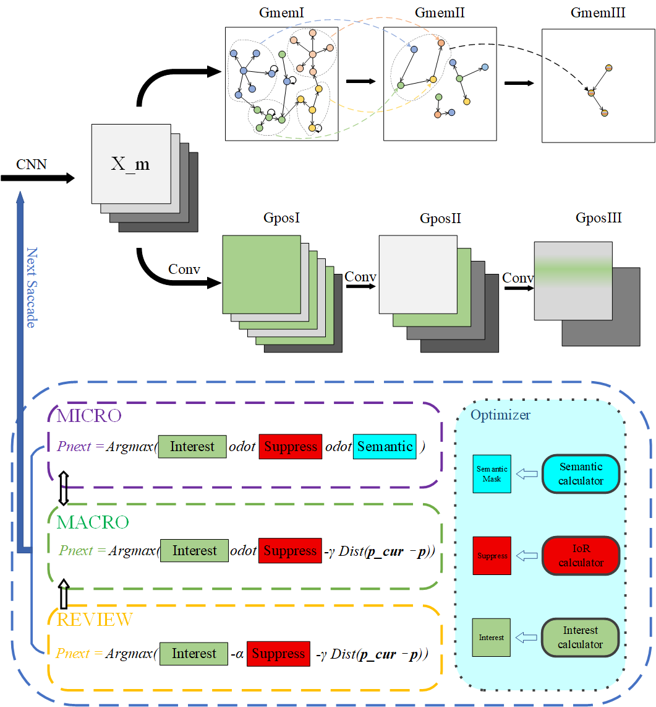
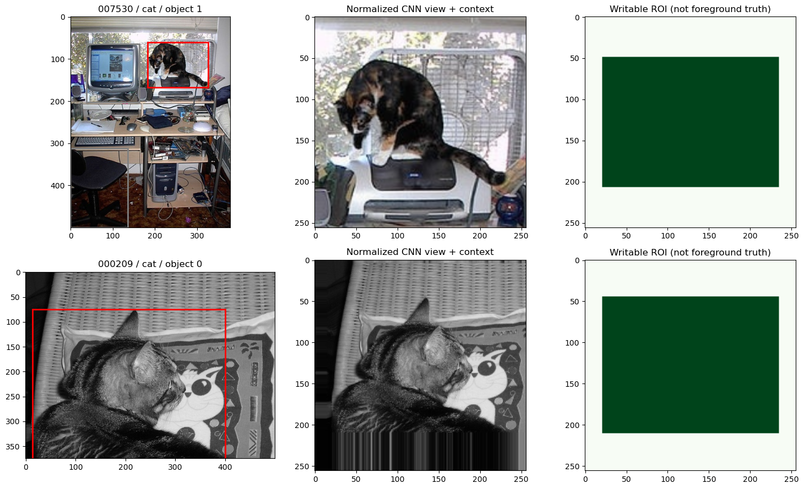
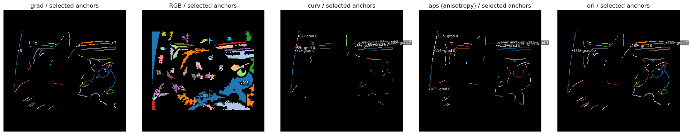
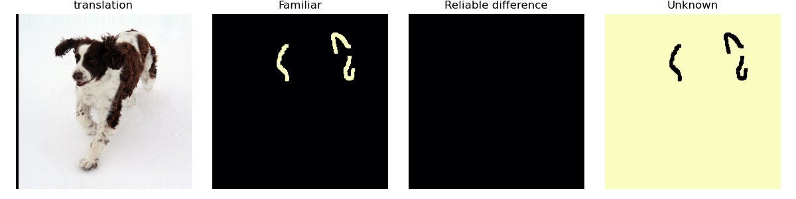

# Conscious Demo

### 基于层级超图的可解释视觉记忆

[English](README.md) · **简体中文**

Conscious Demo 探索如何用显式、可检查的结构实现**部件记忆、实体组合与空间检索**。固定卷积编码器提供视觉特征，持续增长的层级图保存外观、几何关系和观察历史。

核心研究问题是：**能否在不持续重训视觉编码器的情况下，通过持久化的组合记忆实现识别与增量学习？**

[整体结构](#1-模型整体结构原理) · [实验表现](#2-模型表现) · [算法细节](#3-具体算法细节) · [部署方法](#34-部署与复现)

## 1. 模型整体结构原理



*图 1：作者提供的整体原理图。Gmem 保存特征组合，Gpos 计算其空间支持。下半部分为探索性的 MICRO / MACRO / REVIEW 眼跳控制环。当前监督实验使用一次观察构图器和优化器替代这一采集环节；图中的 Conv 是空间响应计算的概念表示，当前层级检索还包含索引候选与显式几何精验。*

### 记忆通路与空间通路

模型将“存储了什么”与“新输入在哪里支持它”分开：

- **Gmem：组合记忆。** 局部特征组成区域，区域组成实体假设。高层结构可以共享低层部件，同时保留各自的角色和相对位置。
- **Gpos：空间检索。** 特征响应产生候选位置，再通过区域和实体约束检查部件是否以相容的布局出现。
- **观察驱动学习。** 新观察支持已有组合，或形成受保护的观察模板；不确定关联显式保留，不强行合并。

因此，每次检索都可以追溯到支持它的区域、特征响应、几何约束和独立观察，使学习与识别过程具有可检查性。

| 层级 | 记忆表示 | 空间推断 |
| --- | --- | --- |
| I | 局部特征原型 | 输入上的特征相似度与可评估位置 |
| II | 以 anchor–peri 关系及附加约束组织的区域组合 | 区域对应与相对几何 |
| III | 由区域角色组成的标注对象或实体假设 | 实体联合验证与定位 |

Gpos 表示三个层级的空间计算职责，并不是三份独立持久化图。本文使用**层级超图记忆**而非“GNN”命名，因为当前实现不属于常规的可训练消息传递图神经网络。

长期目标是形成感知—记忆—行动系统。当前仓库聚焦视觉记忆，多模态理解和动作解码器属于后续研究。

## 2. 模型表现

### 已验证的优势

**在已评价的记忆池中，全部 34 个已存对象均成功找回**，原训练视图的类别预测也全部正确；检查点恢复与重复输入验证通过，形成了可运行的记忆—检索闭环。

| 实验 | 观察结果 | 评价范围 |
| --- | --- | --- |
| 冻结记忆中的训练对象检索 | **34 / 34 目标实体命中** | VOC2007 的 20 张训练图、34 个标注对象，已知对象框 |
| 已存视图的类别预测 | **34 / 34 正确** | 同一批训练观察，不是留出准确率 |
| 三类对象的原图对照 | **3 / 3 命中** | dog、car、cat 各一个对象 |
| 小幅平移／亮度对照 | **两种条件各 2 / 3 命中** | 水平平移 4 像素；亮度乘 0.85 |
| 检查点与重复输入一致性 | **5 / 5 检查通过** | 图版本、账本、节点数、重放幂等性、查询等价性 |

这些选取的可复查结果来自已完成的 CUDA 实验 `voc2007_20260922_222716_908742`，于 2026-09-23 审查。该轮批量部分恢复已有的 34 对象记忆，没有新增独立学习证据。详见[完整实验报告](docs/record/2026-09-23_full_experiment_review.md)。

### 从标注视图到显式视觉部件



*图 2：Notebook 中两个真实对象观察，依次展示原图与标注、归一化 CNN 输入、可写区域。标注框用于限定观察范围，可写掩码不是前景分割真值。*



*图 3：猫对象的梯度、颜色、曲率、各向异性与方向分区。星号标示入选锚点，属性区域文字标示其 grad 父域。颜色用于区分区域，不代表语义类别。*

### 可检查的检索证据



*图 4：dog 图像 003671 水平平移 4 像素后成功检索。四栏为输入、熟悉、可靠差异和未知。热图展示稀疏模板支持，不是稠密对象分割；未知图中的高亮区域尚未被该模板解释。*

### 当前研究边界

训练视图记忆已得到验证，**跨图片识别仍是待解决问题**。该轮 readout_fit、validation、test 的 84 个对象均没有接受的实体。弱证据分类头通过将所有对象预测为 car 得到 51.61% 测试准确率，尚不能说明具备有效的三类判别能力。缩放 0.95 和局部遮挡两种条件中，三个对象均失配。

下一步重点是局部对应冲突、尺度与部分可见结构推断，并对分类结果建立初始化与固定类别基线。熟悉度驱动更新目前仍为只读诊断实验。这些边界区分了已验证的记忆机制和仍需研究的能力。

## 3. 具体算法细节

### 3.1 固定 CNN：结构化视觉特征

编码器由视网膜预处理与固定多尺度特征库组成。高斯平滑和卷积导数提供局部测量，一阶、二阶导数在后续特征流程中复用。监督编码器默认尺度为 `(1, 2, 4)`，所有编码器参数被冻结。

| 特征族 | 作用 |
| --- | --- |
| `RGB` | 颜色与外观连续性 |
| `grad` | 梯度结构与边缘连续性 |
| `curv` | 局部曲率属性 |
| `aps` | 局部各向异性，不等同于目标框的长宽比 |
| `ori` | 方向及置信度相关处理 |

默认 `grad_refined` 分区先将边缘属性限制在保留的 grad 父区域内，再按各属性自身响应细分。同源属性组成 **family**，避免把一条轮廓的多个测量当作多份独立结构证据。

实现：[features.py](src/nns/cnns/features.py)、[FixedCNNEncoder](src/nns/memorygraphs/supervised_readout.py)、[分区设计](docs/algorithm/Alg_RegionRefinementAndShape.md)。

### 3.2 超图记忆：特征、区域与实体

高层节点表示低层**角色及其关系**的组合，而非特征向量的无序集合。即使两个角色引用相同原型，它们在组合中的身份也被保留。

- **Gmem I** 保存带有模态信息的局部特征原型。
- **Gmem II** 围绕区域锚点组织采样，保存相对位置与跨区域接触关系。
- **Gmem III** 将区域角色绑定为实体，保存成员偏移、成员间关系、来源 family、可靠性和观察历史。同一个区域可以参与多个实体。

写入把连续观察转换为显式组合，检索判断这些组合能否解释新特征场。二进制签名与反向关联索引缩小候选范围，随后进行几何精验。粗筛命中只表示候选存在，不是身份确认；不完整搜索也不能证明输入从未出现。

对于候选位置，精验器联合考虑加权特征分数、可评估支持、匹配覆盖、几何残差和证据占用约束。当前检索主要建模平移，其外观聚合可以简记为：

$$
S(H,b)=\exp\left(\frac{\sum_{i\in\mathcal E(H,b)}w_i\log\max(s_i(b),\epsilon)}{\sum_{i\in\mathcal E(H,b)}w_i}\right).
$$

其中 $\mathcal E(H,b)$ 是假设 $H$ 在平移 $b$ 下可评估的槽位集合，$s_i$ 包含局部响应与位移加权。接受还需满足覆盖和结构约束，仅有高外观分数不足以确认实体。

实现与设计：[graph_memorypool_onceoptimizer.py](src/nns/memorygraphs/graph_memorypool_onceoptimizer.py)、[层级图结构](docs/algorithm/Alg_GraphandOptimizer.md)。

### 3.3 学习、巩固、检索与分类算法

下表梳理当前一次观察流程，以及它与整体设计的关系。

| 阶段 | 算法与更新行为 |
| --- | --- |
| 观察构建 | 归一化标注对象视图，确定有效支持，分割连续区域，在预算内采样锚点和外围点。 |
| 区域复用 | 通过粗筛和结构匹配比较已有 Gmem II 模板；关联有歧义时保留本地观察。 |
| 实体关联 | 监督学习中，结合区域／角色对应和几何，选择相容的同类实体；否则建立独立标注种子。标签指导写入，正常检索不接收目标标签。 |
| 证据积累 | 按来源 episode 记录支持与观察机会。同一来源的相关视图最多贡献一份独立支持；只有新增支持才更新相应几何统计。 |
| 结构巩固 | 更新得到支持的成员偏移和关系；未解释成员先成为试用候选，满足条件后再提升。共享部件仍保留独立角色。 |
| 歧义管理 | 保存 pending、confirmed、rejected、stale 状态；模板版本变化使旧关联证据失效，关联确认不自动合并实体。 |
| 提交与恢复 | 检查候选实体能否解释自身写入几何，必要时尝试本地重建；提交完整结果，记录来源并保存版本化检查点。 |

对于新增证据权重 $\Delta w$ 支持的位移 $\hat\delta$，证据累计器按下式更新均值：

$$
\mu' = \mu + \frac{\Delta w}{W+\Delta w}(\hat\delta-\mu).
$$

累计器同时维护几何变化量。同一来源重放不会仅因再次呈现而增加独立支持。这种基于证据的图学习与编码器梯度训练不同。

**增长图上的分类头。** 将实体证据聚合为固定 $6C$ 维向量，$C$ 为类别数。每类包括分数、可评估性、匹配覆盖、归一化几何误差、缺失／拒绝状态和搜索完整性。图节点持续增长时，线性分类头输入维度保持固定。标准读出只使用已接受实体；独立的 weak 对照纳入被拒绝假设。弱类别证据和分类头预测均不能授权图更新。

分类头在冻结图的 readout_fit 上拟合，由 validation 选择检查点。图版本和特征来源合同防止混用旧缓存。检测接口生成候选框、执行图检索并统计检测及候选覆盖；当前检测器使用标准图读出。

**熟悉度驱动学习：诊断原型。** 只读探针按来源 family 聚合证据，将熟悉 $F$、可靠差异 $D$ 和未知 $U$ 分开：

$$
F_f=q_fv_f(1-u_f)s_f,\qquad D_f=q_fv_f(1-u_f)(1-s_f),\qquad U_f=1-q_fv_f(1-u_f).
$$

这些是工程评分，不是经过校准的概率。探针用于检验局部对应是否足以支持未来的选择性更新，尚未实装该更新器，也尚未实现可靠的稠密差异定位。

**早期主动观察控制器。** 原理图中的 MICRO / MACRO / REVIEW 环结合兴趣、返回抑制、语义引导和移动代价选择下一次观察。早期实现保留供研究对照；本文成绩来自一次观察构图与监督流程，不是完整眼跳环的评价结果。

代码：[监督学习](src/nns/memorygraphs/supervised_graph_learning.py) · [未决关联](src/nns/memorygraphs/pending_associations.py) · [读出与分类头](src/nns/memorygraphs/supervised_readout.py) · [熟悉度探针](src/nns/memorygraphs/familiarity_probe.py)。

设计：[一次观察优化器](docs/algorithm/Alg_onceoptimizer_beta.md) · [监督学习](docs/algorithm/Alg_SupervisedGraphLearning.md) · [长期训练](docs/algorithm/Alg_LongTermSupervisedTraining.md) · [熟悉度驱动学习](docs/algorithm/Alg_FamiliarityGuidedGraphLearning.md) · [实验记录索引](docs/record/index.md)。

### 3.4 部署与复现

本项目以研究 Notebook 为运行入口，尚未封装为推理服务。开发环境为 **Linux、Python 3.11、PyTorch 2.10.0+cu128、torchvision 0.25.0+cu128**。CPU 也可以运行，但图检索可能耗时较长；当前尚无完整依赖锁文件。

**在仓库根目录安装：**

```bash
python3.11 -m venv .venv
source .venv/bin/activate
python -m pip install --upgrade pip
python -m pip install torch==2.10.0 torchvision==0.25.0 --index-url https://download.pytorch.org/whl/cu128
python -m pip install numpy pillow pandas matplotlib jupyterlab ipykernel
python -m ipykernel install --user --name conscious-demo --display-name "Conscious Demo"
```

仅使用 CPU 时，将 PyTorch 安装命令替换为：

```bash
python -m pip install torch==2.10.0 torchvision==0.25.0 --index-url https://download.pytorch.org/whl/cpu
```

**准备 VOC2007：**

```text
VOCdevkit/VOC2007/
├── JPEGImages/
├── Annotations/
└── ImageSets/Main/
    ├── train.txt
    ├── val.txt
    └── test.txt
```

评价 test 时需提供对应测试图片及标注。在[监督 Notebook](src/test_supervised_graph_learning.ipynb) 首个代码单元设置：

```python
VOC_ROOT = Path('/your/data/VOCdevkit/VOC2007')
RESUME_CHECKPOINT = None  # 新建图；也可明确指定兼容的检查点
```

默认类别为 cat、dog、car。官方 train 按原图划分为图记忆构建和分类头拟合集；官方 val/test 保持独立。默认过滤 difficult 目标，检测指标为简化协议，不是 VOC 官方评价实现。

```bash
jupyter lab src/test_supervised_graph_learning.ipynb
```

选择 **Conscious Demo** 内核，执行 **Restart Kernel and Run All**。实验开关默认开启；`BATCH_IMAGE_LIMIT`、`QUERY_IMAGE_LIMIT` 默认分别处理 20 张原图，`PILOT_OBJECT_LIMIT` 默认三个对象。完整流程可能需要数小时。`BATCH_START_IMAGE` 选择学习窗口，重复已有来源不算新增训练。

结果写入 `results/supervised_graph/voc2007_<timestamp>/`，包括 `memory.pt`、逐对象学习／查询日志、分类缓存、`head_results.json`、`training_recall.json`、`detection.json`、熟悉度图及 `all_results.json`。[一次观察 Notebook](src/test_memorypool_onceoptimizer.ipynb) 提供更底层的构图入口，运行前需检查其本地输入路径。

```bash
# 环境检查
python -c "import torch; print(torch.__version__, torch.version.cuda, torch.cuda.is_available())"

# 静态编译与针对性回归
python -m compileall -q src/nns
PYTHONPATH=src python -m unittest discover -s src/tests -p 'test_supervised*.py'
PYTHONPATH=src python -m unittest discover -s src/tests -p 'test_onceoptimizer_binary_modalities.py'
```

GPU 特征计算与 CPU 图逻辑共同运行。若发生 cuDNN 版本冲突，请核对内核和外部动态库路径，参见[环境记录](docs/record/2026-09-15_onceoptimizer_performance_cuda_report.md)。图片来源记录在[素材说明](docs/assets/readme/README.md)中。
