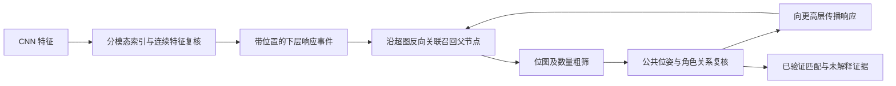

# 层级图记忆与结构检索审查及 GmemIII 优化器设计

日期：2026-09-11。作者：chatgpt（算法设计）。

状态：基于当前代码的审查报告与下一阶段算法草案；本次不修改实现，不重新运行调参实验。用户已验证一次性构图与连续相似区域检索的有效性，本文以这一进展为基础，进一步规定跨区域、跨观察的组合记忆与检索。

2026-09-12 补充：第 11—15 节明确本项目采用“带属性的层级超图”；前文“模板”仅指高层超节点引用的下层子图及其检索视图，不表示另建图像模板库。补充三层连续相似度、二进制关联索引、事件传播与复杂度边界；新输入先查询已有记忆，再决定学习写入。

审查主体：[graph_memorypool_onceoptimizer.py](../../src/nns/memorygraphs/graph_memorypool_onceoptimizer.py)。辅助材料：[一次性优化器设计](Alg_onceoptimizer_beta.md)、[实现记录](../record/2026-09-11_graph_memorypool_onceoptimizer_implementation.md)、[当前调试 Notebook](../../src/test_memorypool_onceoptimizer.ipynb)。本文是用户指定的新阶段文档，与旧草案冲突处以本文明确列出的新设计为准，不能将“拟议接口”当作已实现功能。

## 1. 目标与结论

目标是从一张或多张图片中学习反复出现的局部组合，使其形成可复用的 GmemIII 记忆；新输入具有相似的底层特征及相对排布时，激活对应 GmemIII，并由 GposIII 返回一个或多个位置及位姿。

用户提出的方向合理，但“把多个 GmemII 放入集合、按共现次数加权”还不足以实现该目标。需要同时保存并学习：

1. **组成**：实体有哪些组件，同一组件可以被哪些实体共享；
2. **角色与位姿**：同一组件在实体中的哪一个位置出现、与其他组件如何排列；
3. **跨观察对应**：本次观察到的区域对应哪个已有组件或实体，而不是每次追加全新记忆；
4. **证据可靠性**：重复是否来自新的观察，预期组件缺失时是否真的可见；
5. **检索约束**：多个特征峰是否属于同一位姿下的同一组合，不能分别挑峰后直接相加。

推荐统一原则：**每层记忆都是“带实例角色与相对几何的子图模板”，每层位置检索都是“给定模板，在输入中求一致的空间赋值”。** GmemIII 优化器负责跨观察匹配、累积证据、选择稳定子图；不恢复眼跳状态机。

首版先验证固定尺度、固定方向下的平移检索，再推广到受限旋转、尺度变化和遮挡。不能仅凭空间图加共现机制承诺任意视角、任意形变或语义物体类别都会自然收敛。

## 2. 当前图结构审查

### 2.1 审查证据与完成边界

当前 Notebook 保存的一次构图输出为 GmemI／GmemII／GmemIII = `1671 / 1067 / 0`；其中 GmemII 包含 `207` 个区域容器与 `860` 个接触容器。这是该次保存结果，不是所有输入的规模或性能结论。

Notebook 分别展示真实 `l2_structure_synthesis()` 与 `reference_star_response()`。后者使用存储位移采样 GposI，能够作为固定姿态星型检索的参考实现；真实 GposII 仍未完整使用位置约束。用户已经观察到的连续区域检索成功支持了设计方向，但不等价于三层检索与跨图学习均已完成。

### 2.2 GmemI：特征节点，当前无独立边池

**节点定义。** `ModalityNode` 保存单模态 `prototype`、有效通道 `mask`、门控／拓扑上下文，以及出现次数和神经元状态。当前默认 `sample_instance` 模式按一次观察内的 `(modality, pixel)` 注册，不同位置即使特征相同也保留不同 id；原型复用仅是另一种写入模式。

**边定义。** `GmemoryI` 自身只有节点字典与注册接口，没有邻接边池。所谓“GmemI 节点相连”，实际由 GmemII 容器保存的 `RelationEdge(src_id,dst_id,...)` 实现。

**作用。** 为空间组合提供可检索的低层特征证据；单个节点不表示其在当前查询图中的唯一位置，同一个特征可以有多个响应峰。

**限制。** 原型相似性不等于空间实例相同。后续不能仅按底层 node id 判断跨图组件是否相同，也不能把数值相同的全部位置强行合为一次出现。

### 2.3 GmemII：区域星型与接触关系容器

**节点定义。** `SemanticNode` 保存 `anchor_id`、`child_node_ids` 和 `relation_edges`，当前包含两种用途：

- 区域节点：同一连续区域的一组同模态采样点与锚点星型；
- 接触节点：少量区域接触点构成的关系，可能跨模态。

**边定义。** `RelationEdge` 的两个端点均为 GmemI id，携带对数距离、角度、容差、role、count、confidence 等；多条不同位移的边可以共享同一端点对。`peripheral_links` 只保留兼容性代表视图，不是完整拓扑的权威来源。

**作用。** 保存局部形状、区域内几何，以及区域之间可追溯的低层接触证据。

**限制。** 当前没有直接连接两个 `SemanticNode` id 的通用关系表。区域间连接通过接触容器和共享的 GmemI id 间接表达。区域／接触分类主要保存在 `BuildReport`，持久学习时需要将其提升为可持久查询的索引，不能依赖 Notebook 留在内存中的报告。

### 2.4 GmemIII：已有类与组件接口，尚无构建路径

**节点定义。** `EntityNode` 具有 `components`、`component_edges`、`component_edges_by_semantic` 与激活状态，形式上可以容纳多个 GmemII。

**现有边定义。** `add_component(entity_node,sem_id,dx,dy)` 每次新建一条组件记录，其中 `sem_id` 指向 GmemII，`dx,dy` 表示某种相对位移，`count` 初始化为 1。这是“实体到组件”的从属记录，不是完整的组件对几何关系。

**尚未明确或实现。** 实体统一参考锚点、位移坐标系、同类组件的角色身份、跨观察成员匹配、计数合并、存在概率与几何方差。`components[sem_id]` 是代表项，不能用于表示同一种组件在多个位置出现；完整多重性必须使用 `component_edges` 或其扩展。

`Controller.run_step()` 接收 GmemIII 仅为兼容接口；当前构图器没有调用 `add_entity_node()` 或 `add_component()`，所以为空是当前执行路径的直接结果。

### 2.5 Gpos 三层：应是临时位置假设塔

| 层级 | 当前已有内容 | 应有的节点／状态含义 | 应有的边／约束含义 |
| --- | --- | --- | --- |
| GposI | GmemI id 对应的二维相似度响应图 | 某低层特征在位置 $p$ 的响应假设 | 当前无持久空间边；邻域处理是算子，不是新记忆 |
| GposII | 一个不完整的锚点检索接口；另有独立参考星型评分 | 某 GmemII 模板在位置、尺度、角度下成立的假设 | 由其低层关系边产生的特征赋值和几何一致性约束 |
| GposIII | 无对应实现 | 某 GmemIII 模板在当前图像中的实例假设 | 成员位置、共同位姿及跨成员关系约束 |

“双塔”不要求 Gpos 再复制一套长期可学习图。建议 Gmem 存模板，Gpos 存本次查询的响应和对应关系；查询结束可以释放 Gpos 工作状态。若显式存图，其节点是 `template_id + pose + assignment`，其边记录证据依赖，不能与 Gmem 的关系计数混为一谈。

### 2.6 当前重复学习的实质缺口

`GraphWriteAdapter.write()` 每次都新建区域与接触 GmemII；即使底层选择 `prototype` 复用，也没有匹配已有 GmemII 或 GmemIII。因此重复输入不会自动加强同一个结构模板。

`RelationEdge.count` 仅在同一容器内、同端点同角色且位移足够近时增加，不能代表跨图片独立出现次数。`confidence` 初始化为 1，并按 `confidence += alpha*(1-confidence)` 更新，正常路径下始终为 1，不能直接承担新设计的学习可靠度。

GmemIII 的组件 `count` 每次新建为 1，没有同角色合并更新。神经元 `activation_level` 是短时动力学，不能代替长期边强度。

## 3. 统一三层节点与边的目标定义

### 3.1 观察实例与长期模板分开

一次构图结果称为观察图 $O_t$，记录本次看见的特征、区域及接触。长期记忆称为 $\mathcal M$。新观察应先对长期记忆匹配，再决定更新旧模板还是创建候选模板。

首版保留 GmemI 的采样实例表示，已有长期模板中的底层 id 可以作为稳定采样槽位。新观察的 id 与旧 id 无需相等，通过位置对齐与同模态相似度建立映射。无需先重构 CNN 或全局底层原型库，便可开始跨观察学习。

观察图可以使用现有类在临时池构建；没有被接纳为新模板的临时节点不应无限追加到长期池。原始观察及其匹配关系可按预算保存为证据。

### 3.2 GmemII 模板与槽位

一个长期区域模板 $S$ 表示可复用的局部连续结构：

$$
S=(U_S,E_S,a_S),
$$

$U_S$ 为低层特征槽位，$a_S$ 是固定模板锚点；$E_S$ 为槽位之间的相对位置关系。槽位可以引用相同特征原型，但拥有不同位置身份。当前实例模式可直接使用不同 GmemI id 作为这些槽位，未来启用全局原型压缩时才需要独立 `slot_id`。

不同观察的采样密度可能不同，因此跨图学习不是强求所有采样点一一对应。按对齐后的位置覆盖与特征相似支持模板槽位，低置信新增点先作为候选，不能每次采样略有变化就永久加边。

接触容器保留为关系证据；默认不把每条接触再当作独立物体组件重复计数。需要将短接触关系本身作为可复用组件时，必须显式声明角色。

### 3.3 GmemII 之间的逻辑关系

为支持上层组合，建立可持久化的区域关系索引：

$$
e^{II}_{ij}=(S_i,S_j,\mathcal T_{ij},\mathcal C_{ij},\mathrm{stats}),
$$

其中 $\mathcal T_{ij}$ 表示组件锚点之间的相对变换，$\mathcal C_{ij}$ 引用已有低层接触证据；不同空间关系保留不同边实例，不按 `(S_i,S_j)` 强制合成唯一均值。

这是在 GmemII 节点之间定义的逻辑关系，与“存放在 GmemII 容器内部、端点为 GmemI 的边”不同。建议分别称为 **区域间关系** 和 **区域内关系**，代码中使用不同类型／索引，避免 id 层级混用。

现有接触容器可以作为区域间关系的证据来源，但不是它的充分替代：跨帧需要稳定组件身份、相对锚点位姿及重复统计。首版可新增伴随 Gmem 持久化的关系索引，而不是改写所有已有底层边。

### 3.4 GmemIII 节点、从属边与结构边

一个实体或局部组合模板定义为

$$
E=(\mathcal U_E,\mathcal R_E,u_0),
$$

其中 $u_0$ 是根组件槽位；每个成员槽位

$$
u_j=(\mathrm{slot\_id}_j,\mathrm{semantic\_id}_j,T_j,\mathrm{stats}_j)
$$

表示某个 GmemII 模板在该实体中的一次角色。从属边 $E\to u_j$ 保存存在可靠度与相对实体根的位姿；结构边 $u_i\to u_j$ 保存组件间相对关系及证据引用。

- 同一 GmemII 可属于任意多个实体，不设唯一 parent。
- 同一实体中同一 GmemII 可出现多次，例如两个相同的轮子，必须有不同槽位。
- `component_edge_id` 可以作为首版槽位 id 的基础；`sem_id` 只是模板引用。
- 不把从属边解释成组件之间的空间边；两者都可随学习增强，但统计含义不同。
- 根是坐标规范，不是类别本质。成熟后保持固定；更换根时必须同时变换全部成员与边，不能只换一个 id。

存储上可以只维护根到成员的位姿作为主几何，其他关系边保留为冗余检验／局部接触约束。首版不必学习所有成员两两连边。

本阶段不要求在两个 GmemIII 实体节点之间再新增空间边。本文所谓“GmemIII 的边”是实体拥有的成员从属边与成员之间的结构边；实体之间的联想关系属于后续任务，避免把三个层级之外的能力混入当前验收。

### 3.5 最小持久字段补充

| 对象 | 最小新增或明确字段 | 原因 |
| --- | --- | --- |
| GmemII 模板索引 | `kind`、`template/observation`、版本、反向所属实体索引 | 区分区域、接触、临时观察与长期模板 |
| 区域间关系索引 | 两端模板／角色、相对变换、接触引用、统计 | 跨图累积连接证据 |
| GmemIII | 根槽位、候选／稳定状态、有效观察数、模板版本 | 坐标一致与生命周期 |
| 成员槽位 | 槽位 id、GmemII 引用、根相对位姿及不确定度 | 重复组件、多归属与虚拟展开 |
| 可学习边／从属关系 | 支持数、机会数、独立观察标识、几何均值与方差 | 区分频率、可靠度和可见缺失 |
| 证据索引 | 来源观察、匹配赋值、角色映射 | 防重复计数、诊断错误合并 |

这些是本轮目标新增的持久信息，不能声称当前字段已经足够。可以先以伴随索引实现，但必须与 Gmem 一同保存、加载、版本化；仅放在 `BuildReport` 中不能构成长时记忆。

## 4. GposII 的完整计算

### 4.1 统一位姿与局部几何

首先解码区域边的对数极坐标：

$$
d_e=\exp(\rho_e)(\cos\theta_e,\sin\theta_e)^\top.
$$

对星型，令锚点局部位置 $d_a=0$，其他槽位局部位置由锚点边得到。模板在查询图中的公共位姿写作

$$
T(p)=c+sR_\phi p,\quad s>0.
$$

首版 $s=1,\phi=0$，预测位置为 $\widehat p_i=c+d_i$。所有边共享同一个 $c,s,\phi$，不能为每条边独立选择最有利的尺度或旋转。

一般非星型图通过固定根、相对边和循环一致性重建局部坐标，或直接执行下述因子匹配。若图不连通、缺少跨分量位姿，则不能宣称整个模板具有唯一布局。

### 4.2 特征证据与几何因子

令 $F_i(p)\in[0,1]$ 为 GposI 的门控特征相似度。现有输出还乘有 `modality_weights`；作为几何匹配似然前，必须明确去除已知正模态权重或在外层另行加权，不能按每张图的最大峰归一化。零权重或缺失模态作为未提供证据处理。

对边 $e=(i,j)$，定义查询赋值 $p_i,p_j$ 下的几何兼容性：

$$
K_e(p_i,p_j;T)=\exp\left[-\tfrac12
(p_j-p_i-sR_\phi d_e)^\top
\Omega_e(T)^{-1}
(p_j-p_i-sR_\phi d_e)\right].
$$

$\Omega_e$ 是像素空间的容差协方差。现有 `lambda_rho/gamma_theta` 是位置容差相关参数，不能直接当作像素方差。初版使用声明的像素容差；若从对数极坐标容差转换，必须经 $d=\exp\rho(\cos\theta,\sin\theta)$ 的雅可比传播，并设置最小像素方差，避免短距离退化。

也可在非零半径处使用对数半径／周期角度残差；角度用 `wrap`，对数距离变换只影响尺度。共位与接近零距离关系使用笛卡尔残差，不丢弃自环或把角度当成有效方向。

### 4.3 固定姿态的快速星型评分

对每个目标槽位计算带几何惩罚的局部搜索：

$$
B_i(c,s,\phi)=\max_{z\in\mathcal Z_i}
F_i(c+sR_\phi d_i+z)
\exp(-\tfrac12z^\top\Omega_i^{-1}z).
$$

$\mathcal Z_i$ 是有限容差窗口；越界位置无响应，非整数位置用固定插值约定。固定平移模式可以用局部最大滤波／有限核搜索后平移采样，先得到全图响应，而不是只取一个锚点峰。

将锚点也作为一个证据组，定义

$$
\log S_{II}(c,s,\phi)=
\frac{\sum_i w_i\log(B_i+\epsilon)}{\sum_i w_i}.
$$

同一槽位的多个候选峰取最大值；属于可替代关系版本的边采用竞争／混合，不能全部相乘当成必须同时存在。对无外围点的模板仅返回锚点匹配并标记结构证据不足。

评分权重应有明确的正先验下限，避免新候选因有效支持数为零而出现零分母。没有任何可评估证据时直接返回 `insufficient_evidence`，不能用全零权重的归一化产生有效匹配。

`reference_star_response()` 已具有固定姿态下“按存储位移移采样”的雏形；需要补上统一归一化权重、几何惩罚、有效证据覆盖、匹配位置输出及下述一致性验证，才能作为正式 GposII 路径。

### 4.4 快速评分后的赋值一致性

独立最大值是候选筛选近似，不保证多个槽位对应不同观察。对排名靠前的位姿，收集每个槽位附近的候选特征实例，优化

$$
\max_\pi\left[
\sum_i w_i\log(F_i(p_{\pi(i)})+\epsilon)
+\sum_{e=(i,j)}v_e\log K_e(p_{\pi(i)},p_{\pi(j)};T)
\right].
$$

约束包括：模态匹配、允许未匹配槽位、同一模板中本应不同的重复组件不可使用同一次观察实例、同一源槽位在所有边中使用同一赋值。实现可从贪心赋值加冲突回溯开始，必要时采用二分匹配；一般图的全局最优组合不应被宣称为廉价精确计算。

对连续面内密集采样，不应把“独立峰”作为每个像素槽位的必需条件：同一连续响应区域可以在不同预测坐标支持多个点。去重约束针对重合的空间支持／重复对象角色，而非要求均匀区域产生不存在的离散峰。

### 4.5 缺失、遮挡与覆盖率

把缺失分为三类：

- 输入模态未提供、预期位置不在有效视野：不可评估；
- 位于有效视野且相应模态可用，但无匹配：负证据；
- 有独立证据表明被遮挡：未知或降权，不能仅因匹配失败就自行宣布遮挡。

定义可评估质量占比 $v$ 与其中成功匹配占比 $q$。返回分数时同时报告二者，并设置最小可评估比例、最少有效组件数和空间跨度；不能只在命中的少数槽位上重归一化后给出高置信“完整识别”。首版无可靠遮挡模型时使用严格可见模式，后续再允许显式缺失预算。

### 4.6 多候选输出与激活

输出至少包含：模板 id、响应图、多个 NMS 后的位姿峰、成员赋值、匹配／缺失权重、几何残差和可靠度。尺度、角度从实际搜索网格返回，不用与采样范围无关的索引线性换算。

短时激活由这些有效匹配派生，和长期支持统计分开。相同实体可以在一幅图中出现多次，不能只保留一个全局 argmax。

可以令某模板本次外部激活输入为其通过覆盖与几何门限的实例置信度最大值，再交给原有 `tick_update()` 更新一次短期状态；全部实例位置仍保留在 Gpos 中。这样短时激活不会因同一实体采样点更多、或同图出现次数更多而无界增长。只读评估模式将激活保存在查询结果中，不修改记忆状态。

## 5. GposIII：将多个星型虚拟挂载到统一锚点

### 5.1 合理性及必要条件

该方法可行，适合作为 GposIII 首版，共用 GposII 的位姿搜索与几何匹配内核。必要条件是每个成员相对于实体根的变换已知，并且展开时保留成员角色和证据归属。

仅有多个 GmemII 的集合不能计算虚拟位移；需要先学习成员锚点之间的位置。每个 GmemII 在查询中独立取其最强峰再拼接，也不能代表共同实体位姿。

### 5.2 正确的虚拟坐标变换

选根成员 $u_0$ 的 GmemI 锚点作为虚拟根。成员 $u_j$ 的局部坐标到实体坐标的变换为

$$
T_j(p)=b_j+a_jR_{\psi_j}p.
$$

若成员内部采样槽位为 $i$，相对其原锚点坐标为 $d_{ji}$，则虚拟挂载位置为

$$
\widetilde d_{ji}=b_j+a_jR_{\psi_j}d_{ji}.
$$

首版固定方向与尺度时简化为 $\widetilde d_{ji}=b_j+d_{ji}$。实体在图中的预测位置为

$$
\widehat p_{ji}=c+sR_\phi\widetilde d_{ji}.
$$

必须先在笛卡尔空间完成向量变换与相加，再按需要编码回对数极坐标。不能把两段 `rho_offset` 相加、两段 `theta_offset` 相加来代表位移复合。

例：成员锚点相对根为 $(20,0)$，其外围点相对该成员为 $(0,5)$，虚拟挂载结果是 $(20,5)$，不是两段长度的乘积或角度的直接和。

### 5.3 保留槽位、分组与约束

虚拟槽位标识为 `(entity_id, member_slot_id, feature_slot_id)`，即便多个成员引用同一 GmemII，也不能去重成一个槽位。相同物理观察被多个接触证据引用时，则要按证据身份去重，避免重复加分。

展开后保持以下元信息：

- 所属成员及其从属权重；
- 原始内部边和区域间约束；
- 对应的独立支持单元；
- 成员位姿及其不确定度。

虚拟挂载是查询时的计算视图，不实际改写 GmemII 的锚点或边，也不改变其对其他 GmemIII 的从属关系。

如果只是把所有虚拟叶点等权平均，采样密集的大色块会压倒稀疏边缘。应先在成员内部归一化，再在成员之间聚合：

$$
\log S_{III}(T)=
\frac{\sum_j W_j\,\ell_j(T)}{\sum_j W_j},
\qquad
\ell_j(T)=\frac{\sum_i w_{ji}\log(B_{ji}(T)+\epsilon)}{\sum_i w_{ji}}.
$$

这是对同一几何匹配内核的分组使用，不需要另设计一种 GposIII 相似度。区域间几何约束用于验证共同赋值；与已使用的接触叶点相同的证据只计一次，不能再独立乘入抬高置信。

### 5.4 刚性展开的适用范围

若相对布局确定、使用同一公共变换且保留所有约束，虚拟展开与逐层组合可表达同一个几何假设。出现独立成员形变、可动部件或互斥结构版本时，简单刚性展开不再等价。

首版把这种变化作为受限容差或少量布局版本；不能无限放大方差，否则不同物体会被同一模板吸收。未来可允许 $T_j$ 在有限范围内优化，但所有版本必须分别评分，不能把不同版本的最佳部件拼成不存在的实体。

### 5.5 根遮挡与位姿候选

统一根是坐标原点，不应成为必须可见的唯一证据。任意成员的可靠候选都可以反推根位置：

$$
\widehat c=p_j-sR_\phi b_j.
$$

多个成员投票产生候选，再由完整组合验证。对无根响应的候选降低可评估覆盖或标记根不可见，不直接丢弃；对所有可评估成员均不支持的候选拒绝。

### 5.6 旋转／尺度还涉及特征本身

几何坐标旋转不意味着梯度、ori 等方向特征仍可原样比较。推广时必须根据通道契约变换梯度向量和周期角；多尺度 Curv／aps 等对尺度的响应也可能改变，需要相应通道映射或限制不变性范围。

因此首轮只承诺平移。后续旋转／尺度验证同时检查几何和特征变换，不能只增加 $s,\phi$ 搜索网格就宣布完成不变检索。

## 6. GmemIII 优化器：跨观察的结构归并与巩固

### 6.1 输入、输出与学习单位

输入为本次观察图、有效视野、已有 GmemII／III 模板及来源标识。输出为观察到长期模板的映射、成员归属更新、关系证据更新及新候选模板。

学习单位是 **一次可信的结构出现**，不是像素数、采样边数或一次循环调用。先用冻结的旧记忆完成匹配和归属决策，再批量提交更新，防止某个新写模板立即证明自身正确。

建议模块名称 `GraphConsolidationOptimizer`，其职责包括必要的 GmemII 跨观察对齐；若没有稳定组件身份，无法直接跳到 GmemIII 稳定学习。

### 6.2 阶段 A：将观察区域匹配到 GmemII 模板

对新区域先按模态、粗形状和特征统计召回少量模板，再使用 GposII 几何匹配求位姿与对应。接受条件包括支持覆盖、几何残差以及最佳与次佳候选的区分度。

- 高置信匹配：更新已有模板的区域内关系证据，不新建等价模板。
- 无可靠匹配：创建候选模板，后续再观察才巩固。
- 多解：保留有限候选，不把模糊区域强行合并到当前最频繁模板。

新采样通过对齐后的位置支持已有槽位；采样密度差异不直接造成模板身份变化。若一次分割把旧组件分成多个区域，首版可提出小规模相邻区域联合匹配；若不支持该能力，就把此观察标为分割不一致，不把所有缺失槽位计为可靠反例。

### 6.3 阶段 B：学习组件间的关系

把观察接触中的两侧区域映射到模板／角色，再把两侧锚点位姿变换到共同坐标系，形成区域间关系观测。即使没有物理接触，也可对有限空间邻域内、布局反复稳定的组件提出关系候选。

接触是可靠候选来源，非实体定义：一个物体的不同部分可能不接触，背景也可能接触物体。只把整个接触连通分量升级为实体，容易把整幅图合成一个节点。

关系需要同时满足组件组合可重复和相对几何稳定。对方向／尺度模式不同的出现，保留多个关系版本，而不是平均为一个不存在的位移。

在固定尺度与方向下，若低层接触为 $u\in S_i\to v\in S_j$，且 $d_{iu}$、$d_{jv}$ 分别是两点相对各自区域锚点的位移，则两区域锚点间位移为

$$
b_{ij}=d_{iu}+d_{uv}-d_{jv}.
$$

因此已有接触边可提供区域间位姿证据。没有可靠接触时可以用同次观察中两个区域的锚点位姿求差；这只用于学习，不允许查询读取训练时的绝对坐标。

多个路径推导同一成员位置时，需要检查循环一致性，例如固定姿态下 $b_{ij}+b_{jk}\approx b_{ik}$。冲突时回到对应关系和置信度检查，不按任意遍历路径虚拟挂载。首版选择高置信生成树确定坐标，剩余边用于残差验证；支持足够后再进行加权位姿拟合。

### 6.4 阶段 C：产生允许重叠的 GmemIII 候选

首版用有界的局部子图候选：以可靠 GmemII 区域为起点，在有限空间范围／关系跳数内枚举少量不同大小的连通组合；保留单组件作为退化基线，但不能用它证明高层组合能力。

优先沿重复证据足够、相对位姿稳定的关系扩展，遇到低可靠或背景关系停止。每个起点设候选数量和最大成员数；不枚举全部子图。多个候选可共享成员，不通过互斥聚类强行决定唯一归属。

候选根先选可靠且可重复定位的组件；根确定后在本模板内保持不变。候选保存若干原始支持观察，供后续错误合并检查。

### 6.5 阶段 D：匹配已有 GmemIII

先用组件模板倒排索引召回实体候选，再使用虚拟展开的 GposIII 匹配观察组合，求公共位姿与成员槽位赋值。同一实体内部重复槽位需要不同观察组件；不同实体候选可以暂时共享观察组件。

匹配得到实体到图像的变换 $T_E$ 与组件到图像的变换 $T_{S_j}$ 后，成员的本次根相对位姿为 $\widehat T_j=T_E^{-1}\circ T_{S_j}$。先换到实体坐标系再累积统计，不能平均来自不同图片的绝对锚点坐标。

只有满足匹配覆盖、几何一致性和区分度的候选才更新。近似等价实体竞争时，不同时让全部模板得到一次完整正证据；保留未决或归属权重总和不超过 1。有明确部分／整体关系的不同模板可以同时得到各自成立的证据，并在统计中区分其角色。

查询允许多个重叠假设，学习则需要明确归属，避免所有候选都被同一次模糊观察强化。

### 6.6 阶段 E：更新、巩固与结构选择

匹配成功后更新实体支持数、从属可靠度、区域间关系和位姿统计。未解释的局部组合成为新候选；局部差异先作为可选成员或候选边，不立即重写整个实体。

每积累足够新的独立证据，执行一次有界巩固：

1. 核心关系达到重复支持和几何稳定要求后转稳定；
2. 可选成员保留其较低存在概率，不迫使每张图都具备；
3. 相似模板只有在双向高覆盖、位姿一致并通过反例检查后才合并；
4. 若残差持续多峰或两个成员组经常互斥，分为布局版本／不同候选；
5. 低支持候选按预算归档或删除；不能因某物体长时间未出现就把成熟实体判为错误。

合并实体不能使用裸 id 或单一组件集合相等作依据；分裂不能只因一次遮挡触发。

## 7. 重复强化、负证据与稳定性公式

### 7.1 计数去重

为每个来源记录 `source_id`，并按原图／采集事件组织 `episode_id`。同图的重复调用、裁剪增强或多尺度重算属于相关证据，不应冒充多次独立看到该物体。

建议同时保存原始命中次数 $n_{raw}$ 和有效支持 $n_{eff}$：重复训练可提高数值拟合精度并增加 $n_{raw}$，但对同一 episode 的稳定性贡献设上限。单张图可以学习一个可检索模板，却不能仅靠无限重复该图证明它是跨环境稳定物体。

同一图中多个真实实例可分别用于估计几何，但同一关系在同一观察中因多条采样边被引用，不多次计数。有效计数按 episode／实体实例／成员角色去重，并对同一 episode 的总贡献设限。

### 7.2 统一正证据与机会数

对任意可学习关系 $e$，定义：

- $o_{te}\in[0,1]$：该观察中是否有机会验证此关系；
- $y_{te}\in[0,1]$：对应匹配是否支持该关系；
- $\omega_t\in[0,1]$：去重后的观察权重。

累积

$$
N_e\leftarrow N_e+\omega_to_{te},\qquad
K_e\leftarrow K_e+\omega_to_{te}y_{te}.
$$

带先验的存在可靠度与重复成熟度可定义为

$$
p_e=\frac{K_e+\alpha_0}{N_e+\alpha_0+\beta_0},
\qquad m_e=1-\exp(-K_e/\tau_K),
\qquad w_e=p_em_e.
$$

重复正观察使 $p_e$ 和 $m_e$ 增长并饱和，可靠失败使 $p_e$ 降低。这里是工程上的平滑可靠度，不承诺相关视觉数据满足独立伯努利模型。

从属边的机会条件是“实体已由其他足够证据匹配，且该成员的预期区域可评估”；区域间关系的机会条件是“两端有足够证据及共同位姿可供核验”。不能先要求此边匹配成功才记机会数，否则 $p_e$ 永远只见正例。

当实体整体根本未被识别时，不为其所有成员记失败。输入缺模态或位置出视野时 $o=0$。无独立遮挡证据的可见失败可降低权重，但需要限制一次低质量观察的影响。

识别评分不直接乘实体总出现次数；否则常见模板即便布局错误也会长期获胜。成熟度用于学习、候选优先级及置信报告，几何匹配仍须通过。

### 7.3 几何更新

只用已接受的匹配更新相对变换，并先把观测位置变换到模板坐标系。固定方向／尺度首版可使用加权在线均值与协方差：

$$
\mu' = \mu+\eta(\widehat d-\mu),
\qquad \eta=\frac{\omega}{W+\omega}.
$$

协方差按加权在线二阶矩更新，设置上下界；大残差先检查错配或新布局，不能无限扩大容差。角度用圆周统计，尺度用对数统计；禁止将接近 $-\pi$ 与 $\pi$ 的方向平均为 0。

根成员位姿固定为单位变换，消除整体平移／旋转／尺度自由度。区域模板的锚点若变化，所有引用它的实体位姿要同步换基或使用版本化模板，避免共享组件被更新后拖乱既有实体。

### 7.4 如何避免稳定成“物体加背景”

正重复只能说明某种组合重复出现，不能自动证明其属于同一个物体。需要比较组件单独频率与联合出现频率，并要求布局稳定。

可在同一采样规则得到的局部机会窗口上估计 $P(i)$、$P(j)$ 和 $P(i,j,\text{layout})$，定义辅助关联量

$$
A_{ij}=\log\frac{P(i,j,\text{layout})+\epsilon}{P(i)P(j)+\epsilon}.
$$

机会窗口必须固定生成规则，包含未共同出现的样本，不能只统计已经被选中的正候选。同模板重复角色按两个不同出现计，不用 $P(i,i)=P(i)$ 的错误捷径。首版样本不足时该量只作辅助，不作为确定的物体边界。

同一物体换背景、不同物体共享背景等对照会降低背景成员的从属可靠度或关联收益。若训练数据始终只有固定场景，“物体”与“物体加背景”不可辨识；应接受稳定场景局部作为结果，并明确数据不能支持更强的实体解释。

### 7.5 结构选择的简化目标

候选扩展或保留可以依据“跨观察解释收益减复杂度”：

$$
J(E)=\sum_{t\in\mathcal D_E}\omega_t
\bigl[L(O_t\mid\text{独立组件})-L(O_t\mid E)\bigr]
-\lambda_U|\mathcal U_E|-\lambda_R|\mathcal R_E|.
$$

$L$ 可先用统一匹配负对数损失及明确的未解释组件代价近似；独立组件与组合使用同一证据集合、归一化和位姿先验，不能为了让实体胜出而改变分数尺度。复杂度项抑制把整幅图所有区域装入一个实体。

首版不求全局最优子图，只对有界候选做增量比较，并要求独立支持数达标。若尚未实现可比的解释损失，先使用固定的支持数、覆盖率、几何方差及最大成员数规则，报告为启发式，不声称已经优化上述目标。

### 7.6 GmemII 的共享与更新边界

被多个实体引用的 GmemII 模板，只更新来自多个上下文均一致的内部几何。只在某个实体中出现的局部变化，优先存为该实体成员的位姿／可选关系或一个模板版本，不直接污染共享组件。

这保留了用户希望的“学习主要体现在 GmemII 连接与 GmemII→GmemIII 从属变化”：CNN 固定，GmemI 可先固定，区域内／区域间关系、成员槽位及可靠度逐步稳定。但相同组件的身份匹配是这一过程的必要前置模块。

## 8. 最小工作流与接口

```text
learn_view(features, source_id, episode_id):
    frozen = snapshot_template_versions()
    prior_matches = query_hierarchy(features, frozen)
    observation = OnceGraphBuilder.build_in_temporary_memory(features)
    region_matches = match_regions_to_GmemII(observation, frozen)
    relation_observations = align_contacts_and_local_layouts(region_matches)
    proposals = propose_bounded_overlapping_compositions(relation_observations)
    entity_matches = GposIII.match(proposals, frozen)
    assignments = resolve_learning_ambiguity(prior_matches, entity_matches)
    updates = collect_deduplicated_evidence(assignments, episode_id)
    commit_template_and_relation_updates(updates)
    consolidate_candidates_when_due()

query_view(features):
    feature_responses = GposI.project_selected_templates(features)
    component_hypotheses = GposII.match(feature_responses)
    entity_hypotheses = GposIII.match(component_hypotheses, feature_responses)
    return verified_instances_and_activation(entity_hypotheses)
```

查询时只读长期模板；临时激活可另存查询状态。用户显式启用在线学习时，再将已验证观察送入学习入口，不能让查询默认自我强化。

匹配结果接口至少包括 `template_id, pose, score, evaluable_coverage, matched_coverage, assignments, geometry_error, missing_evidence, template_version`。更新接口区分 raw count、effective support、opportunity 与短期 activation。

## 9. 尚缺模块与优先级

| 优先级 | 模块 | 当前状态与需要完成的功能 |
| --- | --- | --- |
| P0 | 正式 GposII 几何匹配核 | 参考星型可作为起点；补齐位移约束、全图／多峰、覆盖率、公共位姿和赋值一致性 |
| P0 | 观察／模板管理及持久索引 | 当前追加观察；需区分长期模板、区域／接触类型及来源 |
| P0 | GmemII 跨观察对齐 | 当前无结构复用；需要空间与特征匹配及采样密度兼容 |
| P0 | GmemIII 槽位与位姿写入 | 当前全空；需根、成员角色、多归属和重复组件 |
| P0 | GposIII 虚拟展开与分组匹配 | 当前不存在；需坐标复合、成员分组、证据去重和多实例输出 |
| P0 | 重复证据统计与学习归属 | 当前计数不能代表独立观察；需机会数、失败条件与去重 |
| P1 | 区域间关系索引与候选组合 | 当前只有接触证据；需跨图关系、非接触局部关系及有界重叠候选 |
| P1 | 实体巩固、合并／分裂及预算 | 当前无；需稳定标准、布局版本和垃圾候选回收 |
| P1 | 召回索引与缓存 | 避免所有实体的所有叶点全图投影；组件倒排、版本缓存、粗到细筛选 |
| P1 | 分割变化／部分可见匹配 | 需要处理区域分裂、合并、缺模态与可靠遮挡证据 |
| P2 | 旋转、尺度及受限形变 | 需同时变换几何和方向／尺度特征，不只增加位姿参数 |
| P2 | 长期原型压缩与更高阶泛化 | 在实例几何正确后再优化 GmemI 复用与跨视角表示 |

功能上最短的三层验证路径是：**正式 GposII → 人工指定少量组件组合写 GmemIII → GposIII 检索 → 自动 GmemIII 归并优化器**。人工组合仅作为测试夹具，不能冒充自动实体学习；这样可以先排除三层表示和检索错误，再评估自动分组是否合理。

## 10. 验证设计与验收标准

### 10.1 三层表示与位姿

- 两个同模态同特征组件在一个实体中出现两次，应保留两个成员槽位。
- 同一 GmemII 被两个 GmemIII 引用，更新一个实体的成员关系不能修改另一实体的布局。
- 逐层位置复合与虚拟挂载的预测坐标一致；非零内部位移和跨成员位移都要覆盖。
- 删除来源报告中的绝对位置后，仅用记忆模板仍能完成查询，避免借用训练真值。

### 10.2 检索判别性

使用“相同组件，不同左右顺序／间距／相对角度”的负例，以及同图多个相同实体、部分组件缺失、重复部件和根不可见样例。分别测量定位误差、召回、误报、几何残差、有效覆盖和成员赋值正确性。

正例与负例若同样高分，先检查几何核、赋值约束及容差，再判断图表示是否不足。不能只测原图自匹配，也不能只用未改变目标局部结构的半图交换作为负例。

### 10.3 跨观察学习稳定性

| 实验 | 预期 |
| --- | --- |
| 同一图片重复运行 | 原始命中可增加，独立成熟度受限，模板数不线性增长 |
| 相同实体平移后多次出现 | 匹配同一实体模板，相对几何稳定，位置随输入变化 |
| 同一实体换背景 | 核心成员稳定，背景从属不成为必需成员 |
| 两个实体共享一个组件 | 共享 GmemII，多归属成立，两个 GmemIII 可区分 |
| 相同成员不同布局交替出现 | 形成不同模板／布局版本，不平均成错误布局 |
| 输入缺少某模态或被裁切 | 未知证据不自动当失败，完整性置信相应下降 |
| 对象一部分分割粒度改变 | 对齐模块处理或明确拒绝更新，避免结构被噪声侵蚀 |
| 训练顺序打乱 | 稳定模板集合及性能变化应受控，记录顺序敏感性 |

实体稳定至少同时满足：独立支持数达标、成员变更率降低、核心关系几何方差有界，并在未用于当前更新的视图上保持判别性能。`is_completed`、节点总数不变或边 count 很大均不能单独证明稳定。

### 10.4 资源与工程边界

分别统计区域匹配、实体候选数量、位姿搜索、虚拟叶点数和持久模板增长。若实体有 $J$ 个成员、第 $j$ 个成员有 $P_j$ 个叶点，虚拟展开规模为 $\sum_jP_j$；全图全位姿暴力匹配还要乘像素数、位姿数与局部容差搜索成本。

首版限制候选和位姿范围，缓存共享的 GposI 响应及静态虚拟坐标；模板版本变化时失效。可复用特征响应计算，但不能因此合并不同角色的赋值身份。

本轮建议按 P0 路径逐步实现并由调试小组验证。算法方向保留三层图与统一结构匹配内核，新增工作的重点是跨观察身份、成员位姿和证据更新，而不是再引入复杂眼动控制。

## 11. 超图与“模板”的数学关系（2026-09-12 补充）

### 11.1 对用户原设想的明确采用

本项目采用：在第 $\ell$ 层选择若干节点与关系边，形成一个集合，该集合在第 $\ell+1$ 层作为节点；同一个下层成员可以被多个高层节点共享。高层保存引用、从属关系和必要属性，不要求复制其全部低层内容。

前文使用“模板 $S$”是为了描述一个已记忆子图如何参与位置匹配，不是要把超图改造成固定向量或图像块模板。“超图”描述数据结构，“结构模板”描述这个结构在匹配中的用途，两者不是互斥算法。后续实现文档优先使用 **超节点／记忆子图／检索视图** 三个称呼。

### 11.2 严格的等效条件

普通超图通常写为 $\mathcal H=(V,\mathcal E)$，其中超边 $e\in\mathcal E$ 是节点集合的子集；关联矩阵记录节点是否属于超边。这是标准定义，见 [Zhou 等的原始技术报告，第 2 节](https://dennyzhou.github.io/papers/hyper_tech.pdf)。

用户所需的对象比“只记录无属性节点集合”的普通超边更丰富，因为它还选择下层边、保留边属性，并继续嵌套到更高层。本文将其形式化为带属性的层级关联结构：

$$
h^{\ell+1}=\bigl(V_h^{\ell},E_h^{\ell},\iota_h,\mathcal A_h\bigr),
\quad V_h^{\ell}\subseteq V^{\ell},\quad E_h^{\ell}\subseteq E^{\ell}.
$$

$\iota_h$ 保留成员引用及其出现角色；$\mathcal A_h$ 保存权重、几何与其他属性。被选边的端点必须可解析到被选节点／角色；不在集合内部的边只作为外部连接引用，不能混成内部结构。

可将带类型的节点对象和边对象一起作为关联结构中的元素，再用高层对象的关联表描述成员；边本身仍保留源、目标、role 和几何属性。这样“选择节点和边”不会退化为“只选择这些节点的诱导子图”。用户可以选择同一节点集合的不同边子集。

前文 $S=(U_S,E_S,a_S)$ 与这种超节点在以下条件下具有等价的信息：

1. $U_S$ 引用完全相同的下层节点／角色；
2. $E_S$ 保留所选边的身份与全部相关属性；
3. 不丢弃共享成员、重复成员的不同出现以及可替代关系；
4. 锚点 $a_S$ 只选择坐标原点，换锚点时所有相对几何同步变换，不改变原结构。

因此它们可以一一转换；无需维护两套不同的长期结构。反之，只有 $\{A,B,C\}$ 这个集合，不能区分 $A\to B\to C$ 与 $A\to C\to B$，也不能恢复两者的距离和方向。不能说“无属性超边”与“带几何的任意子图模板”无条件等效。

### 11.3 槽位的必要性不违背集合思想

普通集合不能重复包含同一个元素；“同一轮子组件在左、右各出现一次”需要两个出现身份。可用 $(\text{role},\text{child\_id})$ 作为成员元素，两个元素仍引用同一个下层超节点。因此角色／槽位是集合元素的出现身份，不是额外的固定视觉类别。

当前 GmemI 的不同采样实例 id 已提供部分出现身份；GmemIII 的组件引用仍需要区分同一 GmemII 的多次出现。若下层本来就是不同实例节点，则直接引用不同 id，不必再重复包装。

### 11.4 哪种表示更高效

若保存相同引用并执行相同匹配，“超节点”与“结构模板”的时间复杂度没有本质差异。差异来自是否共享计算、是否复制展开、采用稀疏还是稠密表示，而不是名称。

| 实现形式 | 存储与计算特征 | 本项目选择 |
| --- | --- | --- |
| 层级超节点＋成员关联表 | 按实际成员数存储，共享下层节点及其响应 | 长期记忆的权威结构 |
| 每个实体独立复制全部叶点的模板 | 可能重复保存、投影共享组件 | 不作为默认持久表示 |
| 查询时按需展开的虚拟星型 | 方便共用 GposII 内核，仍需保留原边约束 | 仅对候选 GmemIII 生成并缓存 |
| 稠密高阶邻接张量 | 随阶数与节点数快速膨胀 | 当前没有必要 |

若总成员关联数为 $L$，稀疏关联存储规模约为 $O(L)$，另计实际边及属性；全部实体的底层展开规模则取决于重复引用后的叶点总数，可能远大于 $L$。

把一般子图只替换成一棵星型并丢掉原边角色、循环约束，未必等效。本文第 5 节的虚拟星型必须保留原约束及成员分组；它是计算视图，不是用树结构取代超图。

## 12. 三个层级如何控制相似度

### 12.1 原始向量无需分别与三层做同一种点积

CNN 输出只直接与 GmemI 的特征描述子比较。GmemII 比较的是“哪些 GmemI 出现，以及它们如何排列”；GmemIII 比较的是“哪些 GmemII 组合出现，以及它们如何排列”。三个层级都可以被同一次输入激活，但具有依赖关系，不是三个互不相关的全库向量搜索。

同一幅输入产生的稀疏响应事件逐级传播；下层计算一次，上层引用它。不同空间区域和候选可以流水执行，不必等所有 GposI 全图响应完成才开始 GposII。

### 12.2 GmemI：物理意义明确的分组距离

沿用现有门控与 `SimilarityEngine`：绝对属性用标准化欧氏／RBF 距离，方向向量用向量相似度，周期属性用周期距离。只在有效且语义一致的通道上比较。

对欧氏组，令 $D^2$ 是按既有通道权重和尺度归一化的平方距离，则

$$
S=\exp(-D^2/2),\qquad S\ge\tau\iff D\le\sqrt{-2\log\tau}.
$$

该关系让相似度阈值具有明确的容差含义。多个组按已有加权几何平均合成：

$$
S_I=\exp\left(\frac{\sum_g\alpha_g\log\max(S_g,\epsilon)}{\sum_g\alpha_g}\right).
$$

门控未通过、没有足够共同有效通道和“通过门控但相似度低”必须区分；缺少一个模态不应变成该模态的高相似或低相似证据。通道覆盖随结果返回。

### 12.3 GmemII／III：成员相似、布局相似、证据覆盖分别控制

两层共用第 4—5 节的结构匹配内核：连续成员响应与几何核共同评分，并保留公共位姿、角色赋值和分组归一化。分别配置：

- 特征容差：两个子节点的内容是否足够接近；
- 几何容差：同一关系允许多大位移、角度与尺度偏差；
- 覆盖条件：多少成员可评估，其中多少被支持，是否具有足够空间跨度；
- 决策阈值：何时报告候选、确认识别、允许修改长期记忆。

不能用单一“全模型 similarity_threshold”同时表达上述含义。第 $\ell$ 层设较宽的候选召回门限 $\tau_{recall}^{\ell}$ 和较严的验证门限 $\tau_{verify}^{\ell}$；写入／归并还要求更严格的覆盖、残差与歧义检查。各层阈值独立校验，不把 GposI 的 0.8 与 GposIII 的 0.8 当作同一种校准概率。

下层多个中等响应在正确排布下也可能形成有效上层组合。因此不能只将下层最终判定为“识别成功”的单一 id 传给上层；应传递候选及连续响应，留给上层几何约束确认。强行每层只传 top-1 会造成不可恢复的漏检。

### 12.4 “先匹配再学习”的执行顺序

在 Gmem 非空时，先用冻结的记忆索引和 CNN 特征产生跨层匹配，不先向长期 Gmem 写入当前输入。一次性分割器可以在临时工作区构造区域，辅助得到观察支持与组件候选，这不等于已经学习。

匹配后的未解释区域再进入学习候选。若只是被候选预算截断、索引近似漏检或缺模态导致无法检索，状态应为“尚未充分检索”，不能直接判为全新实体。必要时对这部分局部扩大搜索，再决定新建超节点。

## 13. n 位二进制编码：作为超图关联索引

### 13.1 必须区分静态结构编码与动态命中编码

用户的思路可落实为两部分：高层超节点的静态需求位图 $b_h$，以及本次查询的动态命中位图 $q$。不能在原有 $b_h$ 上因输入命中而改写，否则会把“它记住了什么”和“这次看到了什么”混为一体。

先设前一级有 $n$ 个稳定的索引类别，且本层所有高层节点共享这套类别编号。定义

$$
b_h[k]=1\iff h\text{ 包含类别 }k\text{ 的下层成员},
$$

$$
q_C[k]=1\iff\text{本次候选空间上下文 }C\text{ 中存在类别 }k\text{ 的响应候选}.
$$

位编号 $k$ 对应的是类别／成员索引，**不自动等于图像中的位置**。若“对应位置”指的是实体内的某个角色位置，就必须将动态命中索引为 `(h, candidate_pose, role)`，只有成员通过该位姿下的空间检查后才置位。

### 13.2 它与超图关联矩阵直接对应

若每一位精确对应一个下层节点，矩阵

$$
H_{kh}=\mathbf1[k\in h]
$$

就是本层节点与上层超节点之间的关联矩阵。高层节点的静态位图是 $H$ 的一列，低层激活向量为 $q$，则 $H^\top q$ 给出高层成员命中数。

若按特征相似度先把多个下层节点压成同一类别，它就成为原关联矩阵的压缩索引；不再是原超图的无损表示。完整成员 id、重复角色和原边仍保留在 Gmem。

此外，这个位图只描述节点成员的投影。若要精确表示被选的下层边，可另设带类型的边关联索引；不能只靠节点成员位图恢复选定的边集合。

### 13.3 类别如何建立

不建议每个高层节点独立训练自己的 $n$ 类，否则第 5 位在不同节点上含义不同，输入需逐节点重新分类，无法共享检索成本。

推荐使用分层、分模态的共享索引字典：GmemI 索引按现有描述子的度量组织；GmemII 索引优先使用已稳定的区域超节点身份，必要时再按粗结构划分索引类。类别只是查找入口，不替代原型与超节点身份。

新输入按相似度召回少量相邻类别，边界附近允许多重归属，而不是硬 top-1 量化。候选找出后仍用原连续向量和图结构复核。尚不匹配任何已知类的输入保留为未知支持。

字典 id 采用稳定追加／显式版本化；$n$ 随记忆增长，不强求永久固定。可分块位图或稀疏整数集合存储。若再用固定长度哈希压缩，须处理碰撞并返回真实成员验证，不能把哈希相等视为记忆相等。

### 13.4 候选筛选公式与三种证据状态

一个简单的无权候选覆盖量为

$$
r_h(C)=\frac{\operatorname{popcount}(b_h\mathbin{\&}q_C)}{\operatorname{popcount}(b_h)}.
$$

空成员集合不参与识别。该式只用于筛选，不是最终结构相似度；不同成员的可靠度权重还需连续分数或稀疏权重表，不能用一次 popcount 精确代替。

输入通常有很多不属于目标的特征，直接按 Hamming 距离计算两位图相差多少，会惩罚这些无关特征。因此目标检索更适合需求覆盖或带掩码的缺失量，而不是默认比较两个完整位串的距离。Faiss 的标准二进制索引使用 Hamming 距离，只说明位串可以高效索引，并不直接给出本项目需要的空间结构匹配，见 [Faiss 官方二进制索引说明](https://github.com/facebookresearch/faiss/wiki/Binary-indexes)。

动态状态还应有“已评估”掩码 $k_C$：

$$
\text{confirmed\_missing}=b_h\mathbin{\&}k_C\mathbin{\&}\neg q_C.
$$

命中、已查找但未命中、尚未评估三者不同；NOT 操作限定在有效位宽内。单纯未收到低层事件不能证明该类不存在，也可能是还没扫描到、ANN 漏检或模态缺失。在第一轮候选召回阶段，大部分零位应视为未命中候选，不能作为安全的最终否决证据。

### 13.5 位图不能表达的内容

若 $h_1$ 表示“A 在 B 左侧”，$h_2$ 表示“A 在 B 右侧”，二者类别位图均为 `11`。同理，“一个轮子”和“两个轮子”的类别存在位可能相同；多个不同物体上的部件也可以共同点亮同一个全图位图。

因此需要三步逐渐收紧：

1. 类别位图判断是否值得检查该高层超节点；
2. 对具体空间上下文统计角色／实例数量，保留多个位置候选；
3. Gpos 用公共位姿及边关系验证这些角色能否同时成立。

重复数量可用小计数直方图辅助过滤，但同一输入匹配多个相近类别时不能把一个物理实例重复计为多个成员；最终仍需赋值一致性。

不能把整张图的位图当成同一物体的证据，也不能跨图片或跨查询永久 OR 累积。可先按局部空间块提供粗筛选，再从已响应成员反推位姿建立对象候选；块边界使用邻块联合或重叠块，避免切断跨块对象。

### 13.6 局部角色位图

候选 $(h,T)$ 形成后，定义

$$
z_{h,T}[r]=1\iff\text{角色 }r\text{ 在其预测位置容差内获得一致支持}.
$$

这个位图很接近用户描述的“收到对应位置输入便置 1”。它可以加速覆盖率计算、缺口查询和避免重复传播，但计算该位的前提已经包括空间匹配；它并不能免费替代空间匹配本身。连续的响应、几何残差与角色赋值仍需保留。

## 14. 面向全部 Gmem 的稀疏检索与复杂度

### 14.1 反向关联比逐个比较全部高层位串更关键

建立从下层类别／节点到上层父超节点的倒排表：

$$
P_k=\{(h,r):\ h\text{ 的角色 }r\text{ 引用类别或节点 }k\}.
$$

当类别 $k$ 在位置 $p$ 产生候选响应时，只沿 $P_k$ 更新相关父节点；没有相关成员的高层节点无需立即计算。该索引正是超图关联关系的反向视图，不是另建独立模型。

对具有位移 $d_{hr}$ 的角色，固定尺度／方向下可由低层事件反推父锚点 $c=p-d_{hr}$；一般位姿下为 $c=p-sR_\phi d_{hr}$。在相近位姿的投票桶中累计成员证据，再对有足够支持的父假设进行精确结构验证。

由于 GmemII 可多归属，这一传播天然允许同一低层事件支持多个父节点。相同观测经多条关联路径到达同一个角色时只计一次。

### 14.2 GmemI 本身也必须有候选索引

只有高层位图而仍将每个像素与全部 GmemI 比较，不能解决底层瓶颈。建议先在同模态、兼容通道掩码的候选集合中搜索：

- 记忆规模较小时，用分块精确向量比较作为可审计基线；
- 对低维绝对属性，可采用按容差组织的网格／桶或树，并检查相邻桶；
- 对周期或轴向属性，采用相应嵌入或可证明保守的粗索引；
- 大规模混合描述子使用候选向量索引后，再以现有 `SimilarityEngine` 精确复核。

任意混合掩码、分组几何平均并不自动等价于一个固定欧氏向量距离；不能直接用某个普通 ANN 距离替代原度量。分桶与嵌入的漏检边界需要验证；近似搜索明确报告召回损失。

### 14.3 按需生成 Gpos，避免全库全图响应

第一轮可从可靠采样点、连续支持块和特征事件启动搜索；候选父节点需要某个尚未计算的子特征时，再在预测位置邻域补算该特征响应。不能要求先持有每个 GmemI 的整幅 $H\times W$ 响应。

对共享下层节点的同一特征／同一查询位置，复用计算；对共享 GmemII 的候选复用已验证位置假设。GposIII 仅对少量候选展开，保持第 5 节的成员分组、公共位姿与约束。不同父候选可以有不同允许位姿范围，缓存需带查询与模板版本及计算条件，不能混用不兼容的分数。

可靠点启动是计算近似：若当前采样漏掉了对象全部有用支持，就可能根本不产生候选。验证阶段应保留小图的密集搜索对照，并对未解释区域执行局部补查。

### 14.4 复杂度账本

设输入参与首轮搜索的描述子数为 $P$，三层记忆节点数为 $N_1,N_2,N_3$，高层字典位宽为 $n_\ell$，机器字宽为 $w$。

- 底层全量比较约为 $O(PN_1\bar C)$；$\bar C$ 为有效特征维度。
- 每个高层节点都扫描位串仍需 $O(\sum_{\ell=2}^3N_\ell\lceil n_\ell/w\rceil)$，若对多个空间块扫描还要乘块数。位运算降低常数，不消除全库线性项。
- 稀疏事件传播成本与实际触发的倒排项总数相关：$O(\sum_{e\in\mathcal A}|P_{k(e)}|)$，另加索引查询、去重和候选管理成本。
- 若保留 $K_\ell$ 个高层位姿候选，每个含 $s_\ell$ 个成员，局部搜索成本为 $c_\ell$，快速几何复核约为 $O(\sum_\ell K_\ell s_\ell c_\ell)$，复杂赋值求解成本另计。

这里的复杂度收益依赖活动支持稀疏、类别有区分度、父关联不极端稠密。大面积常见颜色可能关联大量父节点，使倒排访问很长；应优先处理高信息量、短倒排的证据，再用已形成的位姿约束补查常见特征。不能永久忽略所有常见特征，因为某些对象可能只由这些特征组成。

### 14.5 精确性与速度的边界

“检索范围覆盖全部记忆”不意味着“为每个节点显式计算完整分数”。索引可以跳过不可能成立的候选；但不存在仅靠 n 位编码就对任意数据保证常数时间、无漏检地找出全部匹配的方法。若全部 $N$ 个节点都成立，光输出全部结果就需要 $\Omega(N)$。

区分两种模式：

- **验证模式**：小规模精确底层查询、完整候选或有证明的上界剪枝，建立参照答案；
- **运行模式**：采样、ANN、位姿量化及候选预算控制耗时，并与参照测量召回率。

top-K、只搜索少数类别和粗位姿桶都是潜在近似，不能声称自动无漏检。上层依赖的弱下层证据被裁掉后，后续位图再精确也不能恢复。

对固定成员、固定权重和固定覆盖规则的几何平均评分，可以给出安全的部分计算上界。令 $a_i\in(0,1]$ 是已经确切计算的该候选成员项，其余项乐观设为 1，则

$$
U=\exp\left(\frac{\sum_{i\in\mathcal V}w_i\log a_i}{\sum_{i\in\mathcal I}w_i}\right).
$$

若 $U<\tau_{verify}$，该候选不可能通过，可提前终止。若位姿／成员赋值还没固定，$a_i$ 必须是未搜索可能性的上界，不能用一次失败采样的分数替代；若可任意删成员或重新归一化，上述剪枝不再成立。

全图 AND 必需位筛选同样只有在“成员确实必需、类别召回保守完整、没有未知证据”的前提下才可作无漏检剪枝。通常位图负责快速召回，空间约束负责确认。

## 15. 本轮建议采用的最小方案

统一的数据与计算关系为：



图中的上行只在三层内推进，不是无限反馈迭代。需要补查低层证据时，按候选请求有限局部计算；不把父节点的期待当作已观测的正证据。

实现顺序：

1. 保持 Gmem 为带属性层级超图，把“模板”解释为其匹配视图；
2. 先用精确 GmemI 搜索和稀疏父关联验证三层传播，保留连续分数与位置；
3. 加入共享类别位图、动态角色位图与查询生命周期管理；
4. 再增加底层近似索引和候选预算，实测精度／复杂度曲线；
5. 查询先于长期写入，已匹配结构只更新证据，未充分搜索的输入不立即建新记忆。

新增验收样例包括：同成员不同排布、同类组件不同数量、特征分散在不同物体、对象跨空间块、类别量化边界、共享组件多父传播、缺模态以及大面积常见特征。分别记录候选召回率、每层候选数、倒排访问数、几何复核次数和误报率，验证二进制加速没有改变超图所表达的内容。
