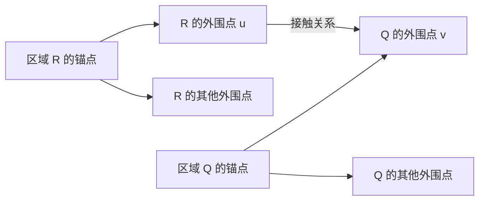

# Alg_onceoptimizer_beta：基于连续区域的一次性采样与图写入

日期：2026-09-11。状态：算法设计草案，尚未实现与验证。

本文按用户要求独立记录新优化器设计。目标是替换当前控制器与眼动优化器，以单帧、确定性的构图流程验证层级图记忆及位置检索；保留已经设计的 CNN、Gmem、Gpos 数据结构与相似度定义。本文的公式属于拟议算法，不代表现有代码已具备相应能力。

关联材料：[项目规范](../forGpt/gpt.md)、[图记忆先行设计](Alg_beta.md)、[原视窗口优化器](Alg_optimizer_beta.md)、[表征与位置检索审查](RepresentationLearn.md)、[当前实现](../../src/nns/memorygraphs/graph_memorypool_newoptimizer.py)。

## 1. 可行性判断与方案定位

该思路可行，尤其适合作为当前阶段的验证基线。先从固定 CNN 特征场中形成连续区域，再采样并写入图，可以将原来相互影响的三个问题分开观察：

1. 输入特征能否分离出连续面、边缘及曲线；
2. 采样和图写入是否正确保存了特征与相对位置；
3. Gpos 能否从这些记忆中找回相应特征及其空间结构。

建议将此模块命名为 **一次性区域构图器（OnceGraphBuilder）**。其中“一次性”指每幅输入独立执行一次完整构图，不依赖眼跳、疲劳、REVIEW 抢占或探索历史收敛；内部允许有限次区域合并，不要求只扫描一次像素。

保留用户方案的主干：

> 同模态局部连续性产生区域；每个区域以一个实际采样点为锚点形成星型关系；邻接区域通过少量接触点连接；跨模态关系由 GmemII 的关系集合组织。

需要修订的四点：

- **边的端点层级与存储层级分开描述。** 当前边可以连接两个 GmemI 节点，但边对象实际存放在 GmemII 的 `SemanticNode.relation_edges` 中。
- **连续区域不要求所有点与固定锚点特征相似。** 平滑曲线的方向会逐渐旋转，应该检查局部相邻点的一致性，而不是要求整条曲线平行于锚点。
- **几何验证首先保留采样实例身份。** 若不同位置全部复用相同原型 id，现有边结构不足以无歧义表达任意重复实例之间的关系。
- **分区结束不等于语义识别完成。** 新流程只能提供更稳定的输入记忆；现有 GposII/GposIII 的缺失能力仍须作为独立问题验证。

## 2. 与现有 Gmem／Gpos 的兼容边界

### 2.1 现有接口事实

| 对象或接口 | 当前作用 | 新构图器的用法 |
| --- | --- | --- |
| `FeatureDescriptor`、`SimilarityEngine` | 通道掩码、门控和分组相似度 | 复用契约；不把不同模态向量直接拼接后比较 |
| `GmemoryI.add_node()` | 注册 `ModalityNode`，没有独立的边池 | 保存选定位置的单模态特征描述子 |
| `GmemoryII.add_semantic_node(anchor_id)` | 创建锚点指向 GmemI 的关系容器 | 分别承载区域星型和区域接触关系 |
| `GmemoryII.add_relation_edge()` | 保存两个 GmemI id 之间的多重关系边 | 写入实际源点到目标点的相对几何 |
| `GmemoryIII.add_component()` | 组合 GmemII 节点 | 首版不必调用；以后可组织整幅视图或实体 |
| `Gposition.l1_footprint_projection()` | 对显式提供的节点生成特征位置响应 | 用于不受节点激活状态干扰的 GposI 验证 |
| `Gposition.l2_structure_synthesis()` | 不完整的结构检索原型 | 作为待测对象，不能作为分割成立的前提 |

因此，本文中的“GmemI 相连”严格指 **关系边的两个端点都是 GmemI 节点**，不表示给 `GmemoryI` 新增邻接表。区域同模态性由新写入器约束，不要求修改 Gmem 类。

当前 `GmemoryII` 的写边接口没有强制检查两端模态相同，因而能够用现有字段组织跨模态关系。但这比稳定文档中旧的“GmemII 仅包含同模态外围点”约束更宽。本文只让区域容器保持同模态，并单独使用关系容器表达跨模态接触，不把两种语义混在一个区域中。

### 2.2 两类 GmemII 容器

**区域容器** $S_R$：一个连续区域对应一个 `SemanticNode`，其锚点和外围节点属于同一模态。默认只存从锚点发出的星型边。

**接触容器** $S_{RQ}^{(j)}$：区域 $R,Q$ 的第 $j$ 个有效接触分量对应的小型 `SemanticNode`。最小形式以 $u\in R$ 为锚点，存储 $u\to v$，其中 $v\in Q$；$u,v$ 复用两侧区域中已经注册的采样节点。同模态区域和跨模态区域均使用该机制，跨模态时无需计算两端向量相似度。

这样，GmemI 端点组成“多个星型加稀疏桥接”的图，而桥接证据在 GmemII 中有明确归属。一个接触容器是局部关系记忆，不应被解释为已经识别出的物体。

容器类别、源区域编号等信息保存在构图器的 `BuildReport` 中，不新增 `SemanticNode` 字段。只保存 Gmem 后，仍可通过共享 GmemI id 及关系边追溯连接；若需要还原“区域／接触”的显式分类，须连同报告保存。



图中所有顶点均为 GmemI 节点。左、右星型分别归两个区域容器所有，`u → v` 归以 `u` 为锚点的第三个接触容器所有。没有新增 GmemII 节点之间的边类型。

### 2.3 为什么首版不把任意 peri–peri 边塞进区域容器

`l2_structure_synthesis()` 对每条边读取 `dst_id`，并统一以 `semantic_node.anchor_id` 为坐标原点；它尚未根据任意 `src_id` 重建源位置。因此把 $p_i\to p_j$ 的位移直接放进锚点为 $a$ 的容器，会让当前读取路径把这条位移误当成 $a\to p_j$。

首版采用以下约束以减小歧义：

- 区域容器只存 $a_R\to p_i$；
- 需要持久化的局部邻接或跨区域连接使用以实际源点为锚点的接触容器；
- 分割阶段的像素邻接图保留在诊断报告中，不要求全部写入持久记忆。

星型边用于保存区域的整体相对几何；接触边用于保存局部相邻关系，两者不应使用同一个“附近”半径限制。长曲线末端距离区域锚点很远，仍然需要星型边。

## 3. 输入、输出与运行约束

### 3.1 输入

输入为已经整理好的特征子空间：

$$
\mathcal X=\{X_m\in\mathbb R^{1\times C_m\times H\times W}\}_{m\in\mathcal M},
\qquad V\in\{0,1\}^{H\times W}.
$$

$V$ 为有效图像掩码。首版处理单帧、单张图；批量输入逐图处理，不允许跨 batch 形成区域。所有位置使用特征图上的 $(x,y)$，边的距离单位为特征图像素。

输入规范沿用现有设计：`grad=[abs_strength, theta, gradx, grady]`、RGB、Curv、aps、ori；方向角按现有转换得到弧度。保存预处理配置及坐标变换，避免把裁剪坐标、原图坐标和投影坐标混用。非线性视网膜投影下的位移只代表投影空间几何；首轮几何验证优先使用当前无该投影的输入路径。

缺失模态直接跳过；缺失通道根据既有 `feature_specs` 和有效通道规则处理。新增通道只有在契约给出门控与度量含义时才参与相似度，不猜测其物理意义。NaN、Inf 位置排除。全无效输入输出空构图结果及原因。

### 3.2 输出

1. 新增的 GmemI 节点及 GmemII 区域／接触容器；
2. 每个模态的区域标签、支持掩码、种子和锚点；
3. 采样实例到节点 id 的映射、边的实际源目标坐标；
4. 区域合并／拒绝原因、采样覆盖误差、缺失证据及预算截断记录；
5. 单独的只读 Gpos 评估结果。

区域标签、绝对坐标与参考掩码是写入器的过程信息及验证真值，不是 Gpos 检索时可以偷用的答案。导出的记忆图应能在不读取这些真值的情况下接受查询。

### 3.3 确定性

固定输入和配置时，种子、合并次序、采样及 id 分配可复现。并列值按 `(modality_id, y, x)`，边按规范化端点顺序处理。默认不随机采样。报告记录配置、输入标识和构建批次。

## 4. 统一局部连接模型

将分割理解为临时像素图上的局部亲和连接。它是优化器内部工作图，不是最终 Gmem。

对模态 $m$ 的有效候选点 $p,q$，定义：

$$
A_m(p,q)=S_m(p,q)\,K_m(p,q)\,\sqrt{Q_m(p)Q_m(q)}\,B_m(p,q),
$$

其中 $S_m$ 是沿用分组度量的特征相似度，$K_m$ 是空间连续核，$Q_m\in[0,1]$ 是支持可靠度，$B_m\in[0,1]$ 是穿越屏障的通行系数。连接还须同时满足各分量的必要阈值，避免高强度掩盖错误方向。

相似度只在相同模态、有效通道交集上计算。候选不足以支持原有度量时，标记为不可比较，不用零向量冒充有效特征。

### 4.1 可靠支持与种子

区分三个集合：

- **支持集合** $D_m$：用于判断连续路径的可靠 CNN 响应；
- **种子集合** $Z_m\subseteq D_m$：可靠支持中的代表性高响应点；
- **可写集合** $W_m$：能够通过既有描述子门控、形成有效 GmemI 原型的位置。

首版优先使用 $D_m=W_m$，使分割和检索的门控一致。如为跨越弱响应而放宽 $D_m$，弱支持点只参与分割，不直接写节点；必须报告这种差异。不能通过关闭写入门控来制造预期结果。

强度类可靠度来自有效幅值及邻域一致性；连续面可靠度可取

$$
Q_m(p)=\exp\!\left[-\frac{\operatorname{Var}_{\mathcal N(p)}X_m}{2\sigma_{Q,m}^2}\right],
$$

方差应按通道量纲标准化，只使用对应的连续性通道。RGB 黑色区域同样可以高度连续，不用 RGB 向量模长作为面域存在的必要条件。

强度种子取可靠幅值场中的非极大值抑制峰；面域种子取连续度高且远离支持边界的位置。常值平台只取确定性的代表点，不能把平台上每个像素都当成独立峰。没有严格峰但具有足够支持的连通分量，补选最高可靠度的可写点为种子；没有可写点则只记录支持区域。

### 4.2 一维与二维连续性的统一空间核

对 $q-p=\delta$，定义局部空间张量：

$$
\Sigma_m(p)=\ell_{\parallel,m}^2\,t_pt_p^\top
+\ell_{\perp,m}^2\,(I-t_pt_p^\top),
$$

$$
K_m(p,q)=\exp\left[-\frac14\delta^\top
\left(\Sigma_m(p)^{-1}+\Sigma_m(q)^{-1}\right)\delta\right].
$$

一维支持取 $\ell_\parallel>\ell_\perp>0$；二维支持取 $\ell_\parallel=\ell_\perp$，此时方向消失。两者共用亲和图和区域合并流程，差异集中在局部空间张量。

梯度 $(g_x,g_y)$ 指向边缘法向，故边缘切向为

$$
t_p=\frac{(-g_y,g_x)}{\sqrt{g_x^2+g_y^2}},
\qquad \sqrt{g_x^2+g_y^2}>\epsilon.
$$

不能直接沿梯度方向追踪边缘。其他模态优先使用契约中已有的可靠方向；没有方向的标量响应可从其局部支持坐标协方差估计主轴，只有各向异性足够强时才解释为一维支持。方向不可靠的位置保留为点事件或待定支持，不因 Curv 名称而自动认定其一定是一条曲线。

一维候选还需满足切向夹角和位移方向约束：

$$
|t_p^\top t_q|\ge\tau_t,
\qquad |t_p^\top\widehat\delta|\ge\tau_a,
\qquad |t_q^\top\widehat\delta|\ge\tau_a.
$$

切向按无向轴处理，允许沿曲线两侧扩展。初版用 8 邻域或固定小半径邻域；较大步幅必须检查中间支持，不能直接跨过背景连接两条邻近曲线。

### 4.3 屏障与有效边界

无效图像区域是硬屏障。二维面扩展时，可将可靠梯度边界作为软／硬屏障；边界证据取连接线段上的最大值，而不是仅看端点。没有梯度模态时，退化到本模态的局部差异，不假设边界已知。

一维边缘本身通常具有高梯度，因此不能用“高梯度即屏障”阻止一维扩展。屏障应反映跨法向跳跃、方向冲突或支持中断。

有效视野边界产生 `view_truncated` 标记，不能当作物体真实闭合边界。

## 5. 区域形成、扩散与合并

### 5.1 推荐实现：种子标记的受约束连通合并

为避免重新引入眼跳式调度，首版不模拟移动注视点，也不维护连续时间扩散方程，而用以下有限流程实现“沿相似连续支持扩散并融合”：

1. 对每个模态构造 $D_m$、$W_m$、种子及局部可接受边。
2. 每个支持点初始化为一个临时分量；种子作为分量标记。
3. 按亲和度由高到低遍历局部边，用并查集合并两端分量；合并前检查下述区域一致性与拓扑条件。
4. 多个种子进入同一合格区域时合并，保留种子列表；种子不是禁止融合的永久边界。
5. 最后为无种子但有可写点且满足最小支持量的分量补种子；无支持的碎片输出拒绝原因。

这是种子可达支持的离散聚合版本，种子负责表征与审计，不控制某个“眼睛”先去哪里。最终区域来自连续证据和合并约束，避免多源分水岭仅因种子较多而把均匀面永久切碎。

局部边集合和分量统计固定后，合并过程有限且可重复。默认只执行一轮排序合并；不进行“直到行为稳定”的状态竞争。

### 5.2 防止相似度传递造成面域漂移

仅要求 $S(p,q)$ 高会产生链式合并：每步颜色变化很小，最终却把明显不同的两端融合。二维面域除局部条件外，还需对合并后区域施加绝对属性范围约束。

以 RGB 的有效通道集合 $C$ 为例，维护每个区域的通道极值，定义

$$
D_{\mathrm{box}}(R)=
\sqrt{\frac1{|C|}\sum_{c\in C}
\left[\frac{\max_{p\in R}X_c(p)-\min_{p\in R}X_c(p)}{\sigma_c}\right]^2}.
$$

仅在 $D_{\mathrm{box}}(R\cup Q)\le\tau_{\mathrm{range},m}$ 时合并。该量是标准化成对距离的保守上界，维护成本低；可能在异常点附近过分割，首版接受可解释的过分割，不用不断更新区域均值来掩盖漂移。门控先排除明显噪声，剩余异常及其造成的分裂在报告中显示。

非 RGB 模态只对具有明确绝对属性意义的通道启用该约束。禁止把周期方向角直接放入普通最大最小范围。

合并统计使用固定的有效通道集合；当两个分量的有效通道集合不同，先检查交集是否足以支持对应度量，不足则不合并。不得随着合并不断删去冲突通道，使区域范围检验失效。

### 5.3 平滑曲线的融合

曲线合并要求局部切向连续、支持连通和交接处曲率变化合理，**不要求曲线所有方向接近某个固定角度**。因此长弧线甚至闭合曲线可以属于同一区域；星型锚点仅在分割完成后选定，不参与全曲线方向限制。

交叉、分叉与尖角附近若出现多个不相容的方向分支，默认停止跨事件合并，将各分支作为独立区域，并把交点作为接触证据。可靠的缓慢转向继续融合。首版不猜测遮挡后的轮廓归属，也不强行把交叉线解释成一个物体。

一维支持可先对幅值沿法向做非极大值抑制以收窄宽响应带；保留原带宽作支持证据。若形成的中心线或局部邻接仍有分叉，按分叉点切段。没有可靠方向时不执行依赖方向的细化。

可操作的分支判据是：在候选点的小邻域中，先将相邻支持按空间方向聚成连续出口；超过两个独立出口时标记分支事件。避免直接把 8 邻域的像素度数大于 2 当成分叉，因为斜线栅格也可能满足该条件。分支点从普通线域的合并通路中移出，单独保留为事件支持，并记录每个邻接分支；这样并查集不会经交点传递地把所有线段合为一体。只有事件位置能通过既有描述子门控时才注册其节点，否则用附近可写端点建立接触关系，并报告事件位置本身不可写。

### 5.4 小间隙和区域重叠

首版默认不跨无支持间隙合并。以后若启用有限间隙连接，必须同时限制间隙长度、两端切向、预测误差及沿线弱支持；报告中标为插补，不能与实测连续性混淆。

同模态区域核心默认互斥；不同模态的区域允许在同一像素重叠，因为颜色面、曲率和边缘本来可能共存。交点和区域接触处可共享采样点，但共享点不触发整个区域再次合并。首版无需实现任意软重叠掩码。

## 6. 区域锚点与重要采样点

### 6.1 锚点选择

锚点必须是 $R\cap W_m$ 中可写的实际位置，保存该点的真实 CNN 特征，不能把可能落在孔洞或背景上的质心当成原型。

- 二维区域：优先选择距区域边界较远、可靠度高的点；并列时选更接近区域质心的位置，再按坐标打破并列。
- 一维无分叉曲线：优先选择沿曲线弧长接近中点的可靠采样位置。闭合曲线用可靠度和坐标确定唯一锚点。
- 小型点事件：选可靠度最大的位置。

跨图像锚点不保证落在同一个物理位置，尤其对于对称、均匀区域；这必须作为检索难度记录，不应把确定性的坐标选点等同于旋转不变锚点。

### 6.2 一维采样

必须保留端点、方向分支接触点、显著转折点及闭合接缝；其余点沿中心线按弧长稀疏采样。限制相邻采样点之间的最大弧长，并控制该段折线对原支持曲线的最大偏差：

$$
e_{\mathrm{curve}}=
\max_{p\in\Gamma}\operatorname{dist}(p,\widehat\Gamma)
\le\epsilon_{\mathrm{curve}}.
$$

这里只把误差作为采样标准和诊断量；当前 Gmem 不保存显式样条模型。为使点序关系可从持久记忆中追溯，可为相邻采样点额外建立小型局部接触容器；是否启用由配置决定，首版几何星型验证可关闭。

### 6.3 二维采样

至少包含锚点、外边界附近的可写点、孔洞边界附近的可写点、与其他区域的接触点及稀疏内部覆盖点。使用区域内最远点采样，直到覆盖误差达标或预算用尽：

$$
e_{\mathrm{cover}}(R,P_R)=
\max_{p\in R}\min_{q\in P_R}d_R(p,q).
$$

$d_R$ 为限制在区域内的路径距离，避免隔着孔洞或狭长凹口误判已经覆盖。首版可以用网格最短路径近似；若采用欧氏距离加速，应明确其覆盖误差偏乐观。

真实边界像素若不通过 RGB 连续性门控，选取区域内最近的可写点，记录向内偏移及未覆盖边界。禁止把边缘像素强行写成 RGB 面原型。若整个狭窄区域都无可写点，报告该门控限制，而不是伪造区域节点。

### 6.4 采样预算

预算按模态及区域面积／弧长分配，保留锚点和接触必需点后再分配覆盖点。先识别区域接触，再完成最终采样，以保证跨区边端点已存在。预算不足时记录误差和截断；不能通过丢掉小模态全部节点而报告“已完整构图”。

采样点数是表示精度参数。固定 CNN 输出时，增密采样应主要改善几何覆盖，而不改变已确定的区域分割。

## 7. 特征原型与空间实例的处理

### 7.1 不可忽略的表示限制

现有 `ModalityNode` 可以被作为可复用原型，但其 id 不含观察实例身份。多个同色位置映射到同一 id 后，会出现 $n\to n$ 的几何关系；不同位置之间的一般连接也可能共享相同 `(src_id,dst_id)`。

多重边能保存部分不同位移，但不能完整恢复“哪一次源实例连接哪一次目标实例”。当前 GposII 还跳过 `src_id==dst_id` 的边。因此，不能同时保证“所有相似特征都折叠为同一原型”与“任意采样实例的几何关系完全保留”，而又完全不改变现有表示。

### 7.2 首版选择：一次构建内按采样实例注册

推荐基线采用 `node_reuse_mode='sample_instance'`：

- 一个唯一的 `(build_id, modality_id, x, y)` 注册一个 GmemI 节点；
- 同一次构建中，同模态同位置被区域和接触容器共同引用时复用该节点；
- 不同位置即使特征相同，也注册不同 id；不同模态始终使用不同 id；
- 只调用现有 `add_node()`，不新增节点字段，不把坐标拼入特征向量；
- 节点保存真实特征及既有掩码，绝对位置映射存在构图报告中。

这是写入策略的变化，没有改变 Gmem/Gpos 类定义，但暂时牺牲跨位置、跨图像的原型压缩。均匀区域可以有多个数值相同而 id 不同的节点；这恰好让星型中的多个位置实例可区分。

首版实验每个场景使用独立记忆，或者显式记录批次 id 列表；不宣称已解决长期记忆去重、容量控制和跨帧实例匹配。

### 7.3 原型复用作为独立对照

可另外设置 `node_reuse_mode='prototype'`，调用既有匹配／更新逻辑评估压缩率。该对照必须报告 id 折叠、自环数量、多重边合并及几何可恢复性的变化，不作为首版默认。

不要把实例编号写进 CNN 特征，也不要通过扰动特征向量强迫原型分开。GposI 应对相同特征给出相同响应；几何区别本来就应由边和实例身份承担。

## 8. 星型区域与区域接触的写入

### 8.1 几何编码

对真实源点 $p_u=(x_u,y_u)$ 和目标点 $p_v$，令

$$
\Delta p_{uv}=p_v-p_u,\quad
r_{uv}=\|\Delta p_{uv}\|_2,\quad
\rho_{uv}=\log\max(r_{uv},\epsilon_r),\quad
\theta_{uv}=\operatorname{atan2}(y_v-y_u,x_v-x_u).
$$

沿用现有 `rho_offset`、`theta_offset`、`lambda_rho`、`gamma_theta` 字段与合并规则，不重新定义其物理意义。`span` 可记录实测距离；`area` 仅在有明确支持面积时填写，否则使用既有默认值，不拿相似度冒充面积。

反向关系应重新计算角度，或取 $\theta_{vu}=\operatorname{wrap}(\theta_{uv}+\pi)$；其对数距离不变。不能把反向边写成 $(-\rho,-\theta)$。默认仅存一个规范方向，验证时按需要推导逆向。

不同模态可能在同一像素接触，$r=0$ 时沿用 $\epsilon_r$ 及约定角度 0 编码，并在报告中标记共位。该近零距离小于现有对数极坐标检索的基础半径，首版只验证其存储；不宣称现有 GposII 能检索共位关系。

### 8.2 区域写入

对每个区域 $R$：

1. 注册其采样实例，得到 $n(p)$；
2. 调用 `add_semantic_node(n(a_R))`；
3. 对每个 $p\ne a_R$，调用 `add_relation_edge(S_R,n(a_R),n(p),...)`，默认 `role='peripheral'`；
4. 所有子节点模态一致，不因为不同模态在同一位置出现就加入该区域；
5. 原子地提交这一容器及其完整边集合，防止失败后留下半个星型。

这里的“原子”是新写入器的校验与提交职责：先在临时计划中核验描述子、id 分配、几何和预算，再提交；异常时回滚本批次新建项，不要求给 Gmem 新增事务接口。

### 8.3 区域间连接

先在临时区域图上判断邻接，再选接触点。面域以边界的有限半径接近、实际接触或跨模态支持重叠为候选；曲线以端点／分支接触或可靠局部邻接为候选。纯空间上接近但中间隔着明确屏障的同模态区域，不自动相连。

对候选区域对 $(R,Q)$，将接触集合分成空间连通的接触分量。在每个分量中选可靠且距离较近的可写点对 $(u,v)$；长接触带可按间距再取少量点对。规范排序后，每对只写一次：

$$
S_{RQ}^{(j)}=\operatorname{SemanticNode}(\operatorname{anchor}=n(u)),
\qquad e_j:n(u)\to n(v).
$$

默认使用既有 `role='peripheral'`，具体属于“区域接触”由报告识别，避免引入现有消费者不能解释的新角色。可以在以后控制器适配时添加角色字符串，但不是首版必要条件。

连接数量由接触分量与接触采样间距决定，不对两个区域的全部 peri 做笛卡尔积，也不对整幅图进行全连接。

同模态但不满足合并条件的相邻区域可以保留弱邻接证据；跨模态使用接触、重叠和边界依附证据，**不使用 RGB 与梯度之间不存在共同含义的向量相似度**。这些连接只说明空间联系，不直接推出“属于同一对象”。

如果两个区域共享同一个同模态采样实例，已通过共同 id 连通，不另写零位移自环；不同模态的共位采样有不同 id，按上述共位规则处理。

### 8.4 写入完成与节点动力学

构建阶段不按像素调用旧 `run_step()`，不把遍历顺序模拟成神经元时间。节点激活与不应期仍保留在原类中，初始状态沿用类默认值。

`is_completed=True` 在本方案中只表示“本次限定视野和采样目标内，该关系容器写入完毕”。若预算导致覆盖目标未满足，保持未完成；对视野截断区域记录 `view_truncated`，即便局部采样已完成，也不能把它判为真实闭合轮廓。`is_closed_contour` 只有在实际检测到闭环且无截断时才允许设置。

`explore_time` 不填像素遍历次数，保留默认值；可根据采样计算 `max_span`。没有明确测量依据时，不为了通过旧阈值而填充 `boundary_coverage`、颜色统计或其他探索字段。

完成后的 GposI 首轮评估显式投影本批次节点，独立于激活门限。激活传播、疲劳和不应期作为后续单独实验，不能用 `is_completed` 代替检索正确性。

## 9. 与当前检索能力的关系

一次性构图可以消除眼跳循环对写入的干扰，却不会自动修复已有 Gpos：

1. GposI 可以验证特征原型在新输入上的响应位置；同色或同方向实例拥有相同响应是合理现象。
2. 现有 GposII 只选单个最佳锚点，`_generalized_distance_transform()` 仍只是平滑，未使用边位移及弹性参数；不能据其高分证明结构匹配正确。
3. 当前不存在完整的 GposIII 位置检索接口。
4. 稀疏星型能保留选定点的几何，不等于连续区域全部像素已被无损存储。若删去过程掩码后无法区分某些孔洞或轮廓，需报告采样／表示限制。

可在独立验证脚本中实现一个只读参考判据，用于区分“边没有写对”与“检索器没有利用边”，不替换 Gpos，也不参与分割反馈。对纯星型在固定尺度和方向下定义：

$$
\log S_R(c)=\log(S_a(c)+\epsilon)
+\frac1{|E_R|}\sum_{e=(a,v)}
\log\left[\max_{\|z\|\le r_{\mathrm{tol}}}
S_v(c+\widehat{\Delta p}_e+z)+\epsilon\right].
$$

其中 $\widehat{\Delta p}_e$ 由存储边解码，越界位置视为无支持，非整数位置采用明确的插值规则；无外围边的容器只评估锚点响应。查询真值、原区域掩码和原绝对位置不得传入这个判据。它只是一种几何核对基线，未约束不同目标实例的一对一分配，不能代表完整的多实例、遮挡和变形识别。

先验证平移；尺度和旋转需要显式变换候选，不能沿用当前 `s_star/theta_star` 的返回值就宣布实现不变性。

## 10. 模块划分与执行顺序

拟议模块全部位于新控制器／优化器侧：

| 模块 | 责任 |
| --- | --- |
| `FeatureSupportBuilder` | 输入适配、缓存门控、可靠度、切向及有效视野 |
| `LocalAffinityBuilder` | 生成同模态局部亲和边和屏障证据 |
| `ContinuousRegionAssembler` | 种子标记、受约束合并、分支和截断处理 |
| `RegionSampler` | 锚点、边界／曲线／内部采样及覆盖评估 |
| `RegionContactBuilder` | 区域邻接、接触分量及跨区端点选择 |
| `GraphWriteAdapter` | 实例注册、星型与接触容器写入 |
| `OnceGraphBuilder` | 有限流程编排、批次管理与输出报告 |

描述子构建复用旧控制器中的纯特征处理规则，可抽取或移植到新适配模块，并预先缓存整图门控；不能为了复用一个私有方法而执行旧控制器状态机。首次实现时逐项核对与既有描述子结果一致性。

```text
build_once(features, valid_mask, memory, config):
    inputs = adapt_and_validate(features, valid_mask)
    supports = compute_supports_gates_and_directions(inputs)
    regions = []
    for modality in canonical_order(inputs):
        seeds = select_seeds(supports[modality])
        affinity = build_local_affinity(supports[modality])
        regions += constrained_component_merge(affinity, seeds)

    contacts = find_region_contacts(regions, supports)
    samples, anchors = sample_regions_and_contact_endpoints(regions, contacts)
    descriptors = describe_writable_samples(inputs, samples)
    plan = prepare_instance_nodes_and_star_contact_edges(descriptors, anchors)
    validate_plan_and_commit(plan, memory)
    return build_report(regions, contacts, samples, plan)
```

分割、采样和写入接口分别支持保存／加载中间结果。查询调用单独执行，查询输入默认只读记忆，不调用 `build_once()`；避免“先把测试图写进去，再证明能识别测试图”的数据泄漏。

## 11. 配置与复杂度

新增参数集中在构图器的配置类中，既有模态度量、写入门控与边容差继续读取 `MemoryConfig`。首版不同时搜索所有参数。

| 参数组 | 物理意义 |
| --- | --- |
| `support_threshold[m]`、`seed_threshold[m]` | 连续支持准入和可靠种子准入 |
| `seed_nms_radius[m]` | 平台／密集峰抑制的空间尺度 |
| `neighbor_radius[m]`、`ell_parallel/perp[m]` | 可连接的局部空间范围及方向偏好 |
| `similarity_min[m]`、`tangent_min[m]`、`alignment_min[m]` | 局部特征及方向一致性 |
| `range_max[m]` | 面域绝对属性允许变化范围 |
| `min_support[m]` | 最小可信面积、弧长或事件支持量 |
| `curve_spacing`、`curve_error`、`surface_cover_radius` | 图表示的几何采样精度 |
| `contact_radius`、`contact_spacing` | 区域接触范围及桥接密度 |
| `sample_budget[m]`、`region_budget` | 可审计的资源上限 |
| `node_reuse_mode`、`write_local_contacts` | 实例／原型策略与局部邻接写入开关 |

距离参数均注明特征图像素单位；改变输入分辨率时相应缩放。阈值不等同于模态之间可直接比较的概率，必须分模态配置。首轮只启用 grad 与 RGB，随后逐个接入其他已有模态。

令有效支持点总数为 $N$、局部邻居数为常数 $k$、采样点数为 $P$、接触边数为 $J$：局部图构建约为 $O(kN)$，边排序约为 $O(kN\log(kN))$，并查集合并近线性；内存约为 $O(kN)$，另计特征张量。

最远点采样朴素实现可能达到 $O(PN)$，区域路径距离计算另有代价，应使用增量距离更新并设预算；不能把整个方案笼统宣称为线性复杂度。区域邻接通过标签邻域或空间分桶构建，避免 $O(|\mathcal R|^2)$ 全对比较。

星型持久边数量约为 $P-|\mathcal R|$，加上 $J$ 条接触边；接触容器数量也随 $J$ 增长。实例模式会增加重复原型投影成本，首版限定图像和采样规模，先换取可解释性。

上述星型计数假设区域采样互不共享；允许共享点时，准确计数为 $\sum_R(|P_R|-1)$。分支出口判定、路径距离和接触搜索均计入构建耗时，分别统计，便于判断优化器是否只是把眼跳复杂度转移到了分割。

## 12. 验证计划与判据

以下为供用户执行的验证计划，本次文档工作不代表已运行这些实验。

### 12.1 分割与采样

| 输入 | 预期现象 | 主要排查点 |
| --- | --- | --- |
| 单一均匀色块，包括黑／灰 | 一个主要 RGB 连续区域 | 平台种子、小幅噪声和面门控 |
| 两个相邻异色色块 | 分开区域，接触关系局部可见 | 面域漂移和屏障穿透 |
| 两个分离的同色色块 | 两个区域，相同特征允许高相似 | 不能按颜色全局合并 |
| 长直线、平滑弧线、闭合曲线 | 各自形成主要连续线域 | 切向／法向混淆及固定锚点方向限制 |
| 平行近邻线、十字与 T 型交点 | 不横跨粘连，交点保留分支联系 | 邻域半径、方向约束和分支规则 |
| 带孔面域、凹形区域 | 边界和孔洞附近有采样证据 | 覆盖距离与锚点落在空白处 |
| 单调颜色渐变 | 合并受范围约束，结果可解释 | 防止无界链式漂移；不要求未实现的新特征族 |
| 有填充边、部分模态缺失 | 不在无效区写入，剩余模态可处理 | 输入契约与有效视野 |

展示原图、各模态支持、种子、合并结果、锚点、采样点和拒绝连接。对真实图像不先指定必须产生几个“物体”，因为这里提取的是感知区域。

### 12.2 记忆写入

- 每个节点原型可追溯到对应有效采样位置，模态与掩码正确。
- 实例模式下，不同位置不因特征相同而折叠；同位置同模态的跨容器引用不重复建点。
- 解码每条非零位移边后，应恢复其源目标差；误差来源只应是声明的浮点容差及既有边合并规则。
- 区域容器保持同模态纯净；接触容器共享两侧采样 id，连接的确存在空间证据。
- 固定输入重复构建得到相同区域、坐标及规范化图结构；重复构建测试在独立记忆中进行，不能把向同一池再次追加当成幂等操作。

### 12.3 位置检索

先写训练视图，冻结节点与边，再对原图和平移图查询。分别记录 GposI 召回、锚点位置误差、结构响应及目标相对干扰物的分数，而非只看最大响应是否很高。

必须加入 **特征相同但排布不同** 的负例，如左右顺序交换、间距改变、部分节点移位；单靠颜色或方向共现能通过的测试不足以验证层级记忆。

对重复特征图案，应允许 GposI 多峰，但高层应区分排布。对几何完全对称、特征完全相同的场景，记录多解，不要求不存在的信息给出唯一身份。

现有 GposII 若不能区分这些负例，报告为高层检索能力未实现／不足，不通过反复调分割参数来遮掩。使用参考判据时，单独标注其结果，不能与现有 Gpos 的结果合并统计。

### 12.4 推荐落地顺序

1. grad／RGB 支持与区域分割，只导出可视化；
2. 实例模式采样、纯星型写入，验证相对几何；
3. 增加稀疏接触容器，验证区域间及跨模态连接；
4. 冻结记忆评估 GposI，并揭示 GposII 的结构检索差距；
5. 再比较原型复用、额外模态和更大规模输入。

第一版不需要 REVIEW、眼跳轨迹、动态工作视窗或新的 CNN 特征族。其完成标准是产生可复现、几何可核验、可供检索测试的层级图输入，而不是宣称已经实现完整物体识别。
