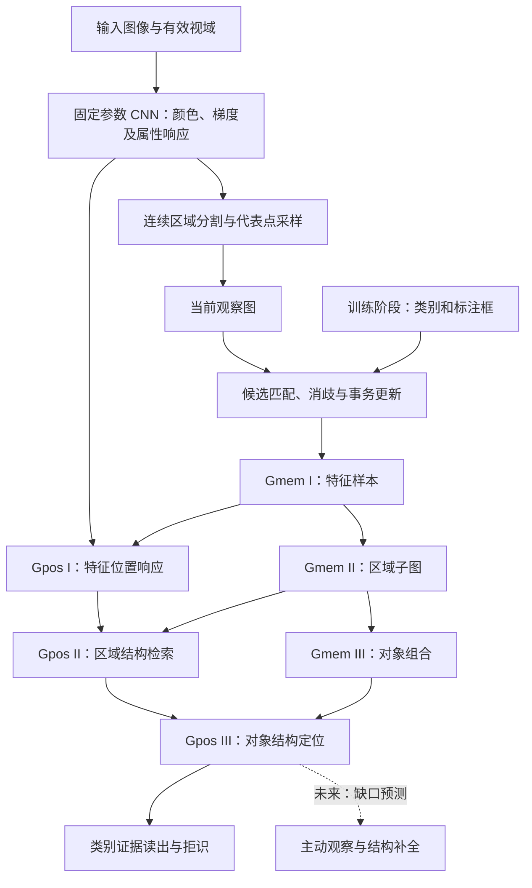

# 博士研究计划：面向持续视觉学习的可解释层级超图记忆与空间检索

**英文题目：Hierarchical Hypergraph Memory and Spatial Retrieval for Interpretable Continual Visual Learning**

**研究方向：**视觉表征、结构化记忆、组合学习与持续学习。  
**版本日期：**2026-09-22。  
**研究基础：**Conscious-demo 已实现的原型及其保存的实验结果。本计划区分已实现机制、初步实验证据与拟开展研究；文中的“模态”主要指颜色、梯度和方向等视觉属性族，不代表已经实现跨传感器多模态学习。

## Abstract

持续视觉学习不仅需要识别当前输入，还需要保存对象的组成关系，在后续观察中定位已知结构，并将重复证据转化为稳定且可修正的记忆。本研究拟构建一种将长期结构记忆与即时空间响应分离的层级超图模型：固定参数视觉编码器提取局部特征，Gmem 以“特征样本—连续区域—对象组合”三级结构保存视觉内容及其相对关系，Gpos 在当前输入中逐层检索这些结构的位置。该模型的核心优势在于：识别结果可追溯到具体特征与空间关系，同一局部结构能够参与多个高层组合，新观察则可通过更新局部节点、关系和证据写入，而无须在每次写入记忆时重新训练整个视觉编码器。这些结构性质为可解释、可组合的增量学习提供了基础；它们能否带来更高的样本效率、更好的记忆保持和资源效率，仍有待实验验证。

现有原型已实现区域构图、三级结构检索、二进制粗筛、标注框监督写入与冻结回查。在 PASCAL VOC2007 的 20 张图像、34 个标注对象上，模型完成全部对象的记忆写入，最终冻结记忆对全部 34 个训练对象均检索到对应实体。该结果验证了小规模观察记忆的保存与检索闭环，但尚不足以证明跨图像泛化能力：全部对象目前仍各自建立新实体，多数关联也尚未完成消歧。博士阶段将重点研究跨观察的部件对应与记忆巩固、部分可见条件下的结构检索，以及增长图上的判别读出和持续学习评价，并进一步探索视频监督、结构补全与主动感知。目标是建立一个能够从具体观察逐步形成稳定视觉结构、同时保留可追溯证据的计算框架。

**关键词：**层级超图；视觉记忆；空间检索；增量学习；弱监督；组合泛化。

### English Abstract

Continual visual learning requires not only recognizing inputs but also retaining their constituent structures, locating familiar configurations, and consolidating repeated observations into revisable memories. This project proposes a hierarchical hypergraph framework that separates persistent structural memory from transient spatial responses. A fixed-parameter visual encoder extracts local features. A three-level memory hierarchy represents feature samples, continuous regions, and object-level compositions, while a corresponding spatial hierarchy retrieves these structures in new observations. The framework provides explicit links between recognition decisions, visual evidence, and spatial relations; supports shared components across higher-level compositions; and permits local memory updates without retraining the entire encoder for each observation. Whether these architectural properties improve sample efficiency, retention, or resource efficiency remains an empirical question.

The current prototype implements region-based graph construction, hierarchical retrieval, binary coarse filtering, bounding-box-supervised memory admission, and frozen-memory audits. On a subset of PASCAL VOC2007 containing 20 images and 34 annotated objects, all objects were stored, and all 34 corresponding entity memories were retrieved during a final training-set recall audit. These results establish a small-scale storage–retrieval loop, rather than cross-image generalization: all observations created new entities, and most reuse associations remain unresolved. The proposed doctoral research will investigate cross-observation correspondence and consolidation, structural retrieval under partial visibility, and classification and continual-learning evaluation for growing graphs. Further extensions will explore video-based supervision, structural completion, and active perception. The intended outcome is an interpretable visual memory system that transforms individual observations into stable, reusable structures while preserving their evidential provenance.

## 1. 研究背景与核心问题

本项目源于对生物视觉中层级组合、记忆再激活和主动观察的关注。博士研究将这一动机转化为可度量的计算问题：**如何从连续视觉输入中形成可复用的结构记忆，并在后续输入中可靠地检索、定位和修正这些记忆？** 生物学启发仅用于提出机制，不能作为模型具有意识或人类学习能力的依据。

研究对象是视觉编码与任务输出之间的记忆层。一个对象既有颜色、方向等局部属性，也有部件的排列关系。如果记忆只记录属性是否出现，就难以区分“相同特征、不同排列”；如果每次观察都保存完整且独立的模板，又难以形成可复用的知识。本研究拟通过显式的层级子图、观察来源和空间约束，在具体实例保真与跨观察共享之间建立可控制的更新机制。

围绕这一目标提出三个研究问题：

1. **表征与巩固：**如何区分特征类型、观察实例和结构角色，使多个观察共享稳定部件，同时避免错误合并不同对象？
2. **检索与定位：**如何在遮挡、分区变化及有限检索预算下，联合判断特征相似性和空间一致性，并区分匹配失败与搜索不充分？
3. **持续学习与判别：**如何让不断增长的记忆服务于固定维度的任务输出，并在学习新数据时保持旧记忆、控制冗余和提供可信的拒识？

本研究的主要假设是：显式角色及几何关系能够在特征共现之外提供判别信息；来源去重和跨观察巩固能够将重复实例压缩为稳定结构；来源分组与不确定性建模能够减少同源属性重复计权。这些假设均需与受控基线进行比较，而不能仅凭采用图结构这一事实推得。

## 2. 现有模型框架

### 2.1 总体结构

模型包含固定视觉前端、长期记忆 Gmem、即时位置响应 Gpos，以及负责观察、检索和写入的控制与优化模块。这里的“双塔”指持久记忆与即时响应的功能分工，并非两个通过对比学习训练的向量编码器。

为使记忆机制能够被独立验证，当前主流程采用确定性的一次观察构图器 `onceoptimizer`。早期的 MACRO/MICRO/REVIEW 眼跳路线保留了主动感知思想，但不作为当前批量学习闭环的必要前提。“优化器”在此主要指图构造、对应和更新程序，不等同于训练固定 CNN 的梯度下降优化器。

### 2.2 各层定义及职责

| 层级 | 长期记忆中的节点与关系 | 当前输入中的响应及作用 |
| --- | --- | --- |
| GmemI / GposI | 节点保存带视觉属性类型、有效通道和来源的特征描述符。当前构图保留不同采样位置的实例身份，尚不能视为已经充分压缩的全局特征字典。 | GposI 计算某种特征在当前视域中的相似度响应，回答“哪里具有这种局部属性”。 |
| GmemII / GposII | 一个节点组织连续区域的锚点、外围采样点和相对位置关系。区域间接触关系通过低层端点表示，并可建立区域层的逻辑关联索引。 | GposII 检查一组局部特征是否按照记忆中的相对位置出现，输出区域模板与位置假设。 |
| GmemIII / GposIII | 一个节点组织多个 GmemII 成员角色、相对位置及证据。一个区域可参与多个实体；同一组件重复出现时须保留不同角色。 | GposIII 联合多个区域的证据定位对象组合；当前采用平移模式的空间精验。 |

必须区分关系的**物理存放位置**与**数学端点层级**。例如，区域星型边可以存放在 GmemII 容器中，但其端点仍是 GmemI 采样节点；它不是两个 GmemII 节点之间的边。高层从属关联则记录“哪个组件以什么角色属于哪个父结构”，不能混同为同层邻接。

Gpos 主要是随输入重建的位置假设、响应和匹配关系，不是另一份独立训练的长期知识库。

## 3. 核心算法

以下公式给出统一的研究表述。明确标为“拟研究”的机制尚未完成；已有机制的公式用于解释其功能，并不表示其逐项等同于所有实现分支。

### 3.1 层级超图：将带关系的子图作为高层节点

设第 $l$ 层的结构为 $G^{(l)}$，一个高层节点可表示为：

$$
h^{(l+1)}=(U_h,E_h,A_h,a_h,\Xi_h),
$$

其中 $U_h$ 是选中的下层节点，$E_h$ 是被选中的关系，$A_h$ 是成员角色关联，$a_h$ 是参考锚点，$\Xi_h$ 保存几何统计、证据及来源。不同高层节点可以共享下层节点和关系，因此层级不是互斥的树。

仅用无序集合 $\{u_1,\ldots,u_k\}$ 表示一个超边，会丢失排列、重复次数和角色。当前模板形式可以理解为一种**带属性、角色和内部关系的层级超图表示**；只有保留这些信息，“模板”与所需的超图编码之间才能相互转换；但即便如此，也不能认为它与任意普通超图完全等价。

同一对特征可以在不同结构中形成不同相对位置模式。因而关系必须具有父结构作用域，必要时保留多条关系实例，避免将树叶与草地中相同绿色的空间外延混在一起。图的可组合性来源于共享引用，具体共享是否正确则由后续对应与验证决定。

### 3.2 特征合同：分离有效性、相似度与几何上下文

给定图像 $I$，固定编码器产生属性场 $X_m(p)$。每种属性具有门控函数 $g_m(p)$、相似度通道掩码以及专用度量：

$$
R_i(p)=M_{\mathrm{valid}}(p)\,g_{m_i}(p)\,\operatorname{Sim}_{m_i}(X_{m_i}(p),w_i).
$$

颜色使用欧氏距离型相似度，轴向方向使用周期为 $\pi$ 的度量。例如：

$$
S_{\mathrm{RGB}}(x,w)=\exp\!\left(-\frac{\|x-w\|^2}{2\sigma_c^2}\right),\qquad
S_{\mathrm{ori}}(\theta,\phi)=\left[\frac{1+\cos 2(\theta-\phi)}{2}\right]^\gamma.
$$

梯度强度负责判断边缘是否可信，方向及梯度向量负责相应的几何和相似度计算。未通过门控的通道不应作为有效的零特征参与匹配；数值修复也不能替代有效性判断。输入裁切和填充同时传播有效视域，以避免把人工边缘写入记忆。

现有 `curv` 主要是二阶导响应，`aps` 主要是局部梯度各向异性。它们不能直接等同于真实轮廓曲率和矩形长宽比。区域长宽比、延展率、闭合度等几何描述符是后续需独立规范、验证的特征族。

### 3.3 从特征场构造区域图

对空间相邻且有效的采样位置 $p,q$，构造属性相似性与局部连续性的联合亲和度：

$$
A_m(p,q)=S_m(p,q)K_m(p,q)\sqrt{Q_m(p)Q_m(q)}B_m(p,q).
$$

其中 $Q_m$ 是响应可靠度，$K_m$ 表示空间连续性，$B_m$ 表示边界阻断或相容性。一维边缘沿局部切向连接，二维颜色区域在相容邻域内扩展。通过种子、局部连通合并和区域一致性约束形成连续区域；区域级约束用于防止一串局部相似点逐步连接成整体差异很大的区域。

当前高级属性采用 **grad 父区域内细分**：先完成 grad 分割，再让 `curv`、`aps`、`ori` 在对应父区域及其邻接拓扑内执行各自的有效性和连续性判断。它们可以细分父区域，但不能越过父区域另行扩张，也不直接复制整块 grad 掩码。RGB 保持独立的面域分割。不同属性区域可以重叠，并以共同的来源组标记其相关性。

对每个区域，选取有效锚点与少量代表点。曲线保留端点、分叉及沿路径的覆盖，分支按不重复边路径采样；面域结合边界和内部覆盖。由此构造区域星型，并在接触位置建立稀疏跨区域关系。若有 $n$ 个代表点和 $k$ 条跨区域接触，边的存储量约为 $O(n+k)$，而非要求全部采样点两两连接；这不意味着整个分割或检索过程具有线性复杂度。

### 3.4 相对位置编码与三级统一检索

区域内采样点 $i$ 相对锚点 $a$ 的位移为 $d_i=p_i-p_a$。关系可用笛卡尔形式或距离、角度形式保存，例如：

$$
\rho_i=\log(\|d_i\|+\epsilon),\qquad
\theta_i=\operatorname{atan2}(d_{iy},d_{ix}).
$$

GmemIII 的成员区域 $j$ 相对实体参考点的偏移为 $b_j$，该区域内部采样点的偏移为 $d_{ji}$，则统一参考系下的位置是：

$$
z_{ji}=b_j+d_{ji},\qquad \hat p_{ji}=c+sR_\varphi z_{ji}.
$$

偏移必须先在笛卡尔空间合成，不能直接相加极坐标角度和对数距离。该“虚拟统一锚点”使 GposIII 能复用局部结构的匹配方法，而无需修改底层图的真实连接。当前验证采用 $s=1,\varphi=0$；尺度和旋转搜索属于后续扩展，不能因为采用了裁切归一化，就推论模型已经具备相应的不变性。

特征事件可通过 $c=p-z_{ji}$ 为参考点位置投票，再精验候选位姿。一个解释性的评分形式为：

$$
D_i(c)=\max_{p\in\Omega_i(c)}R_i(p)\exp\!\left[-\tfrac12(p-\hat p_i)^T\Sigma_i^{-1}(p-\hat p_i)\right],
$$

$$
\log S_h(c)=\frac{\sum_{i\in\mathcal E(c)}w_i\log(D_i(c)+\epsilon)}{\sum_{i\in\mathcal E(c)}w_i+\epsilon}.
$$

这里 $\mathcal E(c)$ 是可评估角色集合。实际接受还要求可评估覆盖、命中覆盖和角色分配等约束，不能仅凭一个高分判断整个实体成立。不同物理部件不能占用同一份位置证据；同一 grad 来源派生出的多个属性也不能被当成多份独立观察。

为限制碎片数量对评分的影响，当前采用来源组计权，其原则可写为：

$$
w_{fr}=W_f\frac{q_{fr}}{\sum_{r'\in f}q_{fr'}+\epsilon}.
$$

$W_f$ 控制来源组的总证据预算，$q_{fr}$ 表示组内角色质量。分片增多不应自动增加该来源的总权重。对分区变化的完整多对多对应仍需进一步研究。

### 3.5 二进制粗筛与连续精验

粗筛将可检测的特征类别或相容桶编码为位，并用倒排表找到相关区域和实体。它的作用是降低需要连续相似度与几何验证的候选数量。包含“红色”和“近圆轮廓”的编码只能说明组合可能存在，不能保证这两种特征属于同一对象，更不能单独区分苹果与红球。

若要求粗筛不漏掉精验能够接受的结果，必须满足：

$$
\operatorname{Accept}(h,x)\Rightarrow\operatorname{Keep}(h,x).
$$

当前已有保守区间粗筛机制，但完整检索仍包含采样、候选限额和补充搜索等步骤。局部安全排除不等于端到端搜索完备；一次未召回不能直接解释为“从未见过”。后续将明确区分“已证明不匹配”“搜索不完整”和“存在竞争解释”。

若全库有 $N$ 个模板，精验成本为 $V$，粗筛留下 $K$ 个候选，则收益条件为：

$$
T_{\mathrm{encode}}+T_{\mathrm{index}}+KV<NV.
$$

相同编码允许对应多个节点。后续可按可观测的形状或关系属性细分索引，但不能仅因编码碰撞就强制合并不同记忆。

### 3.6 图的更新与证据原则

一次观察遵循“冻结已有记忆进行检索—建立局部对应—提出实体解释—验证几何与证据—事务提交”的流程。类别标签用于训练阶段的监督和候选管理，不作为查询时的答案输入。

标注框允许模型建立受保护的对象观察节点，以解决初期难以仅凭单张图像可靠分离对象的问题。但框内可能含背景，因此“标注确认”只说明该观察应被保存，不意味着其所有成员已成为稳定语义部件。当前本地复用存在歧义时保留本地结构；提交前几何不成立时可进行一次本地重建，以避免污染竞争模板。

跨观察更新的研究原则是：重复独立证据增强关系，未观察到的部分不自动作为负证据。同一图像反复运行或同源增强不重复增加独立支持。对关系 $e$，拟统一使用有效观察机会 $N_e$ 与成功支持 $K_e$：

$$
N_e\leftarrow N_e+\omega_o\mathbf1[\text{独立且可评估}],\qquad
K_e\leftarrow K_e+\omega_o\mathbf1[\text{独立且可评估且匹配}].
$$

一个待校准的关系可靠度形式为：

$$
\hat p_e=\frac{K_e+\alpha}{N_e+\alpha+\beta},\qquad
w_e=\hat p_e\bigl(1-\exp(-K_e/\tau)\bigr).
$$

该形式区分了一致率与证据成熟度，是后续统一证据模型的方案，并不表示当前所有代码都已经采用这一公式。几何均值和容忍范围只在可信对应下更新，冲突较大的新观察应保留竞争模式，而非强行平均。

目前已经具备来源账本、证据记录和更新接口，但最新实验尚未出现跨观察实体更新。待决关系的确认、驳回和失效处理尚需补齐，这是从观察库走向概念记忆的核心研究环节。

## 4. 已有研究基础与实验结果

### 4.1 已实现的原型能力

现有原型已贯通固定特征编码、连续区域分割、星型子图写入、三级结构匹配、二进制粗筛、框监督对象准入以及检查点保存与冻结回查。另有增长图的类别证据读出、可训练分类头与候选框检测接口，但它们的存在并不代表已经取得留出集分类或检测成绩。

这些工作建立了可观察的实验平台：能够查看一次识别对应哪些低层点、哪些相对关系、哪些来源组，以及失败发生在候选召回还是结构精验阶段。

### 4.2 最新小规模结果

数据来自运行目录 `voc2007_20260921_231411_853393`。其学习合同为 `supervised-family-quality-v2`，分区模式为 `grad_refined`、版本 4，观察视图为 $256\times256$，学习设备记录为 CUDA。

| 项目 | 已保存结果 | 可支持的解释 |
| --- | --- | --- |
| 数据规模 | VOC2007 子集，20 张原图、34 个标注对象 | 小规模机制验证；不是完整数据集基准 |
| 类别分布 | car 20、dog 10、cat 4 | 类别不均衡，不能由总体结果推断均衡分类能力 |
| 标注对象写入 | 34/34 | 所有本轮标注观察完成准入 |
| 最终冻结训练回查 | 34/34 命中对应目标实体 | 本轮全部已存观察可以再次检索 |
| 回查候选情况 | 每例接受列表仅含对应实体 | 当前原图回查中未记录额外实体命中 |
| 结构补充检索标记 | 34/34 为 true | 完整检索流程通过；不能认为初始稀疏候选已独立完成召回 |
| GmemI / II / III 节点数 | 12467 / 758 / 34 | 已形成三层持久结构 |
| 跨观察更新 | 0 次；每个实体独立支持均为 1 | 尚未证明稳定实体巩固 |
| 局部几何修复 | 25/34 | 写入正确性仍较依赖本地重建 |
| 关联未决实体 | 31/34 | 对应和生命周期机制仍是主要缺口 |
| 成员引用中的唯一复用 | 22/780 | 共享结构的实际利用率仍低 |
| 记录的学习总耗时 | 约 594.26 秒 | 为 34 个对象计时之和，不是吞吐基准 |
| 采样最大 RSS / CUDA 峰值 / 检查点 | 约 2032 MiB / 612 MiB / 21.14 MiB | 当前规模资源记录，不能直接外推大规模容量 |

**结果更新说明：**9 月 21 日准备度报告仅有早、中、晚三个对象的只读抽查；本次核对发现新增的 `training_recall.json`，其中 graph_version=34，34 行全部为 `TARGET_HIT`。上述全量回查结论来自该新文件。回查接口对编码后的输入调用常规层级查询，目标实体 ID 用于事后核对，不用于指定检索答案。本次整理没有重新训练或修改用户的结果文件。

### 4.3 证据边界与当前不足

目前最可靠的结论是：**模型能够在当前小规模实验中保存对象观察，并从相同观察中检索回相应的层级结构。** 原图回查属于记忆保持性检查，不能写成独立测试集上的 100% 识别准确率。

尚缺留出图像上的分类准确率、宏平均 F1、未知类误接受率和检测 mAP；也没有可证明优于其他方法的公平对照。新建 34 个实体并不是学到了 34 个稳定类别。所有实体的独立支持仍为 1，说明此次实验主要验证了观察记录，而非从多次观察形成共享概念。

此外，框监督仍可能保存背景；高级属性的碎片化可能消耗成员预算；全部成员可靠度为 1 尚不具有跨观察校准意义；检索补充流程的依赖程度仍高。上述限制是后续研究的问题来源，并不能通过单纯扩大训练量自动解决。

## 5. 拟开展的研究内容

### 5.1 研究一：跨观察对应与可修正的记忆巩固

**目标：**使重复观察能够更新已有结构，同时保持同类不同实例及不同外观模式的区分。

首先建立明确的三类身份：特征类型、观察实例和父结构内角色。通过局部外观候选与实体几何联合求解对应，不能仅因底层特征相似就直接复用位置。对于分割颗粒度变化，研究沿轮廓弧长或区域重叠的多对多匹配，使一条边缘在新观察中被分成两段时仍可对齐。

其次，将待决关联改为具有 `pending → confirmed / rejected / stale` 转移的对象。几何修复历史只作审计，不永久阻止实体稳定；确认时重新验证候选版本并转移证据，避免同一来源在多个模板重复计数。

最后，研究稳定核心与可变部件的区分。长期重复出现且具有一致几何的成员形成核心，视角、遮挡或背景相关成员保留为可选结构。只有在对应证据充分、合并后旧观察仍能重现时才合并模板；冲突持续存在时保留或分裂模式。

**验证标准：**真实重复观察产生可解释的实体更新；更新后旧观察保持可检索；同类不同实例不会被强制归一；单次独立观察引起的节点增长随重复程度提高而降低，并同时报告误合并率。

### 5.2 研究二：稳定部件与对象前景的形成

**目标：**降低背景和分区波动对高层组合的影响。

短期以标注框为弱监督起点，测量边界附近成员、框外延伸及换背景后的响应变化。对 grad 派生属性进行来源去重，并将真正的区域形状描述符与现有梯度各向异性分开建模。颜色区域的形状可以作为候选特征，但不能把一个同色连通域直接当作完整物体。

中期引入同一对象多视图或视频轨迹，以跨观察一致性估计稳定部件。视频关联需结合光流置信度、前后向一致性、相机运动与遮挡处理；“存在运动”不足以判定前景，相邻帧也不能被视为大量独立证据。

**验证标准：**轻微扰动后的部件对应稳定性、背景替换下的检索变化、核心部件纯度，以及额外监督成本。使用分割真值或外部模型时单独列为额外监督实验。

### 5.3 研究三：部分可见条件下的结构检索与不确定性

**目标：**在合理的召回成本下区分结构吻合、结构矛盾和证据不足。

在现有平移匹配基础上，逐步研究尺度、旋转及有限形变容忍，并约束不同角色共享同一个全局位姿，防止每个部件独立漂移后仍获得高分。对于缺失特征，区分不可见、不可评估以及已充分检查但不匹配三种情形，并据此定义可解释的拒识条件。

索引采用相容桶、倒排关系和位姿投票。候选树的分裂依据必须能由查询输入检测；未知或跨边界输入保留多个分支。分别研究具有保守上界的排除方法与近似预算搜索，输出检索完整性状态，不混用二者的保证。

**验证标准：**相同特征不同布局的误接受率、遮挡下的召回与定位误差、相对小规模密集参考的候选漏检率，以及召回率—延迟—内存曲线。待功能闭环稳定后，再依据实测决定并行和 GPU 数据布局。

### 5.4 研究四：增长图的判别读出与持续学习

**目标：**让记忆规模增长不强制改变分类头输入维度，并系统评价记忆保持。

设类别 $c$ 当前关联的实体集合为 $\mathcal H_c$，可先采用固定类别证据池化：

$$
z_c(x)=\max_{h\in\mathcal H_c}\operatorname{Evidence}(h,x),\qquad \max\varnothing=0.
$$

每类再汇总覆盖、几何残差和不确定性等固定维统计量，构成固定维向量并输入轻量分类头。用最大值或受控的 top-$k$ 聚合，避免某类模板更多就天然获得更高总分。标签与视觉模板一对多，实体 ID 本身不等于类别。

固定 CNN 和图记忆的更新与分类头训练分别管理；图节点合并、删除及版本变化后，读出缓存需要更新。建立类别增量和实例增量两类协议，分别测量新类学习、旧样本保持和部件复用。未知类别采用分数、覆盖及竞争间隔联合拒识，并在独立验证集上校准。

**验证标准：**留出集分类指标、旧任务性能下降、拒识质量和结构规模，而非仅统计写入成功。已知框分类、整图多标签判别和无框检测分别评价。

## 6. 实验设计与评价方法

### 6.1 分阶段的数据协议

第一阶段使用可控几何图形构造颜色相同形状不同、形状相同颜色不同、部件相同排列不同、重复角色、遮挡及噪声等任务，以分离结构推理与视觉前端误差。

第二阶段以现有 VOC2007 为起点，完成已知框条件下的分类与跨图像检索。按原图分组划分 `memory_build`、`readout_fit`、`validation`、`test`；同一原图的不同框和增强不能跨集合泄漏。阈值由验证集确定，测试期间冻结图和分类头。

第三阶段加入真实重复观察或视频，并构造实例增量、类别增量和顺序变化实验。涉及少样本结果时，将建图、分类头训练和相关调参所用监督全部纳入预算，不能只计算写入记忆的样本数。

扩容采用小规模机制验证、分段中等规模、完整协议评估的顺序。每阶段保留旧样本冻结回查及负例检查；具体规模依据功能可靠性与资源测量确定。

### 6.2 对照与消融

| 对照或消融 | 控制条件与研究目的 |
| --- | --- |
| 相同固定特征的池化向量与最近邻分类 | 分离前端特征与结构记忆的贡献 |
| 相同特征的固定维分类头 | 检验显式图在同等监督下的价值 |
| 保留特征共现、移除空间关系 | 检验布局约束是否提高判别性 |
| 平面图与三级层级图 | 在匹配采样/存储预算下检验层级组织的作用 |
| 每观察独立模板与共享巩固 | 测量压缩、保持性及误合并之间的权衡 |
| RGB/grad 基础输入与逐个加入高级属性 | 检验新增属性带来有效信息还是同源冗余 |
| 关闭来源分组、质量计权或待决处理 | 定位稳定学习机制的实际贡献 |
| 近似索引、保守粗筛与小规模密集参考 | 分离候选速度收益与召回损失 |

后续可引入更强的视觉编码器作为独立实验组，但需记录预训练数据与额外资源，不能把前端升级的收益直接归因于图记忆。

### 6.3 指标与复现

- **记忆正确性：**目标实体召回、原图保持、错误实体接受、未决比例、独立证据数。
- **泛化与判别：**留出集准确率、宏平均 F1、分类覆盖率及未知类误接受率；检测阶段另报框定位与 mAP。
- **结构学习：**部件复用、有效巩固、误合并、分裂率及单位观察的节点/边增长。
- **持续学习：**多个学习阶段后的旧任务表现、输入顺序敏感性，以及固定存储预算下的表现。
- **资源：**端到端耗时及分位数、候选量、完整阶段计时、CPU/GPU 内存和检查点大小。

使用多次独立划分和输入顺序，报告变异范围；同一图像或同一轨迹内样本相关，统计时按来源分组。保存执行序列、配置、代码和特征合同版本、图版本及检查点，验证中断恢复不会重复计数。以功能证据和受控对照作为阶段验收依据。

## 7. 长期构想及其实现边界

### 7.1 从结构检索到部分线索补全

当部分成员支持某个实体时，由其关系预测缺失部件的位置，并将预测与真实观测分开存储。第一步输出部件位置分布、边界链或特征响应图；像素级重建需要额外解码器，当前尚未实现。

### 7.2 从被动观察到主动感知

在检索和巩固稳定后，重新引入早期眼跳研究：用结构缺口、未解释稳定响应和访问抑制决定下一观察位置。研究问题从“是否模拟眼跳”转为“在相同观察预算下，主动选择能否减少确认对象所需的观测”。控制器读取统一的结构不确定性，而非为每类视觉现象增加专用状态。

### 7.3 从空间组合到时序与跨模态关联

在空间关系之外引入有来源的时间关系，使对象轨迹、事件顺序和动作结果能够成为高层组合。未来文本或声音也可通过各自的编码器与度量接入共享关联结构；此时仍需解决跨模态对齐和独立评估，不能简单沿用视觉相似度。行动执行器、像素生成器和跨模态学习均属于后续扩展，不纳入当前已完成成果。

## 8. 研究安排与风险控制

以下按四年博士周期拟定，可根据申请项目学制调整。

| 阶段 | 核心工作 | 可审查产出 |
| --- | --- | --- |
| 第 1 年 | 规范角色与证据身份；补齐待决关联闭环；完成合成任务、全量回查和负例；建立独立数据协议 | 可复现原型、对应与巩固算法、基础对照实验 |
| 第 2 年 | 研究部件稳定性、跨观察共享、部分可见检索及固定维读出 | 已知框判别和持续学习结果、机制消融与失败分析 |
| 第 3 年 | 扩展尺度/旋转、存储预算和视频关联；依据实测处理检索规模问题 | 资源约束下的增量学习实验、跨观察/视频评估 |
| 第 4 年 | 在稳定基础上选择结构补全或主动感知方向，整合理论与实验 | 完整研究系统、可复现实验材料和博士论文 |

主要风险是固定低层特征不足以支持复杂语义、跨实例对应过于困难、图冗余增长和弱监督背景污染。应对方式分别是受控前端对照、先验证同实例跨观察再扩展类级共享、保留实例回放的预算化压缩，以及多观察一致性与背景干预实验。

如果高层共享未能显著改善分类，仍需明确其在可追溯实例检索、定位和记忆维护上的有效范围；不以强制合并模板来制造巩固率。研究结论应由对照和失败边界决定，而不是预设图结构必然优于向量表征。

## 9. 预期贡献

拟形成三项相互关联的贡献：

1. **表征方法：**建立保留角色、几何与观察来源的层级视觉记忆，使结构可展开、证据可追溯、更新可局部执行。
2. **学习与检索算法：**形成跨观察对应、未决关联消解和部分可见检索的方法，明确安全排除与近似搜索的边界。
3. **评价体系与实证：**通过增长图判别、持续学习、部件复用及资源约束实验，回答显式结构记忆在何种条件下有益、在何种条件下失效。

上述属于拟验证的贡献，不是已经完成的理论保证或性能领先声明。正式申请中的相关工作比较与新颖性定位，还需结合目标导师研究方向补充外部文献综述。

## 附录 A：算法文档依据与版本取舍

本计划整理了 `docs/algorithm/` 中全部十份现有算法文档。历史文档用于解释设计动机；现阶段描述以最新专项修订、实现记录及保存结果为准，不将不同版本的设想叠加为已经实现的功能。

| 文档 | 纳入本计划的内容与定位 |
| --- | --- |
| [Algorithm_gmp.md](../algorithm/Algorithm_gmp.md) | 早期固定视觉前端、Gmem/Gpos 分工、激活动力学与眼跳流程；作为历史基础 |
| [graph_memorypool_engineering_spec.md](../algorithm/graph_memorypool_engineering_spec.md) | 早期工程接口及实现约束；不作为最新三级检索能力的唯一依据 |
| [Alg_beta.md](../algorithm/Alg_beta.md) | 通道合同、门控/相似度分离、关系作用域及历次设计修订 |
| [RepresentationLearn.md](../algorithm/RepresentationLearn.md) | 组合表征、多重关系、再现与联想的目标及实现边界 |
| [Alg_optimizer_beta.md](../algorithm/Alg_optimizer_beta.md) | 局部窗口、支持维度和主动观察；主要进入未来研究路线 |
| [Alg_onceoptimizer_beta.md](../algorithm/Alg_onceoptimizer_beta.md) | 确定性区域构图、代表点、区域星型和稀疏接触关系 |
| [Alg_GraphandOptimizer.md](../algorithm/Alg_GraphandOptimizer.md) | 三级超图、统一锚点、结构精验、索引及证据更新 |
| [Alg_SupervisedGraphLearning.md](../algorithm/Alg_SupervisedGraphLearning.md) | 框监督准入、增长图判别、数据划分和视频扩展 |
| [Alg_LongTermSupervisedTraining.md](../algorithm/Alg_LongTermSupervisedTraining.md) | 长期学习诊断、来源证据、评价及执行窗口；分区方式采用后续修订 |
| [Alg_RegionRefinementAndShape.md](../algorithm/Alg_RegionRefinementAndShape.md) | grad 父域细分、aps 语义澄清及区域形状特征 |

## 附录 B：实验依据

- [最新规模准备度审查](../record/2026-09-21_large_training_readiness_review.md)：学习统计、局部修复、待决关联、资源和原有三点抽查。
- [准入与质量传播实现记录](../record/2026-09-21_admission_quality_implementation.md)：当前采样与监督合同及机制修订。
- [最新完整训练回查](../../results/supervised_graph/voc2007_20260921_231411_853393/training_recall.json)：34 个训练对象的目标实体命中及补充检索标记；更新了上一份报告的回查证据范围。
- [学习日志](../../results/supervised_graph/voc2007_20260921_231411_853393/learning.jsonl)与[运行合同](../../results/supervised_graph/voc2007_20260921_231411_853393/run_contract.json)：写入、配置与资源数据。
- [冻结回查实现](../../src/nns/memorygraphs/supervised_experiment.py)：说明目标 ID 仅用于结果审计，查询阶段使用视觉输入。

本计划仅整理文档和既有证据，未启动训练、未修改模型或 Notebook，未把未完成的扩展计入已有成果。
