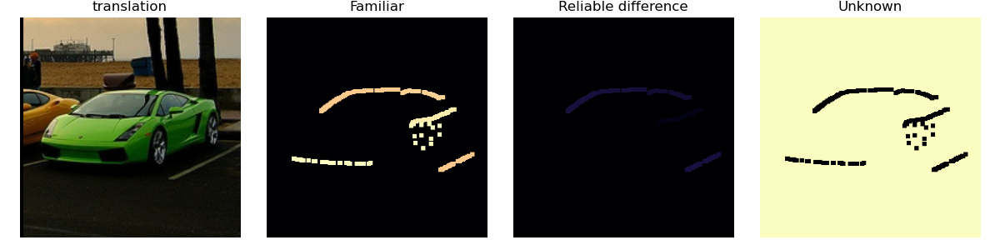
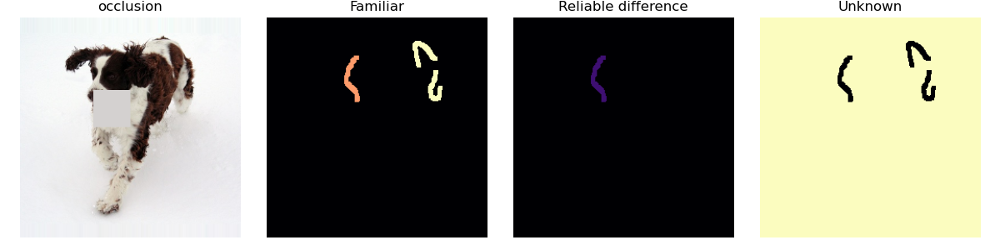
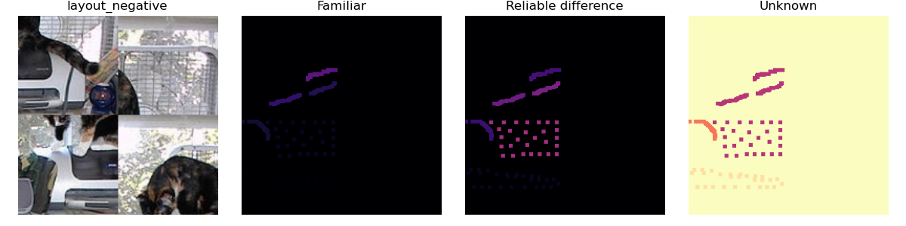

# 层级超图视觉记忆与空间检索：研究进展及后续工作

**项目：Conscious Demo**  
**成果整理日期：2026 年 9 月 23 日**

本项目已构建由固定视觉编码、层级超图记忆、空间结构检索与观察驱动更新组成的完整实验系统，实现了从图像特征提取、连续区域构图、对象级记忆写入，到后续检索、定位和类别读出的计算闭环。系统以显式节点、关系与观察证据组织视觉知识，使检索结果能够追溯到具体部件及其空间支持，也使新观察引起的记忆变化具有明确的更新对象和来源记录。

现阶段工作集中于三个方面：建立外观与几何联合的层级表示；实现可解释、可验证的 Gpos 空间检索；形成带有来源去重、关联消歧和恢复一致性检查的增量学习流程。最新实验完成了 34 个训练对象的全体回查，目标实体检索与类别预测均达到 34/34；局部联合分配进一步将三个对象的平移和亮度扰动检索分别提升至 3/3。下一阶段将围绕尺度稳定性、部分可见结构识别及跨观察巩固推进，并形成相应的算法、软件和实验成果。

## 一、已经完成的研究工作

### 1.1 整体原理：以组合记忆连接感知与识别

*图 1　项目整体原理。上半部分为已实现的 CNN—Gmem—Gpos 表示与检索主线；下半部分为早期主动观察控制设计。当前实验采用一次观察构图和框监督优化器组织输入与更新。*

模型将持久化视觉记忆与当前输入上的空间响应分开组织。

**Gmem 负责存储组合结构。** Gmem I 保存局部特征原型，Gmem II 将局部特征及其相对位置组织为连续区域，Gmem III 再将区域角色及区域间关系组合为对象级实体。高层节点可以共享低层部件，同一个部件在不同实体中拥有各自的角色与几何位置。

**Gpos 负责计算记忆在当前输入中的空间支持。** Gpos I 生成特征响应场，Gpos II 根据区域内部关系检验候选位置，Gpos III 联合多个区域检索实体位置。三层计算使用相同的局部特征证据，并在不同层级逐步引入结构约束。

**优化器负责把观察转化为可积累的记忆证据。** 在已有记忆中找到可靠对应时，更新相关部件、位移和支持统计；观察具有新的组合结构时，建立新的对象模板；存在竞争解释时，保存待决关联并等待后续独立观察。

这一组织方式将视觉学习落实为三个相互配合的过程：

1. **特征测量：**把图像转化为具有明确几何含义的局部响应。
2. **结构解释：**判断已存部件及其排列能否共同解释当前输入。
3. **证据更新：**根据独立观察修正局部关系，并积累更稳定的高层组合。

当前软件已实现这三个过程之间的数据接口、状态管理及实验入口。早期眼跳控制器保留了 MICRO、MACRO、REVIEW 三类观察状态，为后续主动选择观察位置提供了扩展基础。

### 1.2 固定 CNN：多尺度局部视觉测量

#### 1.2.1 特征编码及数值定义

视觉前端采用固定卷积与多尺度特征库，默认尺度为 $\{1,2,4\}$。图学习过程中保持编码器参数固定，主要学习对象是记忆节点、组合关系及其证据。

设经过平滑的亮度图为 $L(x,y)$，通过卷积计算一阶与二阶导数：

$$
g_x=\partial_xL,\qquad g_y=\partial_yL,\qquad
h_{xx}=\partial_{xx}L,\quad h_{yy}=\partial_{yy}L,\quad h_{xy}=\partial_{xy}L.
$$

实现使用离散卷积近似上述微分，并在不同特征分支中复用导数。当前输出包括五类模态：

| 模态 | 已实现的测量内容 | 主要作用 |
| --- | --- | --- |
| RGB | 颜色与局部外观 | 表示颜色连续区域 |
| grad | 梯度与边缘连续性 | 提供轮廓支持和区域拓扑 |
| curv | 二阶导数强度 | 描述局部弯曲与灰度变化的高阶属性 |
| aps | 结构张量特征值关系形成的各向异性属性 | 描述局部方向结构的伸展特征 |
| ori | 结构张量主轴方向及置信度 | 提供方向约束 |

其中，当前 curv 分支计算 Hessian 的 Frobenius 范数：

$$
c(x,y)=\sqrt{h_{xx}^2+h_{yy}^2+2h_{xy}^2},\qquad
\widetilde c(x,y)=\frac{c(x,y)}{\max\{\max_{p\in\Omega}c(p),\varepsilon_c\}}.
$$

代码对无效数值及低能量响应进行显式处理。这里的 curv 是已经确定的二阶导数描述子，其尺度稳定性能够直接通过特征响应和分项损失进行分析。

aps 与 ori 基于局部结构张量：

$$
J=\begin{bmatrix}
\langle g_x^2\rangle & \langle g_xg_y\rangle\\
\langle g_xg_y\rangle & \langle g_y^2\rangle
\end{bmatrix},\qquad
\lambda_1\geq\lambda_2\geq0.
$$

aps 使用带数值正则的特征值对数比及方向符号形成归一化响应；ori 从主轴角度提取方向，并以能量和各向异性共同控制置信度。方向插值在倍角圆周上进行，即先插值 $\cos 2\theta$ 和 $\sin 2\theta$，再恢复角度，从而处理轴向方向的周期性。

#### 1.2.2 连续区域与同源特征组织

已实现的 `grad_refined` 方法首先形成梯度父区域，再在保留的父域内依据 curv、aps、ori 的自身连续性细分。RGB 分支独立形成颜色连续区域。这样，轮廓属性拥有一致的空间来源，同时保留各模态的表达能力。

同一梯度来源及其属性子区域组成一个 family。后续实体评分先分配 family 证据，再分配到成员和采样槽位，使同一轮廓的多属性测量能够在统一来源下参与结构检索。

*图 2　实际 Notebook 输出中的五模态分区。星号为入选锚点，属性区域标注对应的 grad 父域。*

### 1.3 层级超图：从局部样本到实体组合

将第 $\ell$ 层记忆记为 $\mathcal G^{(\ell)}$。高层节点由低层角色集合及其关系构成，可写为：

$$
H^{(\ell+1)}=\bigl(\mathcal U_H,\pi_H,\mathcal R_H,\mathcal E_H\bigr).
$$

其中，$\mathcal U_H$ 为该高层节点内部的角色集合，$\pi_H$ 将角色映射到第 $\ell$ 层的节点，$\mathcal R_H$ 保存角色之间的几何关系，$\mathcal E_H$ 保存独立观察、可靠性和几何统计。

引入角色映射的作用是将“部件原型”与“部件在某个组合中的出现位置”分开。多个角色可以引用同一个低层原型，同时维持不同的相对位置与关系；不同实体也可以共享同一个区域节点。

具体实现如下：

- **Gmem I：**保存特征原型、模态标识及有效通道掩码。
- **Gmem II：**以区域锚点和外围采样构成基本星型结构，保留附加关系及跨区域接触信息。
- **Gmem III：**保存区域角色、相对根位置、成员间关系、来源 family、成员质量和独立观察证据。

区域关系可用对数极坐标表示。对边 $e=(u,v)$，存储 $\rho_e$ 和 $\theta_e$，对应的笛卡尔位移为：

$$
\Delta_e=e^{\rho_e}
\begin{bmatrix}\cos\theta_e\\\sin\theta_e\end{bmatrix}.
$$

检索时选定锚点为坐标原点，沿连通关系恢复局部坐标。若从两条路径到达同一角色，则比较其坐标差；该差受闭环容差约束。由此，模板内部的几何关系在进入空间匹配前已经获得一致的坐标解释。

### 1.4 Gpos 检索原理与数学推导

#### 1.4.1 统一记号与计算目标

设输入空间为 $\Omega\subset\mathbb R^2$，模态 $m$ 的特征场为：

$$
X_m:\Omega\rightarrow\mathbb R^{d_m}.
$$

第 $i$ 个底层记忆节点具有原型 $w_i$、模态标识 $m_i$ 和通道掩码。一个区域或实体模板记为 $H$，包含槽位集合 $\mathcal I_H$。槽位 $i$ 的局部坐标为 $p_i$，归一化权重为 $\omega_i\geq0$，且 $\sum_i\omega_i=1$。

当前正式检索采用平移位姿：

$$
T_b(p)=p+b,\qquad b\in\mathbb R^2.
$$

Gpos 的任务是找到一组满足特征支持与结构约束的位置 $b$，并输出相应的分数、匹配角色、覆盖量和几何解释。

#### 1.4.2 Gpos I：由原型相似度得到位置响应场

对于欧氏属性组，设共同有效通道集合为 $\mathcal C_i$，通道权重为 $a_c>0$，尺度参数为 $\sigma_c>0$。高斯相似度为：

$$
K_i^{\mathrm{E}}(p)=
\exp\left[-\frac12
\frac{\sum_{c\in\mathcal C_i}a_c\left(\frac{X_{m_i,c}(p)-w_{i,c}}{\sigma_c}\right)^2}
{\sum_{c\in\mathcal C_i}a_c}\right].
$$

对于轴向向量属性，将共同有效通道上的输入和原型分别记为 $u$、$v$，采用：

$$
K_i^{\mathrm{V}}(p)=
\left|\frac{u^\top v}{\sqrt{\|u\|^2+\varepsilon_v}\sqrt{\|v\|^2+\varepsilon_v}}\right|^{\gamma}.
$$

需要区分极性时，将绝对值替换为正部函数 $\max(0,\cdot)$。对于周期属性，设周期为 $P_c$，则：

$$
K_i^{\mathrm{P}}(p)=\frac1{|\mathcal C_i|}
\sum_{c\in\mathcal C_i}
\left[\frac{1+\cos\left(\frac{2\pi}{P_c}(X_{m_i,c}(p)-w_{i,c})\right)}2\right]^{\gamma}.
$$

当一个特征包含多个有效度量组时，按组权重 $\alpha_g>0$ 进行几何聚合：

$$
K_i(p)=\exp\left[
\frac{\sum_g\alpha_g\log\max(K_{i,g}(p),\varepsilon_K)}{\sum_g\alpha_g}
\right].
$$

进一步结合模态门控 $G_{m_i}(p)\in[0,1]$ 和有效输入指示量 $V_i(p)\in\{0,1\}$，得到正式检索使用的响应场：

$$
R_i(p)=\operatorname{clip}\bigl(K_i(p)G_{m_i}(p)V_i(p),0,1\bigr).
$$

这里区分两种情况：特征缺失、通道不足或输入位置无效时，该证据不可评估；输入有效而门控或相似响应较低时，该位置提供较弱支持。该区分直接决定后续的评分分母和未知状态。

Gpos I 将记忆原型转化为整幅输入上的可比较响应。底层计算可以复用卷积特征、响应缓存和 GPU 张量采样。

#### 1.4.3 Gpos II：相对位移、局部容差与模板位置响应

对槽位 $i$，在位姿 $b$ 下的预期位置为：

$$
q_i(b)=b+p_i.
$$

设允许的局部整数位移集合为：

$$
\mathcal D_r=\{(d_x,d_y)\in\mathbb Z^2:|d_x|\leq r,\ |d_y|\leq r\}.
$$

采用高斯位移惩罚 $\psi(\delta)=\exp[-\|\delta\|^2/(2\sigma_g^2)]$，独立槽位的最佳响应为：

$$
a_i(b)=\max_{\delta\in\mathcal D_r}
R_i\bigl(q_i(b)+\delta\bigr)\psi(\delta),
$$

$$
\delta_i^*(b)\in\arg\max_{\delta\in\mathcal D_r}
R_i\bigl(q_i(b)+\delta\bigr)\psi(\delta),\qquad
\widehat q_i(b)=q_i(b)+\delta_i^*(b).
$$

响应场在非整数坐标处采用双线性采样。上述计算允许槽位在预期位置附近寻找局部峰值，同时通过位移惩罚保留模板的几何约束。

若定义 $A_i(p)=\max_{\delta\in\mathcal D_r}R_i(p+\delta)\psi(\delta)$，则 $a_i(b)=A_i(b+p_i)$。这表明区域检索可以理解为：先计算每个部件的容差响应场，再按照记忆中的相对位移进行对齐，并在候选锚点处汇合。它构成原理图中结构响应合成的具体计算形式。

#### 1.4.4 来源归一化与重复证据修正

实体中，同一来源 family $f$ 的成员质量记为 $q_j>0$，其总证据权重记为 $A_f$。当前实现先将该权重分配到 family 内的区域成员：

$$
\beta_j=A_{f(j)}\frac{q_j}{\sum_{k:f(k)=f(j)}q_k}.
$$

设成员 $j$ 内部槽位的原始边证据权重为 $a_i$，则分配到槽位的初始权重为：

$$
\widetilde\omega_i=
\frac{\beta_{j(i)}}{\sum_j\beta_j}
\frac{a_i}{\sum_{k:j(k)=j(i)}a_k}.
$$

若若干槽位引用相同原型且具有相同预测坐标，令其重复次数为 $d_i$，再进行一次修正与归一化：

$$
\omega_i=
\frac{\widetilde\omega_i/d_i}{\sum_k\widetilde\omega_k/d_k}.
$$

这一机制将来源贡献、成员质量、局部关系可靠性及重复支持统一到同一组权重中。区域层可以看作只有一个成员组的特例。

#### 1.4.5 从局部响应推导整体匹配分数

令 $v_i(b)\in\{0,1\}$ 表示槽位在预期位置可评估。首先定义可评估总量：

$$
E_H(b)=\sum_i\omega_i v_i(b).
$$

当 $E_H(b)>0$ 时，将可评估槽位上的负对数响应定义为局部匹配损失：

$$
\ell_i(b)=-\log\max(a_i(b),\varepsilon_s).
$$

其归一化加权损失为：

$$
L_H(b)=\frac{\sum_i\omega_i v_i(b)\ell_i(b)}{E_H(b)}.
$$

映射回响应域，得到模板分数：

$$
S_H(b)=e^{-L_H(b)}
=\prod_{i:v_i(b)=1}\max(a_i(b),\varepsilon_s)^{\omega_i/E_H(b)}.
$$

因此，当前 Gpos 使用的是可评估槽位上的加权几何平均。它把外观匹配转化为可分解的对数能量：任一模态、family 或成员的影响，都可以通过其对 $L_H$ 的贡献独立统计。

另设局部命中阈值 $\tau_{\mathrm{hit}}$，定义匹配覆盖：

$$
C_H(b)=\frac{\sum_i\omega_i v_i(b)\mathbf1[a_i(b)\geq\tau_{\mathrm{hit}}]}{E_H(b)}.
$$

$E_H$ 衡量整个模板中有多少证据可以参与判断，$C_H$ 衡量可评估部分中有多少得到局部支持，$S_H$ 则刻画这些响应的联合一致程度。当 $E_H=0$ 时，实现返回零分和零匹配覆盖。

#### 1.4.6 几何约束与局部联合分配

独立槽位寻峰可能使多个角色占用同一个响应峰。已实现的联合分配方法首先检测冲突，将相互冲突的槽位组成连通分量，再为其中的槽位保留 top-$K$ 个候选响应，在限定 beam 内寻找相容分配。

对一个冲突分量 $\mathcal B$，其求解目标可以写为：

$$
\max_{\{q_i\}_{i\in\mathcal B}}
\sum_{i\in\mathcal B}\omega_i
\log\max\left(R_i(q_i)\psi(q_i-b-p_i),\varepsilon_s\right),
\qquad q_i\in\mathcal Q_i(b),
$$

其中 $\mathcal Q_i(b)$ 为槽位保留的局部候选集。搜索同时满足：

1. 同模态且预期位置距离超过角色容差的槽位保持证据占用互斥；当前角色容差为 0.5 像素，占用位置按四位小数比较；
2. 已分配的角色对满足保存的相对位移约束；
3. 不冲突角色的已有分配在该局部修复过程中保持固定。

实现按每个槽位的候选数安排搜索顺序，并在扩展过程中检查占用与关系约束。联合分配完成后，使用新的槽位响应重新计算分数、覆盖和几何误差。

对模板关系集合 $\mathcal R_H$，仅在两端都达到局部命中条件时评价其几何残差：

$$
D_H(b)=\max_{(i,j)\in\mathcal R_H^{+}(b)}
\left\|\widehat q_j(b)-\widehat q_i(b)-\Delta_{ij}\right\|_2.
$$

若可评价关系集合为空，几何误差项取零，其可用性由整体支持和覆盖门限共同约束。最终接受条件为：

$$
S_H(b)\geq\tau_S,\qquad E_H(b)\geq\tau_E,\qquad
C_H(b)\geq\tau_C,\qquad D_H(b)\leq\tau_D,
$$

并要求证据占用约束通过。当前实现中 $\tau_D=2r+\tau_{\mathrm{cycle}}$。

该方法通过修正局部对应恢复可解释的实体匹配，保持了原有的结构约束。top-$K$ 和 beam 给出有界近似搜索，搜索状态与冲突细节被保存在诊断记录中。

*图 3　局部联合分配后的平移检索实例。最新实验中，汽车对象 007490/0 水平平移 4 像素后成功找回实体 1，六个来源 family 提供局部锚定。四栏依次为输入、熟悉响应、可靠差异和未知支持。熟悉轮廓与局部差异共同展示了验证所依据的空间证据；完整检索的接受状态由图注所引实验记录给出。*

#### 1.4.7 Gpos III：多区域统一展开与实体定位

设实体 $H$ 的区域角色集合为 $\mathcal J_H$，角色 $j$ 相对实体根的位移为 $t_j$。区域 $j$ 内部槽位 $i$ 的局部坐标为 $p_{j,i}$，则其在实体坐标系中的位置为：

$$
p_i^{(H)}=t_j+p_{j,i}.
$$

在实体平移 $b$ 下，预测位置直接写为：

$$
q_{j,i}(b)=b+t_j+p_{j,i}.
$$

由此，多个区域星型结构可以在查询阶段虚拟挂载到统一根坐标系中。所有区域内部关系及区域间约束共同组成实体视图，随后复用 Gpos II 的同一评分与验证机制。槽位标识使用“区域角色、区域内角色”的组合，保证共享原型的不同出现位置仍可独立追踪。

这一展开方式使三级检索始终建立在底层可追溯响应之上。实体位置由通过验证的候选峰给出，随后执行非极大值抑制，保留空间分离的匹配实例。

对于视域内部的理想平移，若编码响应满足 $R_i'(p+t)=R_i(p)$，有效掩码同步平移，则：

$$
a_i'(b+t)=a_i(b),\qquad
E_H'(b+t)=E_H(b),\qquad
S_H'(b+t)=S_H(b).
$$

证明只需将 $q_i'(b+t)=b+t+p_i$ 代入局部寻峰式；平移后的响应在每个位移候选上与原值相同，因而最大值、覆盖及相对几何均保持一致。该性质给出了结构检索平移等变性的条件，也为实际平移实验提供了明确的验证目标。

#### 1.4.8 二进制粗筛与安全上界

已实现的二进制编码以“模态、描述子量化区间、有效通道”为索引单元。输入区域的响应范围产生可能激活的位集合，模板则保存各位对应的证据权重。

设粗筛保留的最大可能命中质量为 $U_H$。若模板能够满足 $E_H\geq\tau_E$ 和 $C_H\geq\tau_C$，则其实际命中质量 $M_H=E_HC_H$ 必然满足：

$$
M_H\geq\tau_E\tau_C.
$$

由 $M_H\leq U_H$ 可得必要条件：

$$
U_H\geq\tau_E\tau_C.
$$

因此，上界不足的模板可以提前排除；满足该条件的模板继续进入精验。无法提供紧上界的度量保留相应候选，使筛选过程遵循保守原则。

在逐槽位精验中，也可以为尚未计算的响应设上界 1。对已经计算的槽位集合 $\mathcal P$，在可评估集合确定之后有：

$$
S_H(b)\leq
\exp\left[\frac{\sum_{i\in\mathcal P}\omega_i v_i(b)
\log\max(a_i(b),\varepsilon_s)}{E_H(b)}\right].
$$

若这一上界已经低于接受门限，就可以结束该候选的后续计算。联合分配的备选响应被约束为不超过独立最大响应，从而与上述上界保持一致。

### 1.5 观察驱动更新：从写入到巩固

#### 1.5.1 独立来源与几何统计

系统以 source episode 记录证据。令第 $e$ 个独立来源的支持量为 $h_e\in[0,1]$，观察机会为 $o_e\in\{0,1\}$，则：

$$
N_+=\sum_e h_e,\qquad N_{\mathrm{obs}}=\sum_e o_e.
$$

同一来源再次出现时，支持量取历史支持与新支持的最大值，使该来源的累计贡献不超过 1。由此，原图重放、相关视图和独立新观察在统计上具有明确区别。

对新增支持权重 $\Delta w>0$ 及其位移测量 $\widehat\delta$，采用加权在线均值更新：

$$
\mu'=\mu+\frac{\Delta w}{W+\Delta w}(\widehat\delta-\mu),
$$

$$
M_2'=M_2+\Delta w(\widehat\delta-\mu)\odot(\widehat\delta-\mu'),\qquad
W'=W+\Delta w.
$$

其中 $M_2$ 保存逐坐标二阶中心矩，$\odot$ 表示逐元素乘法。在线统计为关系位移、稳定性和后续巩固提供依据。

实现还将支持可靠性与成熟度结合，形成关系证据权重：

$$
w_{\mathrm{evidence}}=
\max\left\{w_{\min},
\frac{N_++\alpha}{N_{\mathrm{obs}}+2\alpha}
\left(1-e^{-N_+/\kappa}\right)\right\}.
$$

$\alpha$ 为平滑参数，$\kappa$ 控制成熟速度。该权重用于表达独立观察积累后的结构可靠性。

#### 1.5.2 监督准入与事务式提交

已完成的框监督流程依次执行对象视图归一化、区域选择、局部复用、实体对应、工作副本更新和写入几何验证。对应可靠时更新已有实体；同类结构差异较大或存在竞争解释时，保存独立的标注观察实体，并记录待决关系。

提交前检查拟写入实体能否解释当前观察的几何结构。必要时执行一次本地重建，再进行验证。图与来源账本共同提交，保证检查点中保留的是完整学习结果。

待决关联包含 pending、confirmed、rejected、stale 等状态，按独立来源累计支持与反对证据。模板版本变化会触发关联证据失效处理。区域复用、成员提升和实体合并因此具有各自的决策边界，能够逐步形成可审查的记忆巩固过程。

### 1.6 增长图上的类别读出与熟悉度分析

#### 1.6.1 固定维度类别接口

对于固定的 $C$ 个类别，将实体检索结果按类聚合为：

$$
z=[z_1;\ldots;z_C]\in\mathbb R^{6C}.
$$

每类六个分量记录响应分数、可评估覆盖、匹配覆盖、归一化几何误差、缺失或拒绝状态，以及搜索完整性。实体节点数量增长时，类别读出接口保持固定维度。

系统已实现两条读出路径：标准读出使用通过精验的实体；弱证据读出保留被拒绝候选的分项信息，用于学习与比较类别区分能力。分类头对拟合集估计标准化统计，对常量维度进行处理，再计算：

$$
p(y=c\mid z)=\operatorname{softmax}(W_{\mathrm{cls}}\widehat z+b_{\mathrm{cls}})_c.
$$

分类头在冻结图的 readout_fit 集上训练，validation 用于选择检查点，test 用于固定设置评价。当前实验已纳入初始化基线、多个随机种子、每轮预测分布、各类召回率和宏 F1，形成了从图证据到判别输出的完整评价接口。

#### 1.6.2 熟悉、差异与未知的分离

已实现只读的熟悉度分析模块。对来源 family $f$，用质量 $q_f$、可比较支持 $v_f$、不确定性 $u_f$ 和局部相似度 $s_f$ 定义：

$$
F_f=q_fv_f(1-u_f)s_f,\qquad
D_f=q_fv_f(1-u_f)(1-s_f),\qquad
U_f=1-q_fv_f(1-u_f).
$$

各项在理论上属于 $[0,1]$，并满足 $F_f+D_f+U_f=1$。通过归一化投影，将 family 证据转换为空间热图；重叠区域按来源聚合。

最新实现将“局部特征熟悉”与“实体对应可靠”分开判断，结构验证与冲突状态共同控制行动建议。该模块已经能够输出支持分布、候选竞争、可靠差异和保持观察等诊断结果，为后续选择性学习率和复习策略提供了明确接口。

*图 4　局部遮挡下的分层证据。dog 对象 003671/0 的探针仍选中正确候选实体 0，并保留三个可靠 family；family 平均熟悉度约为 0.931。完整实体精验未通过，系统输出 `hold_correspondence`，保留对应并等待补充观察。图示体现了局部熟悉证据与整体接受状态的分离。*

三类热图统一使用 0–1 显示范围，颜色由暗到亮表示数值增大。投影只覆盖候选模板的采样支持，其余位置归入未知；因此，图中的高亮未知背景与稀疏轮廓共同给出了当前解释的空间范围。报告采用的最新图示及其原始指标记录于[图示来源说明](../assets/research_progress/README.md)。

### 1.7 模型表现与实验成果

#### 1.7.1 训练记忆的完整保持与检索

最新完整实验采用 PASCAL VOC2007 的 cat、dog、car 三类对象。基础记忆由 20 张图像中的 34 个标注对象构建，包含 12,467 个 Gmem I 节点、758 个 Gmem II 节点和 34 个 Gmem III 实体。

| 评价项目 | 最新结果 |
| --- | ---: |
| 最终冻结图的训练目标实体回查 | 34/34 |
| 同一批训练视图的类别预测 | 34/34 |
| 检查点图版本、来源账本、节点数一致性 | 全部通过 |
| 重复输入的来源去重与查询等价检查 | 全部通过 |

全体回查使用普通视觉查询与结构补充检索。结果表明，对象的局部特征、区域组合和相对位置已经形成可持久保存、可重新激活的记忆结构。

#### 1.7.2 联合分配带来的扰动检索改善

在 dog、car、cat 各一个对象上，使用相同冻结记忆进行六条件对照。局部联合分配前后的普通检索结果为：

| 条件 | 修复前命中 | 最新命中 |
| --- | ---: | ---: |
| 原始视图 | 3/3 | 3/3 |
| 水平平移 4 像素 | 2/3 | 3/3 |
| 亮度乘 0.85 | 2/3 | 3/3 |
| 缩放至 0.95 | 0/3 | 0/3 |
| 局部遮挡 | 0/3 | 0/3 |

三个布局打乱输入均未接受任何实体。联合分配修复了已定位的局部证据争用问题，并保持了已测原图记忆和结构负对照的结果。该实验形成了从失败诊断、算法修改到对照验证的完整改进链条。

*图 5　结构布局负对照。cat 对象 007530/1 交换对角象限后，图像保留原有局部像素而改变组合位置。最新检索未接受任何实体；探针选出的候选实体 18 缺少可靠 family 锚定，输出 `insufficient_correspondence`。图中热图描述该候选的局部解释，展示了相似外观与相容组合之间的判定层次。*

#### 1.7.3 类别判别与分项诊断

独立划分包含 27 个 readout_fit 对象、26 个 validation 对象和 31 个 test 对象。当前完整实体检索在这 84 个输入上的接受数为 0，类别学习通过已保存的弱结构证据继续进行。

最新三个固定随机种子的弱证据分类头结果如下：

| 随机种子 | validation 准确率／宏 F1 | test 准确率／宏 F1 |
| --- | --- | --- |
| 0 | 50.00% / 0.4370 | 41.94% / 0.4020 |
| 1 | 34.62% / 0.3429 | 29.03% / 0.2969 |
| 2 | 38.46% / 0.3332 | 38.71% / 0.3639 |

三组均产生三个类别的预测，测试宏 F1 均高于此前固定预测 car 的 0.2270 基线。固定预测 car 在该测试窗口的准确率为 51.61%，因此后续优化同时以类别均衡性和总体正确率为目标。固定规则与多个随机种子的并列评价，使判别改进能够从初始化偏置和类别比例影响中单独分析。

已完成的 Gpos 对数损失分解进一步给出了清晰的算法改进依据：

- 在提供正确缩放几何的三个诊断条件中，curv 对整体负对数损失的贡献约为 74.7%–85.1%。后续尺度改进因此可以集中于描述子稳定性与同源证据分配。
- 遮挡条件下，目标模板仍具有约 87.8%–94.2% 的匹配覆盖；整体分数主要受少量低响应槽位影响。可见核心已经提供较强支持，部分匹配评分成为直接的推进方向。
- 联合分配显著减少了候选精验中的冲突记录，为进一步分析特征响应与评分机制排除了一个已确认的局部对应障碍。

#### 1.7.4 已形成的软件与复现资产

项目已公开完整代码、双语说明和算法文档，建立了两图演示、批量学习、冻结回查、留出分类、扰动对照、检查点恢复及逐对象日志等实验入口。核心模块均保留独立配置与诊断接口。

实验记录包含图版本、来源账本、候选 trace、类别混淆矩阵、分项损失、运行资源和关键图示。最新结果对应 `voc2007_20260923_171046_543975`，上一轮对照对应 `voc2007_20260922_222716_908742`。已知位置和尺度的评分分解作为定位误差来源的独立诊断，与普通检索结果分别记录。

## 二、即将开展的工作

### 2.1 建立尺度稳定的特征与证据分配

首先开展逐模态尺度对照，分离坐标变换、池化采样相位、导数幅度与归一化统计的作用。重点检验 curv 在轻微缩放下的响应变化，并比较局部归一化和尺度相关描述方式。

同时，将 family 内部权重进一步组织为“来源—模态—成员—槽位”的分层分配，使同一模态的贡献对区域碎片数量保持稳定。相关检查将采用人为改变分区粒度的对照，直接验证证据质量守恒。

本阶段的验收重点是：轻微尺度变化下能够保持可靠的对应与整体响应，轮廓替换、同色异形等结构对照仍保持有效区分。特征定义变化时同步升级编码合同并重建相应记忆。

### 2.2 实现具有可见核心约束的部分匹配

在现有完整结构评分之外，建立面向遮挡的部分识别通道。首先比较有界负对数损失、可见核心评分和残差预算，并保留最小可见总量、独立 family 数量、空间跨度和几何一致性约束。

例如，待验证的稳健评分可写为：

$$
S_H^{\mathrm{robust}}(b)=
\exp\left[-\frac{\sum_i\omega_i v_i(b)\min\{\ell_i(b),L_{\max}\}}{E_H(b)}\right].
$$

该评分限制单个低响应对整体解释的影响，同时需要单独记录被截断的残差质量，并对遮挡、外观替换、错位组合和背景干扰进行成组评价。正式引入新评分时，将同步调整粗筛必要条件和渐进上界，使候选生成与最终判定保持一致。

### 2.3 推进跨观察巩固与差异驱动更新

在对应与可见性解释稳定后，引入同一实体的独立观察和新的训练窗口，验证区域复用、实体更新及 pending 退出。学习机制将围绕“稳定核心—可选成员—差异候选”组织：稳定核心维持身份，局部差异先建档，再由重复观察决定关系提升或新实体建立。

差异热图首先用于补采样和复习优先级，随后再用于本实体成员关系的差异化更新。独立来源计数与更新幅度分别维护，共享部件的修改受到所属实体和证据来源约束。

### 2.4 完成增长记忆的判别与连续学习评价

首先利用现有缓存完成线性分类头的优化充分性分析，记录实际参数更新次数、拟合收敛和类别分布；再比较多候选统计、Gmem II 部件覆盖和分项残差等类别特征。随后扩大按原图独立的拟合与验证规模，并预留新的最终测试窗口。

持续学习实验将分阶段记录记忆增长、旧对象保持、新对象识别、实体复用率、关联确认率和单位新增观察成本，形成从局部算法到长期运行的统一评价链。

## 三、未来可能形成的产出

### 3.1 算法与方法成果

围绕“层级结构记忆—空间检索—证据驱动更新”形成一套完整方法，重点产出以下三类算法：

1. **可追溯的层级超图空间检索。** 统一特征响应、相对坐标展开、局部联合分配和层级几何验证，形成可进行分项分析的结构匹配方法。
2. **面向部分可见输入的组合记忆识别。** 建立尺度稳定描述、可见核心及受约束残差机制，提高结构记忆对真实观察变化的适应能力。
3. **跨观察巩固与差异引导的持续学习。** 通过独立来源证据、待决关联和局部可塑性，将具体观察逐步组织为稳定、可复用的实体结构。

相关结果可按完成度组织为方法论文与持续学习实证研究，并结合对照实验说明各模块的独立作用。

### 3.2 软件与实验成果

持续完善公开研究代码，形成模块化编码器、超图记忆、检索器、更新器和类别读出接口；同步提供版本化配置、可重建检查点、实验脚本及图形化诊断工具。

在现有 Notebook 基础上，建立覆盖平移、尺度、遮挡、局部替换、错误布局和连续学习序列的可复现实验套件。该套件能够同时评价识别结果与内部结构变化，为后续算法比较提供统一条件。

### 3.3 可拓展的研究成果

完成静态图像上的跨观察巩固后，将自然延伸到视频中的多视角关联与主动观察：利用时间连续性和运动线索选择新的观察，检验记忆如何决定下一步感知位置，以及新增观察如何消除结构歧义。

进一步可围绕结构补全、部件级重组和查询条件下的记忆激活开展研究，使视觉记忆从“保存并检索已见结构”推进到“利用组合关系组织新的解释”。

## 成果与实现索引

| 内容 | 文档或实现 |
| --- | --- |
| 最新实验与损失分解 | [联合分配后的完整实验审查](../record/2026-09-23_post_joint_assignment_review.md) |
| 联合分配实现 | [实现记录](../record/2026-09-23_joint_assignment_implementation.md)、[local_assignment.py](../../src/nns/memorygraphs/local_assignment.py) |
| Gmem / Gpos 与层级检索 | [graph_memorypool_onceoptimizer.py](../../src/nns/memorygraphs/graph_memorypool_onceoptimizer.py) |
| 固定视觉特征 | [features.py](../../src/nns/cnns/features.py) |
| 监督学习与提交 | [supervised_graph_learning.py](../../src/nns/memorygraphs/supervised_graph_learning.py) |
| 分类头与实验接口 | [supervised_readout.py](../../src/nns/memorygraphs/supervised_readout.py)、[supervised_experiment.py](../../src/nns/memorygraphs/supervised_experiment.py) |
| 熟悉度分析 | [familiarity_probe.py](../../src/nns/memorygraphs/familiarity_probe.py) |
| 完整实验入口 | [监督学习 Notebook](../../src/test_supervised_graph_learning.ipynb) |
