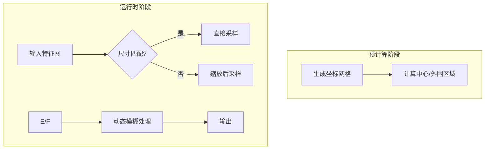

## Retina技术文档

### `_precompute_grid` 函数

本函数用于预计算输出特征图到输入特征图的坐标映射关系，模拟视网膜中央凹的高分辨率感知和外围区域的渐降分辨率特性。

#### **1. 生成归一化输出坐标系**
```python
out_y = torch.linspace(-1, 1, self.output_size)
out_x = torch.linspace(-1, 1, self.output_size)
grid_y, grid_x = torch.meshgrid(out_y, out_x, indexing='ij')
```
- **变量说明**:
  - `out_y`, `out_x`: 在 [-1, 1] 范围内均匀分布的坐标序列，长度由 `output_size` 决定
  - `grid_y`, `grid_x`: 形状为 `(H, W)` 的网格坐标矩阵，其中 H=W=`output_size`
- **数学表示**:
  \[
  \text{out\_y}_i = -1 + \frac{2i}{H-1}, \quad i \in \{0,1,...,H-1\}
  \]
  \[
  \text{out\_x}_j = -1 + \frac{2j}{W-1}, \quad j \in \{0,1,...,W-1\}
  \]

#### **2. 计算极坐标参数**
```python
rho = torch.sqrt(grid_x**2 + grid_y**2)
```
- **变量说明**:
  - `rho`: 形状 `(H, W)` 的归一化半径矩阵，表示每个位置到图像中心的距离
- **数学公式**:
  \[
  \rho_{i,j} = \sqrt{\left(\text{grid\_x}_{i,j}\right)^2 + \left(\text{grid\_y}_{i,j}\right)^2}
  \]
  取值范围：0（中心） ≤ ρ ≤ √2（角落）

#### **3. 初始化输入坐标映射**
```python
in_grid = torch.zeros(self.output_size, self.output_size, 2)
```
- **变量说明**:
  - `in_grid`: 形状 `(H, W, 2)` 的坐标映射矩阵，最后一维存储 (x,y) 坐标
  - 初始值为全零，后续填充归一化坐标值（范围 [-1,1]）

#### **4. 中心区域直接映射**
```python
center_mask = rho <= (self.center_size/self.output_size)
in_grid[center_mask] = torch.stack([grid_x[center_mask], grid_y[center_mask]], dim=-1)
```
- **变量说明**:
  - `center_mask`: 布尔掩码矩阵，标记中心高分辨率区域
  - `self.center_size/output_size`: 归一化的中心区域半径阈值
- **数学原理**:
  \[
  \text{center\_mask}_{i,j} = 
  \begin{cases}
  1 & \text{if } \rho_{i,j} \leq \frac{D_{\text{center}}}{D_{\text{out}}} \\
  0 & \text{otherwise}
  \end{cases}
  \]
  其中 \( D_{\text{center}} \) = `center_size`, \( D_{\text{out}} \) = `output_size`

#### **5. 外围区域坐标变换**
```python
outer_mask = ~center_mask
scaled_rho = rho[outer_mask]
```
- **变量说明**:
  - `outer_mask`: 反向掩码，标记外围区域
  - `scaled_rho`: 外围区域的半径值集合

#### **6. 指数衰减映射函数**
```python
scale_factor = self.tau ** (scaled_rho * self.output_size / self.center_size)
scaled_rho = scaled_rho * scale_factor
```
- **数学原理**:
  \[
  \rho' = \rho \cdot \tau^{\left(\rho \cdot \frac{D_{\text{out}}}{D_{\text{center}}}\right)}
  \]
  - \( \tau \) (`tau`): 分辨率衰减系数 (0 < τ < 1)
  - \( \frac{D_{\text{out}}}{D_{\text{center}}} \): 尺寸比例因子
  - **效果**：随着半径ρ增大，缩放因子呈指数衰减，实现坐标压缩

#### **7. 极坐标转换**
```python
theta = torch.atan2(grid_y[outer_mask], grid_x[outer_mask])
in_grid[outer_mask] = torch.stack([
    scaled_rho * torch.cos(theta),
    scaled_rho * torch.sin(theta)
], dim=-1)
```
- **变量说明**:
  - `theta`: 极角，计算每个位置相对于中心的角度
  \[
  \theta_{i,j} = \arctan2(\text{grid\_y}_{i,j}, \text{grid\_x}_{i,j})
  \]
- **坐标转换**:
  \[
  x_{\text{in}} = \rho' \cdot \cos(\theta)
  \]
  \[
  y_{\text{in}} = \rho' \cdot \sin(\theta)
  \]
  将缩放后的极坐标转换为笛卡尔坐标

#### **8. 输出格式调整**
```python
return in_grid.unsqueeze(0)
```
- **功能说明**:
  - 添加批次维度，将形状从 `(H, W, 2)` 转换为 `(1, H, W, 2)`
  - 适配 PyTorch 的 `grid_sample` 输入要求

#### **坐标映射可视化**
``` 
输出空间 (512x512)           输入空间 (动态尺寸)
    · · · · · ·                  ↗ 指数衰减区域
    · ○○○○ ·                    ○ 线性映射中心区域
    ·○     ○·                  · 过渡区域
    ·       · 
    · · · · · ·
```

#### **关键参数关系**
| 参数 | 数学符号 | 影响域 | 物理意义 |
|------|----------|--------|----------|
| output_size | \( D_{\text{out}} \) | 全局 | 输出特征图尺寸 |
| center_size | \( D_{\text{center}} \) | 中心区域 | 高精度感知区域直径 |
| gamma | \( \gamma \) | 池化核 | 控制模糊核尺寸增长速度 \( k \propto \rho^\gamma \) |
| tau | \( \tau \) | 外围区域 | 空间分辨率衰减速率 |

该预计算系统通过建立非线性坐标映射关系，在保持中心区域高分辨率的同时，对外围区域实现可调控的分辨率衰减，为后续的动态采样提供空间变换基础。

### `_dynamic_pooling` 函数逐行解析

#### **1. 获取输入维度信息**
   ```python
   B, C, H, W = x.shape
   ```
   - `B`: 批次大小
   - `C`: 通道数
   - `H`: 输入高度
   - `W`: 输入宽度

#### **2. 扩展预计算网格**
   ```python
   grid = self.grid_map.repeat(B, 1, 1, 1)
   ```
   - 将预计算的(1,H,W,2)坐标网格复制为(B,H,W,2)
   - 数学形式：grid[b,i,j] = grid_map[0,i,j]

#### **3. 动态尺寸适配**
   ```python
   if H != W or H != self.output_size:
       scale = torch.tensor([W/self.output_size, H/self.output_size], device=x.device)
       grid = grid * scale
   ```
   - 当输入尺寸与预设输出尺寸不符时：
     - `scale`: 尺寸缩放因子 (s_w, s_h)
     - 坐标变换公式：x' = x * s_w, y' = y * s_h

#### **4. 双线性采样**
   ```python
   sampled = F.grid_sample(x, grid, align_corners=False)
   ```
   - 使用可微分的网格采样
   - 采样公式：对于每个输出位置(i,j)，通过双线性插值计算：
     \[
     V_{out} = \sum_{m,n} w_{m,n}V_{in}^{(m,n)}
     \]
     其中权重w由相邻四个像素的距离决定

#### **5. 获取动态模糊核**
   ```python
   blur_kernel = self._get_blur_kernel(H, W)
   ```
   - 调用核生成函数，返回形状为(1,1,k,k)的卷积核

#### **6. 应用模糊卷积**
   ```python
   return F.conv2d(sampled, blur_kernel, padding='same')
   ```
   - 使用'same'模式卷积保持输出尺寸
   - 卷积公式：I_out = I_in ∗ K

#### **关键步骤说明**

| 代码段 | 功能 | 数学表达 |
|--------|------|----------|
| `grid.repeat(B,1,1,1)` | 批量复制坐标网格 | \( G_{b,i,j} = G_{i,j} \ \forall b \in [1,B] \) |
| `grid * scale` | 动态尺寸适配 | \( \begin{cases} x' = x \cdot \frac{W_{in}}{W_{out}} \\ y' = y \cdot \frac{H_{in}}{H_{out}} \end{cases} \) |
| `F.grid_sample` | 双线性插值采样 | \( V_{out} = \sum_{n=1}^4 w_n V_{in}^{(n)} \) |
| `F.conv2d` | 动态模糊处理 | \( I_{blur} = I \ast K_\sigma \) |

#### **参数说明**
| 参数 | 类型 | 作用 |
|------|------|------|
| `x` | Tensor(B,C,H,W) | 输入特征图 |
| `align_corners` | bool | 采样对齐模式 |
| `padding` | str | 卷积边界处理 |

#### **特性说明**
1. **动态尺寸适应**：
   - 自动处理任意输入尺寸（H,W ≠ output_size）
   - 保持中心区域几何不变性

2. **采样-模糊分离**：
   ```mermaid
   graph LR
   A[输入] --> B[坐标变换采样]
   B --> C[动态模糊处理]
   C --> D[输出]
   ```
---

### `_get_blur_kernel` 函数逐行解析


####  **1. 核尺寸计算**：
   \[
   k_{size} = \left\lfloor \min(H,W)/2 \right\rfloor^\gamma \lor 1
   \]
   - 保证为奇数的最小尺寸：`|1` 操作

#### **2. 计算高斯标准差**
   ```python
   sigma = kernel_size / 3.0
   ```
   - 根据3σ原则设置标准差
   - 确保核的有效覆盖范围：3σ ≈ kernel_size

#### **3. 生成坐标网格**
   \[
   K_{i,j} = \frac{e^{-(i^2+j^2)/2\sigma^2}}{\sum_{m,n} e^{-(m^2+n^2)/2\sigma^2}}
   \]
#### **4. 调整维度格式**
   ```python
   return kernel.view(1, 1, kernel_size, kernel_size)
   ```
   - 转换为PyTorch卷积核要求的(输出通道, 输入通道, H, W)格式


---

### 计算流程图解

```
输入特征图
    │
    ▼
[动态尺寸适配] → 调整采样网格比例
    │
    ▼
[双线性采样] → 根据网格坐标重采样
    │
    ▼
[动态模糊卷积] → 应用自适应高斯核
    │
    ▼
输出特征图
```

---

### 典型应用场景

1. **高分辨率图像处理**
   - 输入尺寸：2048×2048
   - 中心保持256×256清晰
   - 外围区域逐步模糊

2. **实时视频处理**
   - 固定输出为512×512
   - 动态适应不同输入分辨率
   - 利用预计算网格加速

3. **医学图像分析**
   - 关注中心病灶区域
   - 降低外围组织细节
   - 参数设置：center_size=128, gamma=0.6

---

### 性能优化技巧

1. **预计算重用**
   - 在初始化阶段完成所有静态计算
   - 运行时仅执行轻量操作

2. **向量化计算**
   - 使用meshgrid代替循环
   - 利用广播机制加速矩阵运算

3. **内存优化**
   - 使用view代替reshape
   - 及时释放中间变量

4. **混合精度训练**
   ```python
   with torch.autocast(device_type='cuda', dtype=torch.float16):
       output = retina_layer(input)
   ```


### 参数影响
| 参数 | 影响规律 | 效果示例 |
|------|----------|----------|
| `gamma` | \( k \propto \rho^\gamma \) | gamma=0.5 → 慢增长<br>gamma=1.2 → 快增长 |
| 输入尺寸 | \( k_{max} \propto \min(H,W) \) | 1024x1024输入 → 更大模糊核 |


### 数据处理流水线


### 关键特性对比
| 特性 | `_dynamic_pooling` | `_get_blur_kernel` |
|------|--------------------|--------------------|
| 主要作用 | 空间坐标变换 | 分辨率模拟 |
| 计算复杂度 | O(BCHW) | O(k²) |
| 可微分性 | ✓ | ✓ |
| 参数依赖 | grid_map | gamma |

### 典型应用示例
```python
# 配置快速衰减的视网膜层
layer = EfficientRetinaLayer(
    output_size=512,
    center_size=128,
    gamma=1.0,
    tau=0.4
)

# 处理不同尺寸输入
output1 = layer(torch.randn(1,3,256,256))  # 小尺寸自动上采样
output2 = layer(torch.randn(1,3,1024,1024)) # 大尺寸自适应模糊
```

### 数学补充说明

#### 动态模糊核的尺寸控制
\[
k_{size} = \min\left(
    \left\lfloor \left(\frac{\min(H,W)}{2}\right)^\gamma \right\rfloor,
    \text{max\_allowed}
\right)
\]

#### 双线性采样公式
对于输出位置 \((i,j)\)：
\[
I_{out}(i,j) = \sum_{m=0}^1 \sum_{n=0}^1 w_{m,n} I_{in}(x_m, y_n)
\]
其中 \( w_{m,n} \) 为双线性权重。